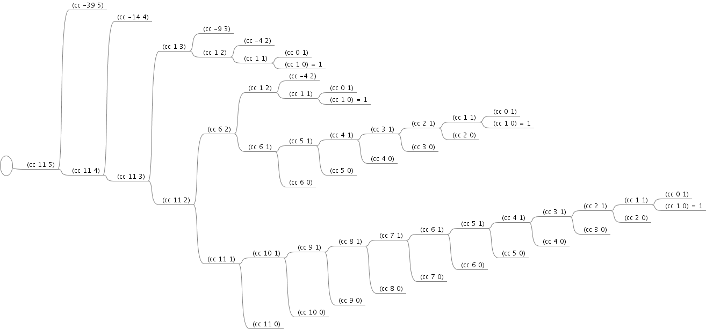

1.2 过程与它们所产生的计算
===============================

一个过程也就是一种模式, 它描述了一个计算过程的局部演化方式, 描述了这一计算过程中的每个步骤是如何根据前面的步骤建立起来的。

1.2.1 线性的递归和迭代
----------------------
阶乘的线性递归实现:

.. code-block:: scheme

  (define (factorial n)
    (if (= n 1)
        1
        (* n (factorial (- n 1)))))

阶乘的线性迭代实现:

.. code-block:: scheme

  (define (factorial n)
    (fact-iter 1 1 n))

  (define (fact-iter product counter max-count)
    (if (> counter max-count)
        product
        (fact-iter (* counter product)
                   (+ counter 1)
                   max-count)))

对于递归实现, 解析器需要维护因推迟执行而暂存的堆栈数据信息, 堆栈的长度随着参数值线性增长。

对于迭代实现, 解释器仅需维护固定数量的状态变量, 只有计算步骤会随参数值线性增长。

递归过程并不等同于递归计算过程, 递归过程论述的是语法形式事实, 即在过程的定义中(直接或间接)引用了该过程本身；递归计算过程论述的是计算过程的进展方式。因此对于某个递归过程, 可以产生出一个迭代的计算过程。

在其它语言中描述迭代过程, 需要借助特殊的循环结构- ``do`` 、 ``repeat`` 、 ``until`` 、 ``for`` 、 ``while`` , 而在 ``scheme`` 中则可以将一个递归过程由迭代型计算过程实现, 此即为 **尾递归** 。

*练习 1.9*
--------------

对于过程:

.. code-block:: scheme

  (define (+ a b)
    (if (= a 0)
        b
        (inc (+ (dec a) b))))

计算 ``(+ 4 5)`` 时的替换过程为:

::

  (+ 4 5)
  (if (= 4 0) 5 (inc (+ (dec 4) 5)))
  (inc (+ 3 5))
  (inc (if (= 3 0) 5 (inc (+ (dec 3) 5))))
  (inc (inc (+ 2 5)))
  (inc (inc (if (= 2 0) 5 (inc (+ (dec 2) 5)))))
  (inc (inc (inc (+ 1 5))))
  (inc (inc (inc (if (= 1 0) 5 (inc (+ (dec 1) 5))))))
  (inc (inc (inc (inc (+ 0 5)))))
  (inc (inc (inc (inc (if (= 0 0) 5 (inc (+ (dec 0) 5)))))))
  (inc (inc (inc (inc 5))))
  (inc (inc (inc 6)))
  (inc (inc 7))
  (inc 8)
  9

可以看到明显的展开与收缩的过程, 因此为线性递归计算过程。

对于过程:

.. code-block:: scheme

  (define (+ a b)
    (if (= a 0)
        b
        (+ (dec a) (inc b))))

计算 ``(+ 4 5)`` 时的替换过程为:

::

  (+ 4 5)
  (if (= 4 0) 5 (+ (dec 4) (inc 5)))
  (+ 3 6)
  (if (= 3 0) 6 (+ (dec 3) (inc 6)))
  (+ 2 7)
  (if (= 2 0) 7 (+ (dec 2) (inc 7)))
  (+ 1 8)
  (if (= 1 0) 8 (+ (dec 1) (inc 8)))
  (+ 0 9)
  (if (= 0 0) 9 (+ (dec 0) (inc 9)))
  9

可以看到并没有展开与收缩, 仅用固定的存储, 因此为线性迭代计算过程。

*练习 1.10*
--------------

.. code-block:: scheme

  (define (A x y)
    (cond ((= y 0) 0)
          ((= x 0) (* 2 y))
          ((= y 1) 2)
          (else (A (- x 1)
                   (A x (- y 1))))))

根据函数定义分别计算 ``(A 1 10)``, ``(A 2 4)``, ``(A 3 3)``

::

  (A 1 10)
  (A 0 (A 1 9))
  (* 2 (A 1 9))
  (* 2 (A 0 (A 1 8)))
  (* 2 (* 2 (A 1 7)))
  ......

即为 2\ :sup:`10`

::

  (A 2 4)
  (A 1 (A 2 3))
  (A 1 (A 1 (A 2 2)))
  (A 1 (A 1 (A 1 (A 1 (A 2 1)))))
  (A 1 (A 1 (A 1 (A 1 2))))
  (A 1 (A 1 (A 1 4)))
  (A 1 (A 1 16))
  (A 1 256)

即为  2\ :sup:`16`

::

  (A 3 3)
  (A 2 (A 3 2))
  (A 2 (A 2 (A 3 1)))
  (A 2 (A 2 2))
  (A 2 4)

即为 2\ :sup:`16`

根据代入数值计算结果, ``(A 0 n)`` 即为 ``2 * n``, ``(A 1 n)`` 即为 :math:`{2^n}`, ``(A 2 n)`` 即为 :math:`{{2^2}^n}`

关于 **Ackermann函数** 可参见 `Ackermann Function <http://en.wikipedia.org/wiki/Ackermann_function>`_

1.2.2 树形递归
---------------

计算斐波那契数的递归过程:

.. code-block:: scheme

  (define (fib n)
    (cond ((= n 0) 0)
          ((= n 1) 1)
          (else (+ (fib (-n 1))
                   (fib (- n 2))))))

计算斐波那契数的迭代过程:

.. code-block:: scheme

  (define (fib-iter a b count)
    (if (= count 0)
        b
        (fib-iter (+ a b) a (- count 1))))
  (define (fib n)
    (fib-iter 1 0 n))

计算换零钱的递归过程:

.. code-block:: scheme

  (define (count-change amount)
    (cc amount 5))

  (define (cc amount kinds-of-coins)
    (cond ((= amount 0) 1)
          ((or (< amount 0)
               (= kinds-of-coins 0))
           0)
          (else (+ (cc amount (- kinds-of-coins 1))
                   (cc (- amount (first-denomination kinds-of-coins))
                       kinds-of-coins)))))

  (define (first-denomination kinds-of-coins)
    (cond ((= kinds-of-coins 1) 1)
          ((= kinds-of-coins 2) 5)
          ((= kinds-of-coins 3) 10)
          ((= kinds-of-coins 4) 25)
          ((= kinds-of-coins 5) 50)))

计算换零钱的迭代过程:

首先计算只有第一种硬币(1美分)的情形, 则此时只有一种兑换方式;

然后计算只有第一种硬币和第二种硬币(5美分)的情形, 则此时的兑换方式为:

0 个 5 美分 + 100 个 1 美分;

1 个 5 美分 + 95 个 1 美分;

2 个 5 美分 + 90 个 1 美分;

。。。。。。

20 个 5 美分 + 0 个 1 美分;

因为包含两种硬币, 因此确定有几个 5 美分的硬币后, 1 美分硬币的个数也就随之确定(100 - 硬币个数 * 5), 所以此时的兑换方式即为 1 美元最多可以由多少个 5 美分的硬币构成。

按照这个思路梳理一下兑换的过程:

1. 起始为 0 个 5 美分的硬币
2. 判断硬币个数与硬币面值的乘积是否大于 1 美元
3. 超过则返回兑换方式的数量, 否则兑换数量加一且硬币个数加一
4. 回到第二步继续判断

然后用这个思路来验证包含三种硬币时的情形:

0 个 10 美分 + 0 个 5 美分(此时即为 100 个 1 美分);

0 个 10 美分 + 1 个 5 美分(此时即为 95 个 1 美分);

0 个 10 美分 + 2 个 5 美分(此时即为 90 个 1 美分);

。。。。。。

0 个 10 美分 + 20 个 5 美分(此时即为 0 个 1 美分);

1 个 10 美分 + 0 个 5 美分(此时即为 90 个 1 美分);

1 个 10 美分 + 1 个 5 美分(此时即为 85 个 1 美分);

1 个 10 美分 + 2 个 5 美分(此时即为 80 个 1 美分);

。。。。。。

1 个 10 美分 + 18 个 5 美分(此时即为 0 个 1 美分);

2 个 10 美分 + 0 个 5 美分(此时即为 80 个 1 美分);

。。。。。。

2 个 10 美分 + 16 个 5 美分(此时即为 0 个 1 美分);

。。。。。。

9 个 10 美分 + 2 个 5 美分(此时即为 0 个 1 美分);

10 个 10 美分 + 0 个 5 美分(此时即为 0 个 1 美分);

则兑换可总结为:

1. 起始设置每个面额的硬币(不包含 1 美分)个数都为零
2. 判断最大面额的硬币个数与硬币面值的乘积是否大于兑换金额
3. 超过则返回兑换方式的数量
4. 否则判断每种硬币个数与硬币面值的乘积之和是否大于兑换金额
5. 没有超过, 则将最小面额的硬币(不包含 1 美分)个数加一, 兑换方式的数量加一
6. 超过, 则将最小面额的硬币个数置为零, 次最小面额的硬币个数加一
7. 回到第二步继续判断

由此即可得到迭代过程:

.. code-block:: scheme

  (define (count-change amount)
    (cc-iter amount 0 0 0 0 0))

  (define (cc-iter amount total x2 x3 x4 x5)
    (cond ((> (* x5 50) amount)
           total)
          ((> (+ (* x5 50) (* x4 25)) amount)
           (cc-iter amount total 0 0 0 (+ x5 1)))
          ((> (+ (* x5 50) (* x4 25) (* x3 10)) amount)
           (cc-iter amount total 0 0 (+ x4 1) x5))
          ((> (+ (* x5 50) (* x4 25) (* x3 10) (* x2 5)) amount)
           (cc-iter amount total 0 (+ x3 1) x4 x5))
          (else
           (cc-iter amount (+ total 1) (+ x2 1) x3 x4 x5))))

*练习 1.11*
---------------

递归计算过程:

.. code-block:: scheme

  (define (func n)
    (if (< n 3)
        n
        (+
          (* 1 (func (- n 1)))
          (* 2 (func (- n 2)))
          (* 3 (func (- n 3))))))

迭代计算过程:

.. code-block:: scheme

  (define (func n)
    (fun-iter 0 1 2 n))

  (define (fun-iter a b c count)
    (if (= count 0)
        a
        (fun-iter b c (+ (* 1 c) (* 2 b) (* 3 a)) (- count 1))))

*练习 1.12*
---------------

计算帕斯卡三角形某个位置元素值的递归过程

.. code-block:: scheme

  (define (pasca n i)
    (cond ((= i 1) 1)
          ((= i (+ n 1)) 1)
          (else
            (+ (pasca (- n 1) (- i 1))
               (pasca (- n 1) i)))))

*练习 1.13*
--------------

证明:

已知, 对于斐波那契数列有

**公式(1)** :math:`f(n+1) = f(n) + f(n-1)`

设存在

**公式(2)** :math:`f(n+1) + x \cdot f(n) = y \cdot [f(n) + x \cdot f(n-1)]`

则有

:math:`f(n+1) = (y-x) \cdot f(n) + x \cdot y \cdot f(n-1)`

根据 **公式 (1)** , 则有

:math:`y - x = 1`

:math:`x \cdot y = 1`

即

:math:`x \cdot (x+1) = 1`

此方程有解

:math:`x = \frac{\sqrt{5} - 1}{2}`

:math:`y = \frac{\sqrt{5} + 1}{2}`

则 **公式 (2)** 成立, 即存在等比数列, 其中

**首项** 为 :math:`f(2) + \frac{\sqrt{5} - 1}{2} \cdot f(1) = \frac{\sqrt{5} + 1}{2}`

**公比** 为 :math:`\frac{\sqrt{5} + 1}{2}`

则此数列的通项公式为

:math:`F(n) = (\frac{\sqrt{5} + 1}{2})^{n}`

将 :math:`F(n)` 代入 **公式 (2)** , 则有

:math:`f(n+1) + \frac{\sqrt{5} - 1}{2} \cdot f(n) = (\frac{\sqrt{5} + 1}{2})^{n}`

即

**公式 (3)** :math:`f(n+1) = \frac{1 - \sqrt{5}}{2} \cdot f(n) + (\frac{\sqrt{5} + 1}{2})^{n}`

设存在

**公式 (4)** :math:`f(n+1) + x \cdot (\frac{\sqrt{5} + 1}{2})^{n+1} = \frac{1 - \sqrt{5}}{2} \cdot (f(n) + x \cdot (\frac{\sqrt{5} + 1}{2})^{n})`

则有

:math:`f(n+1) = \frac{1 - \sqrt{5}}{2} \cdot f(n) + (-\sqrt{5} \cdot x \cdot (\frac{\sqrt{5} + 1}{2})^{n})`

根据 **公式 (3)** 则有

:math:`x = -\frac{\sqrt{5}}{5}`

则 **公式 (4)** 成立, 即存在等比数列, 其中

**首项** 为 :math:`f(1) - \frac{\sqrt{5}}{5} \cdot \frac{\sqrt{5} + 1}{2} = \frac{5 - \sqrt{5}}{10}`

**公比** 为 :math:`\frac{1 - \sqrt{5}}{2}`

则此数列的通项公式为

:math:`G(n) = \frac{5 - \sqrt{5}}{10} \cdot (\frac{1 - \sqrt{5}}{2})^{n-1}`

将 :math:`G(n)` 代入 **公式 (4)** , 则有

:math:`f(n) - \frac{\sqrt{5}}{5} \cdot (\frac{\sqrt{5} + 1}{2})^{n} = \frac{5 - \sqrt{5}}{10} \cdot (\frac{1 - \sqrt{5}}{2})^{n-1}`

则有

:math:`f(n) = \frac{(\frac{\sqrt{5} + 1}{2})^{n} -  (\frac{1 - \sqrt{5}}{2})^{n}}{\sqrt{5}}`

设

:math:`\phi = \frac{\sqrt{5} + 1}{2}`

:math:`\psi = \frac{1 - \sqrt{5}}{2}`

则有

:math:`f(n) = \frac{\phi^{n} - \psi^{n}}{\sqrt{5}}`

所以

**公式 (5)** :math:`\frac{\phi^{n}}{\sqrt{5}} = f(n) + \frac{\psi^{n}}{\sqrt{5}}`

其中

:math:`\frac{1}{\sqrt{5}} < \frac{1}{2}`

:math:`|\psi| = |\frac{1-\sqrt{5}}{2}| < 1`

所以

:math:`|\frac{\psi^{n}}{\sqrt{5}}| < \frac{1}{2}`

则由 **公式 (5)** 可知 :math:`f(n)` 为最接近 :math:`\frac{\phi^{n}}{\sqrt{5}}` 的整数。

1.2.3 增长的阶
------------------

我们称 :math:`R(n)` 具有 :math:`\Theta(f(n))` 的增长阶, 记为

:math:`R(n) = \Theta(f(n))`

如果存在与 ``n`` 无关的整数 :math:`k_{1}` 和 :math:`k_{2}` , 使得

:math:`k_{1} \cdot f(n) \leqslant R(n) \leqslant k_{2} \cdot f(n)`

对任何足够大的 ``n`` 都成立。

*练习 1.14*
------------------

换零钱对11美分处理时的计算过程:

图为二叉树，其中由根节点到最底层的叶子的路径为

::

  (cc 11 5)->
  (cc 11 4)->
  (cc 11 3)->
  (cc 11 2)->
  (cc 11 1)->
  (cc 10 1)->
  (cc 9 1)->
  (cc 8 1)->
  (cc 7 1)->
  (cc 6 1)->
  (cc 5 1)->
  (cc 4 1)->
  (cc 3 1)->
  (cc 2 1)->
  (cc 1 1)->
  (cc 0 1)

则数的深度为 :math:`n + 5`, 则空间增长阶为 :math:`\Theta(n)`

设 :math:`f(n, k)` 为计算 ``amount`` 分为 ``kinds`` 种货币时需要的步骤，则由图中可知

::

  f(1, 1)=2
  f(2, 1)=4
  f(3, 1)=6
  ......

则有 :math:`f(n, 1) = 2 \cdot n` ，则 :math:`f(n, 1)` 步骤增长阶为 :math:`\Theta(n)`

而

:math:`f(n, 2) = f(n, 1) + f(n-5, 2)`

:math:`f(n-5, 2) = f(n-5, 1) + f(n-10, 2)`

设 :math:`m = \frac{n}{5}` (整数)，则有 :math:`f(n, 2)`

:math:`= f(n-5 \cdot 0, 1) + f(n-5 \cdot 1, 1) + f(n-5 \cdot 2, 1) + ...... + f(n-5 \cdot m, 1)`

:math:`= 2 \cdot [(n-5 \cdot 0) + (n-5 \cdot 1) + (n-5 \cdot 2) + ...... + (n-5 \cdot m)]`

:math:`= 2 \cdot [n \cdot m - 5 \cdot (0 + 1 + 2 + ...... +m)]`

:math:`= 2 \cdot [n \cdot m - 5 \cdot m \cdot \frac{m + 1}{2}]`

:math:`= 2 \cdot n \cdot m - 5 \cdot (m^{2} + m)`

则 :math:`f(n, 2)` 的步骤增长阶为 :math:`\Theta(n^{2})`

同理推得 :math:`f(n, 5)` 的步骤增长阶为 :math:`\Theta(n^{5})`

*练习 1.15*
-------------

.. code-block:: scheme

  (define (cube x) (* x x x))

  (define (p x) (- (* 3 x) (* 4 (cube x))))

  (define (sine angle)
    (if (not (> (abs angle) 0.1))
        angle
        (p (sine (/ angle 3.0)))))

求解 ``(sine 12.15)`` 的过程为

::

  (sine 12.15)
  --> (p (sine 4.05))
  --> (p (p (sine 1.35)))
  --> (p (p (p (sine 0.45))))
  --> (p (p (p (p (sine 0.15)))))
  --> (p (p (p (p (p (sine 0.05))))))

a) :math:`12.15 = 0.05 \cdot 3^{5}` ，``p`` 被使用 5 次

b) 设 :math:`a = x \cdot 3^{n}` ，其中 ``x`` 小于 0.1, 则有

:math:`\frac{a}{3^{n}} = x < 0.1`

:math:`\frac{10 \cdot a}{3^{n}} < 1`

:math:`10 \cdot a < 3^{n}`

:math:`\log{10 \cdot a} < \log{3^{n}}`

:math:`\frac{\log{10 \cdot a}}{\log{3}} < n`

则其增长的阶为 :math:`\Theta(\log{a})`

1.2.4 求幂
------------

求幂的递归过程:

.. code-block:: scheme

  (define (expt b n)
    (if (= n 0)
        1
        (* b (expt b (- n 1)))))

求幂的迭代过程:

.. code-block:: scheme

  (define (expt b n)
    (expt-iter b n 1))

  (define (expt-iter b counter product)
    (if (= counter 0)
        product
        (expt-iter b (- counter 1) (* b product))))

快速求幂的递归过程:

.. code-block:: scheme

  (define (fast-expt b n)
    (cond ((= n 0) 1)
          ((even? n)
           (square (fast-expt b (/ n 2))))
          (else
           (* b (fast-expt b (- n 1))))))

*练习 1.16*
-------------

根据提示, :math:`a \cdot b^{n}` 保持不变、使用 ``a`` 来保存结果，观察如下变换过程

:math:`(b\ 100\ a)`

:math:`(b^{2}\ 50\ a)`

:math:`(b^{4}\ 25\ a)`

此时根据 ``fast-expt`` 的过程，应将 ``25`` 执行减 ``1`` 操作，如果保持 :math:`a \cdot b^{n}` 不变，则可有如下变换

:math:`(b^{4}\ 24\ b^{4})`

即 :math:`(b^{4})^{24} \cdot b^{4} = b^{100}`, 当 ``n`` 为奇数时, :math:`a = a \cdot b`

:math:`(b^{8}\ 12\ b^{4})`

:math:`(b^{16}\ 6\ b^{4})`

:math:`(b^{32}\ 3\ b^{4})`

此时 ``n`` 为奇数, :math:`a = a \cdot b` 则

:math:`(b^{32}\ 2\ b^{36})`

:math:`(b^{64}\ 1\ b^{36})`

:math:`(b^{64}\ 0\ b^{100})`

则定义过程如下

.. code-block:: scheme

  (define (fast-expt b n)
    (fast-expt-iter b n 1))

  (define (fast-expt-iter b counter product)
    (cond ((= counter 0) product)
          ((even? counter)
           (fast-expt-iter (square b) (/ counter 2) product))
          (else
           (fast-expt-iter b (- counter 1) (* b product)))))

*练习 1.17*
--------------

.. code-block:: scheme

  (define (* a b)
    (if (= b 0)
        0
        (+ a (* a (- b 1)))))

  (define (double x)
    (+ x x))

  (define (halve x)
    (/ x 2))

  (define (fast* a b)
    (cond ((= b 0) 0)
          ((even? b) (double (fast* a (halve b))))
          (else (+ a (fast* a (- b 1))))))

*练习 1.18*
--------------

.. code-block:: scheme

  (define (fast* a b)
    (fast*-iter a b 0))

  (define (fast*-iter a b v)
    (cond ((= b 0) v)
          ((even? b)
           (fast*-iter (double a) (halve b) v))
          (else
           (fast*-iter a (- b 1) (+ a v)))))

*练习 1.19*
-------------

已知: ``T变换`` 对于 :math:`(a, b)` 、 :math:`(p, q)` 有

:math:`a = b \cdot q + a \cdot q + a \cdot p`

:math:`b = b \cdot p + a \cdot q`

则有如下变换过程

:math:`(a, b)`

=> :math:`(b \cdot q + a \cdot q + a \cdot p, b \cdot p + a \cdot q)`

=> :math:`(b \cdot q' + a \cdot q' + a \cdot p', b \cdot p' + a \cdot q')`

则有

**公式(1)**

:math:`b \cdot q' + a \cdot q' + a \cdot p' = (b \cdot p + a \cdot q) \cdot q + (b \cdot q + a \cdot q + a \cdot p) \cdot q + (b \cdot q + a \cdot q + a \cdot p) \cdot p`

**公式(2)**

:math:`b \cdot p' + a \cdot q' = (b \cdot p + a \cdot q) \cdot p + (b \cdot q + a \cdot q + a \cdot p) \cdot q`

将 **公式(1)** 右边展开，得到

:math:`b \cdot q' + a \cdot q' + a \cdot p'`

= :math:`(b \cdot p + a \cdot q) \cdot q + (b \cdot q + a \cdot q + a \cdot p) \cdot q + (b \cdot q + a \cdot q + a \cdot p) \cdot p`

= :math:`b \cdot p \cdot q + a \cdot q^{2} + b \cdot q^{2} + a \cdot q^{2} + a \cdot p \cdot q + b \cdot p \cdot q + a \cdot p \cdot q + a \cdot p^{2}`

= :math:`2 \cdot b \cdot p \cdot q + 2 \cdot a \cdot p \cdot q + 2 \cdot a \cdot q^{2} + b \cdot q^{2} + a \cdot p^{2}`

= :math:`b \cdot (2 \cdot p \cdot q + q^{2}) + a \cdot (2 \cdot p \cdot q + q^{2}) + a \cdot (p^{2} + q^{2})`

则有

:math:`p' = p^{2} + q^{2}`

:math:`q' = 2 \cdot p \cdot q + q^{2}`

代入 **公式(2)** ，检测正确

:math:`b \cdot p' + a \cdot q'`

= :math:`(b \cdot p + a \cdot q) \cdot p + (b \cdot q + a \cdot q + a \cdot p) \cdot q`

= :math:`b \cdot p^{2} + a \cdot p \cdot q + b \cdot q^{2} + a \cdot q^{2} + p \cdot a \cdot q`

= :math:`b \cdot (p^{2} + q^{2}) + a \cdot (2 \cdot p \cdot q + q^{2})`

1.2.5 最大公约数
------------------

求解最大公约数的欧几里得算法:

.. code-block:: scheme

  (define (gcd a b)
    (if (= b 0)
        a
        (gcd b (remainder a b))))

拉梅定理:

::

  如果欧几里得算法需要 k 步计算出一对整数的最大公约数, 那么这对数中较小的那个数必然大于或等于第 k 个斐波那契数。

证明:

设 :math:`(a_{k+1}, b_{k+1})` -> :math:`(a_{k}, b_{k})` -> :math:`(a_{k-1}, b_{k-1})` 是应用欧几里得算法求解最大公约数的过程中的连续三个数对, 根据欧几里得算法的定义, 可以得到

:math:`b_{k+1} = a_{k}`

:math:`a_{k} = q \cdot b_{k} + b_{k-1}`

因为 ``q`` 至少为 1 , 所以可得

:math:`b_{k+1} = q \cdot b_{k} + b_{k-1} \geqslant b_{k} + b_{k-1}`

即

**公式(1)**  :math:`b_{k+1} \geqslant b_{k} + b_{k-1}`

已知当 ``k`` 为 ``1`` 时, ``Fib(1)=1``, 定理成立。

现在假设对于所有小于等于 ``k`` 的整数都成立, 即对于 :math:`(a_{k+1}, b_{k+1})` -> :math:`(a_{k}, b_{k})` -> :math:`(a_{k-1}, b_{k-1})`

:math:`b_{k-1} \geqslant Fib(k - 1)`

:math:`b_{k} \geqslant Fib(k)`

则有

:math:`b_{k} + b_{k-1} \geqslant Fib(k) + Fib(k - 1)`

根据斐波那契数列的特性, 有 :math:`Fib(k) + Fib(k - 1) = Fib(k + 1)`, 结合 **公式(1)**, 则有

:math:`b_{k+1} \geqslant b_{k} + b_{k-1} \geqslant Fib(k + 1)`

即

:math:`b_{k+1} \geqslant Fib(k + 1)`

这样假设小于等于 ``k`` 的整数成立时, ``k + 1`` 也成立, 同时 ``k = 1`` 时成立, 因此对于任意整数拉梅定理都成立。

*练习 1.20*
---------------

正则序

::

  (gcd 206 40)
  --> (if (= 40 0) 206 (gcd 40 (r 206 40)))
  --> (gcd
           40
           (r 206 40))

  --> (if (= (r 206 40) 0) 40 (gcd (r 206 40) (r 40 (r 206 40))))
  --> (gcd
           (r 206 40)
           (r 40 (r 206 40)))

  --> (gcd
           (r 40 (r 206 40))
           (r (r 206 40) (r 40 (r 206 40))))

  --> (gcd
           (r (r 206 40) (r 40 (r 206 40)))
           (r (r 40 (r 206 40)) (r (r 206 40) (r 40 (r 206 40)))))

  --> (gcd (r (r 40 (r 206 40)) (r (r 206 40) (r 40 (r 206 40))))
           (r (r (r 206 40) (r 40 (r 206 40))) (r (r 40 (r 206 40)) (r (r 206 40) (r 40 (r 206 40))))))

共执行 ``12 + (1 + 2 + 4 + 7) = 26`` 次

应用序

::

  (gcd 206 40)
  --> (if (= 40 0) 206 (gcd 40 (r 206 40)))
  --> (gcd 40 (r 206 40))
  --> (gcd 40 6)

  --> (if (= 6 0) 40 (gcd 6 (r 40 6)))
  --> (gcd 6 (r 40 6))
  --> (gcd 6 4)
  --> (gcd 4 2)
  --> (gcd 2 0)

共执行 ``1 + 1 + 1 + 1 = 4`` 次

1.2.6 实例: 素数检测
-----------------------

寻找给定整数(大于1)的最小整数因子:

.. code-block:: scheme

  (define (smallest-divisor n)
    (find-divisor n 2))

  (define (find-divisor n test-divisor)
    (cond ((> (square test-divisor) n) n)
          ((divides? test-divisor n) test-divisor)
          (else (find-divisor n (+ test-divisor 1)))))

  (define (divides? a b)
    (= (remainder b a) 0))

基于此构建检测一个整数是否为素数的过程:

.. code-block:: scheme

  (define (prime? n)
    (= n (smallest-divisor n)))

**费马小定理**: 如果 :math:`n` 是一个素数, :math:`a` 是小于 :math:`n` 的任意正整数, 那么 :math:`a` 的 :math:`n` 次方与 :math:`a` 模 :math:`n` 同余。

根据此定理构造校验一个整数是否为素数的费马检查:

.. code-block:: scheme

  ;; 构建 base 的 exp 次幂对 m 取模的结果
  (define (expmod base exp m)
    (cond ((= exp 0) 1)
          ((even? exp)
           (remainder
            (square (expmod base (/ exp 2) m))
            m))
          (else
           (remainder
            (* base (expmod base (- exp 1) m))
            m))))

  ;; 费马检查
  (define (fermat-test n)
    (define (try-it a)
      (= (expmod a n n) a))
    (try-it (+ 1 (random (- n 1)))))

  ;; 概率方法, 基于费马检查对一个整数 n 检查 times 次
  (define (fast-prime? n times)
    (cond ((= times 0) #t)
          ((fermat-test n)
           (fast-prime? n (- times 1)))
          (else #f)))

*练习 1.21*
--------------

::

  > (smallest-divisor 199)
  199
  > (smallest-divisor 1999)
  1999
  > (smallest-divisor 19999)
  7

*练习 1.22*
---------------

在 `Chez Scheme <https://scheme.com/>`_ 中可以使用 ``(real-time)`` 来代替 ``(runtime)``, 但对于题目中的数据量级而言, 返回的时间单位太大, 导致时间差一直为零, 因此可采用 ``(current-time)`` 来实现, 此函数返回的时间为纳秒级别, 相关文档参见 `Times and Dates <https://cisco.github.io/ChezScheme/csug9.5/system.html#./system:h10>`_

.. code-block:: scheme

  ;; 分别取 time-utc 的秒和纳秒构造浮点型数值
  (define (runtime)
   (let ((t (current-time)))
     (+ (time-second t)
        (* 0.000000001 (time-nanosecond t)))))

  ;; 为便于比较耗时增长情况做了一些改造
  (define (report-prime n elapsed-time)
    (newline)
    (display n)
    (display " *** ")
    (display elapsed-time)
    (display " *** ")
    (display (/ elapsed-time (sqrt 10))))

  ;; 查找比 n 大的最小的三个素数
  (define (search-for-primes n)
    (if (even? n)
        (search-for-primes-iter (+ n 1) 3 (runtime))
        (search-for-primes-iter n 3 (runtime))))

  ;; 迭代查找, 基于 prime? 实现, 为便于比较, 将耗时扩大了一百万倍
  (define (search-for-primes-iter n count start-time)
    (cond ((= count 0) (newline) (display "search over!") (newline))
          ((prime? n)
           (report-prime n (* 1000000 (- (runtime) start-time)))
           (search-for-primes-iter (+ n 2) (- count 1) (runtime)))
          (else
           (search-for-primes-iter (+ n 2) count (runtime)))))

然后基于以上过程分别求解大于一千、一万、十万、一百万的三个最小的素数。

::

  > (search-for-primes 1000)

  1009 *** 0.95367431640625 *** 0.30157829858478347
  1013 *** 0.95367431640625 *** 0.30157829858478347
  1019 *** 0.95367431640625 *** 0.30157829858478347
  search over!
  > (search-for-primes 10000)

  10007 *** 3.0994415283203125 *** 0.9801294704005463
  10009 *** 3.0994415283203125 *** 0.9801294704005463
  10037 *** 3.0994415283203125 *** 0.9801294704005463
  search over!
  > (search-for-primes 100000)

  100003 *** 15.020370483398438 *** 4.74985820271034
  100019 *** 15.020370483398438 *** 4.74985820271034
  100043 *** 15.020370483398438 *** 4.74985820271034
  search over!
  > (search-for-primes 1000000)

  1000003 *** 30.040740966796875 *** 9.49971640542068
  1000033 *** 29.087066650390625 *** 9.198138106835897
  1000037 *** 30.040740966796875 *** 9.49971640542068
  search over!

可以看到耗时的增长倍数并不是 :math:`\sqrt{10}`

*练习1.23*
---------------

.. code-block:: scheme

  ;; next 过程, 对于 2 返回 3, 否则返回下一个奇数
  (define (next test-divisor)
    (if (= test-divisor 2)
        3
        (+ test-divisor 2)))

  (define (find-divisor n test-divisor)
    (cond ((> (square test-divisor) n) n)
          ((divides? test-divisor n) test-divisor)
          ;; 这里将 test-divisor 递增改成调用 next 过程
          (else (find-divisor n (next test-divisor)))))

然后基于以上过程再次求解大于一千、一万、十万、一百万的三个最小的素数。

::

  > (search-for-primes 1000)

  1009 *** 0.95367431640625 *** 0.30157829858478347
  1013 *** 0.95367431640625 *** 0.30157829858478347
  1019 *** 0.95367431640625 *** 0.30157829858478347
  search over!
  > (search-for-primes 10000)

  10007 *** 2.1457672119140625 *** 0.6785511718157629
  10009 *** 3.0994415283203125 *** 0.9801294704005463
  10037 *** 2.1457672119140625 *** 0.6785511718157629
  search over!
  > (search-for-primes 100000)

  100003 *** 5.0067901611328125 *** 1.5832860675701133
  100019 *** 4.0531158447265625 *** 1.2817077689853298
  100043 *** 5.0067901611328125 *** 1.5832860675701133
  search over!
  > (search-for-primes 1000000)

  1000003 *** 16.927719116210938 *** 5.3530147998799060
  1000033 *** 11.920928955078125 *** 3.7697287323097934
  1000037 *** 13.113021850585938 *** 4.1467016055407720
  search over!

可以看到耗时并没有缩短为原来的一半。算法复杂度揭示的是增长速度的快慢, 并不能准确预测程序的运行时间, 因为系统资源占用每时每刻都在变化, 即使使用相同的算法, 相同的输入, 运行时间也不尽相同, 因此并不能保证基于不同算法, 运行时间会按照算法复杂度的比例完成。

*练习 1.24*
--------------

.. code-block:: scheme

  (define (search-for-primes-iter n count start-time)
    (cond ((= count 0) (newline) (display "search over!") (newline))
          ;; 这里替换为 fast-prime?
          ((fast-prime? n 10)
           (report-prime n (* 1000000 (- (runtime) start-time)))
           (search-for-primes-iter (+ n 2) (- count 1) (runtime)))
          (else
           (search-for-primes-iter (+ n 2) count (runtime)))))

然后重新计算大于一千、一万、十万、一百万的三个最小的素数

::

  > (search-for-primes 1000)

  1009 *** 13.113021850585938 *** 4.146701605540772
  1013 *** 13.113021850585938 *** 4.146701605540772
  1019 *** 13.828277587890625 *** 4.372885329479360
  search over!
  > (search-for-primes 10000)

  10007 *** 14.066696166992188 *** 4.448279904125556
  10009 *** 15.020370483398438 *** 4.749858202710340
  10037 *** 12.874603271484375 *** 4.071307030894577
  search over!
  > (search-for-primes 100000)

  100003 *** 17.1661376953125 *** 5.428409374526103
  100019 *** 17.1661376953125 *** 5.428409374526103
  100043 *** 17.1661376953125 *** 5.428409374526103
  search over!
  > (search-for-primes 1000000)

  1000003 *** 25.033950805664063 *** 7.916430337850566
  1000033 *** 25.033950805664063 *** 7.916430337850566
  1000037 *** 25.987625122070313 *** 8.218008636435350
  search over!

增长速度并不为 :math:`\log{n}`, 原因与 **练习1.23** 相同。

*练习 1.25*
-----------------

理论上可行，但是直接求 :math:`base^{exp}` 的话可能会因为结果太大而出现溢出。

*练习 1.26*
-----------------

修改后将对于 :math:`base^{2n}` 进行如下方式的计算过程

::

  (base*base*base*...)*(base*base*base*...)

而原来的方式将进行如下方式的计算过程

:math:`(base^{n})^{2}` => :math:`[(base^{\frac{n}{2}})^{2}]^{2}` => ...

因此原有方式为 :math:`\Theta(\log{n})` 而修改后为 :math:`\Theta(n)`

*练习 1.27*
---------------

.. code-block:: scheme

  (define (carmichael n)
    (carmichael-iter n 1))

  (define (carmichael-iter n a)
    (cond ((= a n) true)
          ((= (expmod a n n) a) (carmichael-iter n (+ a 1)))
          (else #f)))

基于以上定义的过程进行检测

::

  > (carmichael 561)
  #t
  > (carmichael 1105)
  #t
  > (carmichael 1729)
  #t
  > (carmichael 2465)
  #t
  > (carmichael 2821)
  #t
  > (carmichael 6601)
  #t

*练习 1.28*
-------------

已知费马小定理: 如果 :math:`n` 是素数, 其中 :math:`1 < a < n`, 则有 :math:`a^{n} \equiv a (mod \, n)`

可得如下变形过程:

:math:`a^{n} \equiv a (mod \, n)`

:math:`a^{n} = k \cdot n + a`

:math:`a^{n-1} = \frac{k}{a} \cdot n + 1`

:math:`a^{n-1} = k^{'} \cdot n + 1`

:math:`a^{n-1} \equiv 1 (mod \, n)`

即 :math:`a` 的 :math:`(n-1)` 次幂与 :math:`1` 模 :math:`n` 同余。

如果存在 :math:`1` 取模 :math:`n` 的非平凡平方根, 则 :math:`n` 不为素数。

证明:

设 :math:`n` 为素数, 其中 :math:`1 < a < (n-1)`, 假设 :math:`a^{2} \equiv 1 (mod \, n)`, 则有

:math:`a^{2} - 1 = k \cdot n`

:math:`(a + 1) \cdot (a - 1) = k \cdot n`

:math:`(a + 1) \cdot (a - 1) \equiv 0 (mod \, n)`

:math:`a + 1 \equiv 0 (mod \, n)` 或 :math:`a - 1 \equiv 0 (mod \, n)`

:math:`a = n - 1` 或 :math:`a = 1`

而 :math:`1 < a < (n-1)`

则 要么 :math:`n` 不为素数, 要么不存在 :math:`1 < a < (n-1)` 且 :math:`a^{2} \equiv 1 (mod \, n)`

实现 **Miller-Rabin** 检查过程

.. code-block:: scheme

  (define (miller-rabin n)
    (miller-rabin-iter n 1))

  (define (miller-rabin-iter n a)
    (cond ((= a n) #t)
          ((= (expmod a (- n 1) n) 1) (miller-rabin-iter n (+ a 1)))
          (else #f)))

  (define (expmod base exp m)
    (cond ((= exp 0) 1)
          ((even? exp)
           (nontrivial-square-root (expmod base (/ exp 2) m) m))
          (else
           (remainder (* base (expmod base (- exp 1) m)) m))))

  (define (nontrivial-square-root a n)
    (define (try-it value)
      (if (and (> a 1) (< a (- n 1)) (= value 1))
          0
          value))
    (try-it (remainder (square a) n)))

基于 **Miller-Rabin** 过程重新检测
 ::

  > (miller-rabin 561)
  #f
  > (miller-rabin 1105)
  #f
  > (miller-rabin 1729)
  #f
  > (miller-rabin 2465)
  #f
  > (miller-rabin 2821)
  #f
  > (miller-rabin 6601)
  #f
