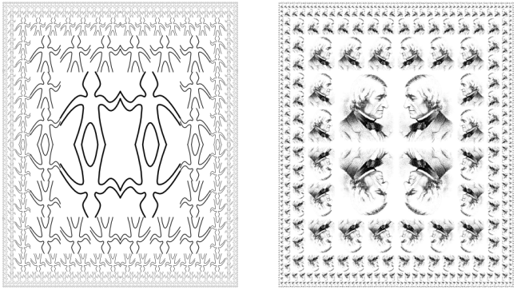
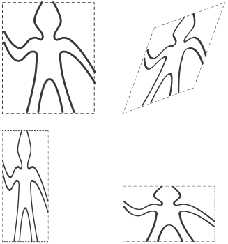
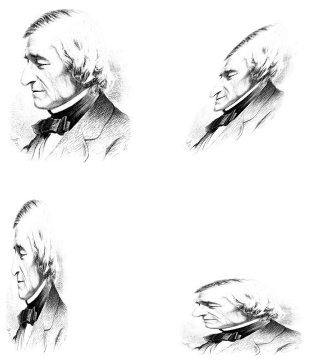
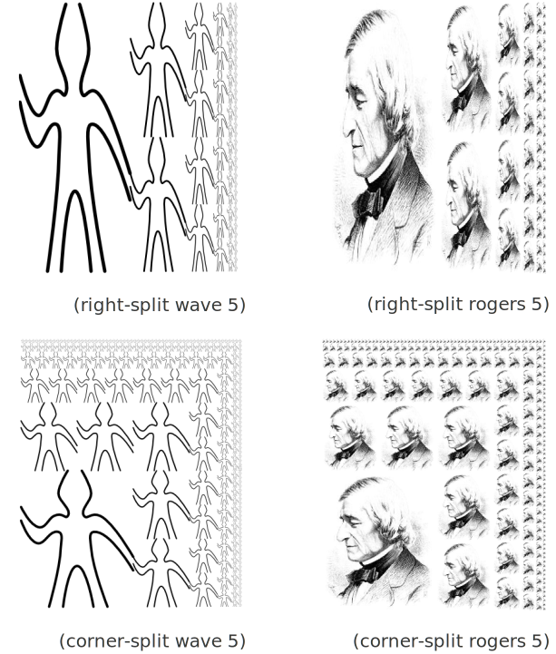
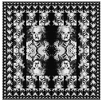

2.2 层次性数据和闭包性质
============================

一般来说, 某种组合数据对象的操作满足闭包性质, 那就是说, 通过它组合起数据对象得到的结果本身还可以通过同样的操作再进行组合。闭包性质是任何一种组合功能的威力的关键因素，因为它使我们能够建立起层次性的结构。

*2.2.1 序列的表示*
---------------------

通过 `list` 构建有表尾结束标记的序对的链。

::

  > (define one-through-four (list 1 2 3 4))
  > one-through-four
  (1 2 3 4)
  > (car one-through-four)
  1
  > (cdr one-through-four)
  (2 3 4)
  > (car (cdr one-through-four))
  2
  > (cons 10 one-through-four)
  (10 1 2 3 4)

**表操作**

.. code-block:: scheme

  ;; 返回表的第 n 项
  (define (list-ref items n)
    (if (= n 0)
        (car items)
        (list-ref (cdr items)
                  (- n 1))))

测试验证

::

  > (define squares (list 1 4 9 16 25))
  > (list-ref squares 3)
  16

`null?` 用于检查是否为空表, 基于其实现求表长的过程

.. code-block:: scheme

  (define (length items)
    (if (null? items)
        0
        (+ 1 (length (cdr items)))))

测试验证

::

  > (define odds (list 1 3 5 7))
  > (length odds)
  4

`length` 过程的迭代实现

.. code-block:: scheme

  (define (length items)
    (define (length-iter a count)
      (if (null? a)
          count
          (length-iter (cdr a)
                       (+ 1 count))))
    (length-iter items 0))

`append` 两个表合成一个新表的实现

.. code-block:: scheme

  (define (append list1 list2)
    (if (null? list1)
        list2
        (cons (car list1)
              (append (cdr list1)
                      list2))))

测试验证

::

  > (append squares odds)
  (1 4 9 16 25 1 3 5 7)
  > (append odds squares)
  (1 3 5 7 1 4 9 16 25)

*练习 2.17*
-------------

.. code-block:: scheme

  ;; 获取表的最后一项
  (define (last-pair items)
    (if (null? (cdr items))
        (car items)
        (last-pair (cdr items))))

测试验证

::

  > (last-pair squares)
  25
  > (last-pair odds)
  7
  > (last-pair (list 23 72 149 34))
  34

*练习 2.18*
--------------

.. code-block:: scheme

  ;; 翻转即为将列表第二个元素翻转再加上第一个元素
  (define (reverse items)
    (if (null? items)
        '()
        (append (reverse (cdr items)) (list (car items)))))

  ;; 翻转即为倒序取列表值再组合成新的列表
  (define (reverse items)
    (define (reverse-iter a n)
      (if (< n 0)
          '()
          (cons (list-ref a n) (reverse-iter a (- n 1)))))
    (reverse-iter items (- (length items) 1)))

*练习 2.19*
---------------

.. code-block:: scheme

  (define (first-denomination coin-values)
    (car coin-values))
  (define (except-first-denomination coin-values)
    (cdr coin-values))
  (define (no-more? coin-values)
    (null? coin-values))

改变 `coin-values` 的排列顺序并不会影响 `cc` 的结果, 因为在 `cc` 过程中递归的累加只用某种币值的兑换种数和除去这种币值后的兑换种数, 因此和次数无关

::

  > (define us-coins (list 50 25 10 5 1))
  > (cc 100 us-coins)
  292
  > (cc 100 (reverse us-coins))
  292

*练习 2.20*
---------------

.. code-block:: scheme

  (define (same-parity x . y)
    ;; 首先定义flag过程, 以判断传入的两个数是否奇偶性一致
    (define (flag a b)
      (= (remainder a 2) (remainder b 2)))
    ;; 然后在get-list过程中递归使用cdr取列表的剩余部分完成奇偶性检查
    (define (get-list items)
      (if (null? items)
          '()
          (if (flag x (car items))
              ;; 最后将满足条件的值拼接成列表
              (cons (car items) (get-list (cdr items)))
              (get-list (cdr items)))))
    (get-list (cons x y)))

测试验证

::

  > (same-parity 1 2 3 4 5 6 7)
  (1 3 5 7)
  > (same-parity 2 3 4 5 6 7)
  (2 4 6)

**对表的映射**

将某种变换应用于一个表的所有元素的示例

.. code-block:: scheme

  (define (scale-list items factor)
    (if (null? items)
        '()
        (cons (* (car items) factor)
              (scale-list (cdr items) factor))))

其将达到如下效果

::

  > (scale-list (list 1 2 3 4 5) 10)
  (10 20 30 40 50)

将其抽象为一般过程

.. code-block:: scheme

  ;; 为避免与系统自带的 map 过程冲突, 改个名字
  (define (my-map proc items)
    (if (null? items)
        '()
        (cons (proc (car items))
              (my-map proc (cdr items)))))

测试验证

::

  > (my-map abs (list -10 2.5 -11.5 17))
  (10 2.5 11.5 17)
  > (my-map (lambda (x) (* x x)) (list 1 2 3 4))
  (1 4 9 16)

然后基于 `my-map` 重新实现 `scale-list`

.. code-block:: scheme

  (define (scale-list items factor)
    (my-map (lambda (x) (* x factor)) items))

借助 `map` 为如何实现变换与如何提取表元素以及组合结果建立了抽象屏障, 对不同抽象层次的细节进行了分离。

*练习 2.21*
-------------

两种方式实现 `square-list`

.. code-block:: scheme

  (define (square-list items)
    (if (null? items)
        '()
        (cons (square (car items))
              (square-list (cdr items)))))

  (define (square-list items)
    (my-map (lambda (x) (* x x))
            items))

*练习 2.22*
------------

`Louis` 在组成新的结果时, 在 `cons` 的两个参数上搞反了, 调整之后因为对列表和数值直接结合导致出现如下结果

::

  (((((() . 1) . 4) . 9) . 16) . 25)

正确的修正方式应为: 将数值变换为列表然后再和之前的结果相加

.. code-block:: scheme

  (define (square-list items)
    (define (iter things answer)
      (if (null? things)
          answer
          (iter (cdr things)
                (append answer
                        (list (square (car things)))))))
    (iter items '()))

*练习 2.23*
--------------

.. code-block:: scheme

  (define (my-for-each proc items)
    (cond ((not (null? items))
           (proc (car items))
           (my-for-each proc (cdr items)))))

*2.2.2 层次性结构*
----------------------

把树看做这样一种序列: 它的元素也是序列。

通过递归处理树结构, 这里演示了统计树的叶子节点个数的过程

.. code-block:: scheme

  (define (count-leaves x)
    (cond ((null? x) 0)
          ((not (pair? x)) 1)
          (else (+ (count-leaves (car x))
                   (count-leaves (cdr x))))))

*练习 2.24*
-------------

::

  > (list 1 (list 2 (list 3 4)))
  (1 (2 (3 4)))

其树形结构为

::

       (1 (2 (3 4)))
        *
       / \
      /   \ (2 (3 4))
     1     *
          / \
         /   \ (3 4)
        2     *
             / \
            /   \
           3     4

*练习 2.25*
-------------

(1 3 (5 7) 9)

::

  > (define x (list 1 3 (list 5 7) 9))
  > (car (cdr (car (cdr (cdr x)))))
  7
  > (car (cdaddr x))
  7

((7))

::

  > (define x (list (list 7)))
  >  (car (car x))
  7
  > (caar x)
  7

(1 (2 (3 (4 (5 (6 7))))))

::

  > (define x (list 1 (list 2 (list 3 (list 4 (list 5 (list 6 7)))))))
  > (car (cdr (car (cdr (car (cdr (car (cdr (car (cdr (car (cdr x))))))))))))
  7
  > (cadadr (cadadr (cadadr x)))
  7

*练习 2.26*
------------

::

  > (define x (list 1 2 3))
  > (define y (list 4 5 6))
  > (append x y)
  (1 2 3 4 5 6)
  > (cons x y)
  ((1 2 3) 4 5 6)
  > (list x y)
  ((1 2 3) (4 5 6))

*练习 2.27*
-------------

仿照 `reverse` 过程进行实现

.. code-block:: scheme

  (define (deep-reverse items)
    (cond ((null? items) '())
          ((pair? (car items))
           (append (deep-reverse (cdr items))
                   (list (deep-reverse (car items)))))
          (else
           (append (deep-reverse (cdr items))
                   (list (car items))))))

测试验证

::

  > (define x (list (list 1 2) (list 3 4)))
  > x
  ((1 2) (3 4))
  > (reverse x)
  ((3 4) (1 2))
  > (deep-reverse x)
  ((4 3) (2 1))

*练习 2.28*
--------------

.. code-block:: scheme

  (define (fringe items)
    (cond ((null? items) '())
          ((not (pair? items)) (list items))
          (else
           (append (fringe (car items))
                   (fringe (cdr items))))))

测试验证

::

  > (define x (list (list 1 2) (list 3 4)))
  > x
  ((1 2) (3 4))
  > (fringe x)
  (1 2 3 4)
  > (fringe (list x x))
  (1 2 3 4 1 2 3 4)

*练习 2.29*
---------------

a)

.. code-block:: scheme

  (define (make-mobile left right)
    (list left right))

  (define (make-branch length structure)
    (list length structure))

  ;; 根据上面构造函数来构建选择函数
  (define (left-branch mobile)
    (car mobile))

  (define (right-branch mobile)
    (cadr mobile))

  (define (branch-length branch)
    (car branch))

  (define (branch-structure branch)
    (cadr branch))

b)

.. code-block:: scheme

  ;; 先检查是不是二叉活动体,如果是则递归求两个分支的重量
  ;; 再检查分支的structure是否仍然是活动体, 如果是则递归求structure的重量
  ;; 最后对于最简单的分支情况直接相加重量
  (define (total-weight mobile)
    (define (mobile-flag m)
      (pair? (left-branch m)))
    (define (branch-flag m)
      (pair? (branch-structure m)))
    (define (total-weight-iter m tw)
      (cond ((null? m) tw)
            ((mobile-flag m) (+ (total-weight-iter (left-branch m) tw)
                                (total-weight-iter (right-branch m) tw)))
            ((branch-flag m) (+ (total-weight-iter (branch-structure m) tw)))
            (else (+ tw (branch-structure m)))))
    (total-weight-iter mobile 0))

测试验证

::

  > (define m (make-mobile (make-branch 10 12) (make-branch 10 18)))
  > (define n (make-mobile (make-branch 10 m) (make-branch 10 10)))
  > m
  ((10 12) (10 18))
  > n
  ((10 ((10 12) (10 18))) (10 10))
  > (total-weight m)
  30
  > (total-weight n)
  40

另外还可以将全部重量看成是两个分值的重量之和

.. code-block:: scheme

  (define (total-weight mobile)
    (+ (branch-weight (left-branch mobile))
       (branch-weight (right-branch mobile))))

然后再对活动体求重量即可

.. code-block:: scheme

  (define (branch-weight branch)
    (if (pair? (branch-structure branch))
        (total-weight (branch-structure branch))
        (branch-structure branch)))

c)

.. code-block:: scheme

  ;; 首先定义分支的力矩
  (define (branch-value branch)
    (* (branch-length branch)
       (branch-weight branch)))

  ;; 然后实现活动体的检测过程:两个分支平衡且两个分支的力矩相等
  (define (check-balance mobile)
    (if (pair? (left-branch mobile))
        (and (check-balance (left-branch mobile))
             (check-balance (right-branch mobile))
             (= (branch-value (left-branch mobile))
                (branch-value (right-branch mobile))))
        #t))

测试验证

::

  > (define bm (make-mobile (make-branch 10 10) (make-branch 10 10)))
  > bm
  ((10 10) (10 10))
  > (check-balance bm)
  #t
  > m
  ((10 12) (10 18))
  > (check-balance m)
  #f

d)

只需要修改对应的选择函数即可

.. code-block:: scheme

  (define (left-branch mobile)
    (car mobile))

  (define (right-branch mobile)
    (cdr mobile))

  (define (branch-length branch)
    (car branch))

  (define (branch-structure branch)
    (cdr branch))

测试验证

::

  > (define bm (make-mobile (make-branch 10 10) (make-branch 10 10)))
  > bm
  ((10 . 10) 10 . 10)
  > (check-balance bm)
  #t

**对树的映射**

基于 `map` 对树做与 `scale-list` 类似的操作

.. code-block:: scheme

  (define (scale-tree tree factor)
    (cond ((null? tree) '())
          ((not (pair? tree))
           (* tree factor))
          (else
           (cons (scale-tree (car tree)
                             factor)
                 (scale-tree (cdr tree)
                             factor)))))

  ;; 使用 map 来实现相同的功能
  (define (scale-tree tree factor)
    (map (lambda (sub-tree)
           (if (pair? sub-tree)
               (scale-tree sub-tree factor)
               (* sub-tree factor)))
         tree))

*练习 2.30*
-------------

.. code-block:: scheme

  ;; 指定定义
  (define (square-tree tree)
    (cond ((null? tree) '())
          ((not (pair? tree)) (* tree tree))
          (else (cons (square-tree (car tree))
                      (square-tree (cdr tree))))))

  ;; 通过 map
  (define (square-tree tree)
    (map (lambda (sub-tree)
           (if (pair? sub-tree)
               (square-tree sub-tree)
               (* sub-tree sub-tree)))
         tree))

测试验证

::

  > (square-tree (list 1 (list 2 (list 3 4) 5) (list 6 7)))
  (1 (4 (9 16) 25) (36 49))

*练习 2.31*
-------------

.. code-block:: scheme

  ;; 直接将上面的 square 替换为参数即可
  (define (tree-map proc tree)
    (map (lambda (sub-tree)
           (if (pair? sub-tree)
               (tree-map proc sub-tree)
               (proc sub-tree)))
         tree))

  (define (square-tree tree)
    (tree-map square tree))

*练习 2.32*
-------------

.. code-block:: scheme

  ;; 仿照换零钱的例子
  ;; rest取不包含(car s)元素的所有剩余元素的组合
  ;; 则应加上(car s)元素与所有剩余元素的组合
  (define (subsets s)
    (if (null? s)
        (list '())
        (let ((rest (subsets (cdr s))))
          (append rest
                  (map (lambda (sub-tree)
                         (append (list (car s))
                                 sub-tree))
                       rest)))))

测试验证

::

  > (subsets (list 1 2 3))
  (() (3) (2) (2 3) (1) (1 3) (1 2) (1 2 3))

*2.2.3 序列作为一种约定的接口*
------------------------------

计算一棵树中叶子值为奇数的平方和

.. code-block:: scheme

  (define (sum-odd-squares tree)
    (cond ((null? tree) 0)
          ((not (pair? tree))
           (if (odd? tree) (square tree) 0))
          (else (+ (sum-odd-squares (car tree))
                   (sum-odd-squares (cdr tree))))))

测试验证

::

  > (sum-odd-squares (list 1 2 (list 3 4) 5))
  35

由前 `n` 项斐波那契数中的偶数构成的表

.. code-block:: scheme

  (define (even-fibs n)
    (define (next k)
      (if (> k n)
          '()
          (let ((f (fib k)))
            (if (even? f)
                (cons f (next (+ k 1)))
                (next (+ k 1))))))
    (next 0))

测试验证

::

  > (even-fibs 10)
  (0 2 8 34)

上面两个过程的共通之处在于:

1. 从一个枚举器开始, 枚举给定范围内的所有元素作为“信号”
2. 对每个信息经过一个特定的判断
3. 对满足条件的“信号”进行特定的处理
4. 基于某个规则积累得到的结果

**序列操作**

过滤器的实现

.. code-block:: scheme

  (define (filter predicate sequence)
    (cond ((null? sequence) '())
          ((predicate (car sequence))
           (cons (car sequence)
                 (filter predicate (cdr sequence))))
          (else (filter predicate (cdr sequence)))))

测试验证

::

  > (filter odd? (list 1 2 3 4 5))
  (1 3 5)

积累器的实现

.. code-block:: scheme

  (define (accumulate op initial sequence)
    (if (null? sequence)
        initial
        (op (car sequence)
            (accumulate op initial (cdr sequence)))))

测试验证

::

  > (accumulate + 0 (list 1 2 3 4 5))
  15
  > (accumulate * 1 (list 1 2 3 4 5))
  120
  > (accumulate cons '() (list 1 2 3 4 5))
  (1 2 3 4 5)

枚举器的实现

.. code-block:: scheme

  ;; 数值区间枚举器
  (define (enumerate-interval low high)
    (if (> low high)
        '()
        (cons low
              (enumerate-interval (+ low 1) high))))
  ;; 树的枚举器
  (define (enumerate-tree tree)
    (cond ((null? tree) '())
          ((not (pair? tree)) (list tree))
          (else
           (append
            (enumerate-tree (car tree))
            (enumerate-tree (cdr tree))))))

测试验证

::

  > (enumerate-interval 2 7)
  (2 3 4 5 6 7)
  > (enumerate-tree (list 1 (list 2 (list 3 4)) 5))
  (1 2 3 4 5)

利用上面实现的枚举器、过滤器、积累器重新构建 `sum-odd-squares` 和 `even-fibs`

.. code-block:: scheme

  (define (sum-odd-squares tree)
    (accumulate +
                0
                (map square
                     (filter odd?
                             (enumerate-tree tree)))))
  (define (even-fibs n)
    (accumulate cons
                '()
                (filter even?
                        (map fib
                             (enumerate-interval 0 n)))))

测试验证

::

  > (sum-odd-squares (list 1 2 (list 3 4) 5))
  35
  > (even-fibs 10)
  (0 2 8 34)

仿照上面的实现, 构造一个前 `n + 1` 个斐波那契数的平方的过程

.. code-block:: scheme

  (define (list-fib-squares n)
    (accumulate cons
                '()
                (map square
                     (map fib
                          (enumerate-interval 0 n)))))

生成一个序列中所有奇数的平方之乘积的过程

.. code-block:: scheme

  (define (product-of-squares-of-odd-elements sequence)
    (accumulate *
                1
                (map square
                     (filter odd?
                             sequence))))

*练习 2.33*
-------------

.. code-block:: scheme

  ;; map 过程即为使用过程 p 作用 x, 然后再合并作用 y 后的结果
  (define (map p sequence)
    (accumulate (lambda (x y) (cons (p x) y)) '() sequence))

  ;; append 过程为合并两个列表, 则初始值为空表, 要传入的列表为枚举两个参数列表的元素组成的列表
  (define (append seq1 seq2)
    (accumulate cons '() (enumerate-tree (list seq1 seq2))))

  ;; length 过程即为在 y 参数不为空时将长度递增
  (define (length sequence)
    (accumulate (lambda (x y) (+ 1 y))  0 sequence))

*练习 2.34*
-------------

.. code-block:: scheme

  (define (horner-eval x coefficient-sequence)
    (accumulate
     (lambda (this-coeff higher-terms)
       (+ this-coeff
          (* higher-terms x)))
     0
     coefficient-sequence))

测试验证

::

  > (horner-eval 2 (list 1 3 0 5 0 1))
  79

*练习 2.35*
--------------

.. code-block:: scheme

  (define (count-leaves t)
    (accumulate +
                0
                (map (lambda (x) 1) (enumerate-tree t))))

*练习 2.36*
-------------

.. code-block:: scheme

  ;; 这里关键是从序列的序列中依次取第一个、第二个、第 N 个元素
  ;; 则应首先枚举序列中的每个序列, 检测非空, 分别取首元素
  ;; 即 (map car (filter pair? seqs))
  (define (accumulate-n op init seqs)
    (if (null? (car seqs))
        '()
        (cons (accumulate op init (map car (filter pair? seqs)))
              (accumulate-n op init (map cdr (filter pair? seqs))))))

测试验证

::

  > (accumulate-n + 0 (list (list 1 2 3) (list 4 5 6) (list 7 8 9) (list 10 11 12)))
  (22 26 30)

*练习 2.37*
--------------

.. code-block:: scheme

  ;; 向量的点积
  (define (dot-product v w)
    (accumulate + 0 (map * v w)))

  ;; 矩阵与向量的乘法即为矩阵中的每一行与向量做 dot-product
  (define (matrix-*-vector m v)
    (map (lambda (w) (dot-product v w)) m))

  ;; 矩阵转置即为分别取矩阵相同行的相同列组成新的行
  (define (transpose mat)
    (accumulate-n cons '() mat))

  ;; 矩阵乘法即为第一个矩阵的转置与第二个矩阵中的每一行做 matrix-*-vector
  (define (matrix-*-matrix m n)
    (let ((cols (transpose n)))
      (map (lambda (w) (matrix-*-vector cols w)) m)))

测试验证

::

  > (define m (list (list 1 2 3 4) (list 4 5 6 6) (list 6 7 8 9)))
  > m
  ((1 2 3 4) (4 5 6 6) (6 7 8 9))
  > (define v (list 1 2 3 4))
  > v
  (1 2 3 4)
  > (define w (list 5 6 7 8))
  > w
  (5 6 7 8)
  > (dot-product v w)
  70
  > (matrix-*-vector m v)
  (30 56 80)
  > (define n (transpose m))
  > n
  ((1 4 6) (2 5 7) (3 6 8) (4 6 9))
  > (matrix-*-matrix m n)
  ((30 56 80) (56 113 161) (80 161 230))

*练习 2.38*
-------------

.. code-block:: scheme

  (define (fold-left op initial sequence)
    (define (iter result rest)
      (if (null? rest)
          result
          (iter (op result (car rest))
                (cdr rest))))
    (iter initial sequence))

::

  > (define fold-right accumulate)
  > (fold-right / 1 (list 1 2 3))
  3/2
  > (fold-left / 1 (list 1 2 3))
  1/6
  > (fold-right list '() (list 1 2 3))
  (1 (2 (3 ())))
  > (fold-left list '() (list 1 2 3))
  (((() 1) 2) 3)

因为这两种方式的不同之处在于对结果的累加方式，因为如果对于op，如果满足交换律则两种方式处理的结果相同

::

  > (fold-right + 0 (list 1 2 3 4))
  10
  > (fold-left + 0 (list 1 2 3 4))
  10
  > (fold-right * 1 (list 1 2 3 4))
  24
  > (fold-left * 1 (list 1 2 3 4))
  24

*练习 2.39*
------------

.. code-block:: scheme

  (define (reverse sequence)
    (fold-right (lambda (x y) (append y (list x))) '() sequence))

  (define (reverse sequence)
    (fold-left (lambda (x y) (append (list y) x)) '() sequence))

**嵌套映射**

给定自然数 `n`, 找出所有不同的有序对 `i` 和 `j`, 其中 :math:`1 \le i < j \le n`, 使得 :math:`i + j` 是素数。

处理流程: 首先生成出所有小于等于 `n` 的正自然数的有序对; 而后通过过滤, 得到那些和为素数的有序对; 最后对每个通过了过滤的序对 `(i, j)`, 产生出一个三元组 `(i, j, i + j)`

生成 `n` 为 `6` 时的序对

.. code-block:: scheme

  (define n 6)
  (accumulate
   append
   '()
   (map (lambda (i)
          (map (lambda (j)
                 (list i j))
               (enumerate-interval 1 (- i 1))))
        (enumerate-interval 1 n)))

  ;; ((2 1) (3 1) (3 2) (4 1) (4 2) (4 3) (5 1) (5 2) (5 3) (5 4) (6 1) (6 2) (6 3) (6 4) (6 5))

将以上过程抽象为 `flatmap`

.. code-block:: scheme

  (define (flatmap proc seq)
    (accumulate append '() (map proc seq)))

然后实现对序对之和是否为素数的校验

.. code-block:: scheme

  (define (prime-sum? pair)
    (prime? (+ (car pair) (cadr pair))))

最后对满足条件的序对构建三元组

.. code-block:: scheme

  (define (make-pair-sum pair)
    (list (car pair)
          (cadr pair)
          (+ (car pair) (cadr pair))))

将上面的过程组合在一起, 得到了最终的过程

.. code-block:: scheme

  (define (prime-sum-pairs n)
    (map make-pair-sum
         (filter
          prime-sum?
          (flatmap
           (lambda (i)
             (map (lambda (j) (list i j))
                  (enumerate-interval 1 (- i 1))))
           (enumerate-interval 1 n)))))

测试验证

::

  > (prime-sum-pairs 6)
  ((2 1 3) (3 2 5) (4 1 5) (4 3 7) (5 2 7) (6 1 7) (6 5 11))

得到集合 `S` 的所有排列

.. code-block:: scheme

  (define (permutations s)
    (if (null? s)
        (list '())
        ;; 1. 遍历 s 中的每一个 x
        (flatmap (lambda (x)
                   ;; 3. 将 x 加在每个 s - x 的所有排列的序列的前面
                   (map (lambda (p) (cons x p))
                        ;; 2. 递归生成 s - x 的所有排列的序列
                        (permutations (remove x s))))
                 s)))

  ;; remove 操作即返回不包含指定项的列表
  (define (remove item sequence)
    (filter (lambda (x) (not (= x item)))
            sequence))

测试验证

::

  > (permutations (list 1 2 3))
  ((1 2 3) (1 3 2) (2 1 3) (2 3 1) (3 1 2) (3 2 1))

*练习 2.40*
-------------

直接将前面的过程封装即可

.. code-block:: scheme

  (define (unique-pairs n)
    (flatmap (lambda (i)
               (map (lambda (j) (list i j))
                    (enumerate-interval 1 (- i 1))))
             (enumerate-interval 1 n)))

  (define (prime-sum-pairs n)
    (map make-pair-sum (filter prime-sum? (unique-pairs n))))

*练习 2.41*
--------------

构建三元组即为在二元组的基础上进行组合
如 `n` 为 `6` 的三元组即为 `6` 与 `5` 的二元组的组合
即 `(cons i (unique-pairs (- i 1))`

所以构建三元组的过程为

.. code-block:: scheme

  (define (unique-pairs-new n)
    (flatmap (lambda (i)
               (map (lambda (j) (cons i j))
                    (unique-pairs (- i 1))))
               (enumerate-interval 1 n)))

测试验证

::

  > (unique-pairs-new 6)
  ((3 2 1) (4 2 1) (4 3 1) (4 3 2) (5 2 1) (5 3 1) (5 3 2)
   (5 4 1) (5 4 2) (5 4 3) (6 2 1) (6 3 1) (6 3 2) (6 4 1)
   (6 4 2) (6 4 3) (6 5 1) (6 5 2) (6 5 3) (6 5 4))

过滤三元组的过程为

.. code-block:: scheme

  (define (s-sum? pair s)
    (= s (accumulate + 0 pair)))

组合在一起即为

.. code-block:: scheme

  (define (s-sum-pairs n s)
    (define (unique-pairs-new n)
      (flatmap (lambda (i)
                 (map (lambda (j) (cons i j))
                      (unique-pairs (- i 1))))
               (enumerate-interval 1 n)))
    (define (equal-s? pair)
      (= s (accumulate + 0 pair)))
    (filter equal-s? (unique-pairs-new n)))

测试验证

::

  > (s-sum-pairs 6 6)
  ((3 2 1))
  > (s-sum-pairs 6 8)
  ((4 3 1) (5 2 1))
  > (s-sum-pairs 10 9)
  ((4 3 2) (5 3 1) (6 2 1))

*练习 2.42*
------------

首先实现对棋盘定义的相关过程

.. code-block:: scheme

  ;; 初始化 n 阶棋盘的一列
  (define (matrix-seqs n)
    (define (iter seqs i)
      (if (< i n)
          (iter (cons 0 seqs) (+ i 1))
          seqs))
    (iter '() 0))
  ;; 构造 n 阶棋盘
  (define (matrix-n n)
    (define (matrix-iter matrix i)
      (if (< i n)
          (matrix-iter (cons (matrix-seqs n) matrix)
                       (+ i 1))
          matrix))
    (matrix-iter '() 0))

测试验证

::

  > (matrix-n 4)
  ((0 0 0 0) (0 0 0 0) (0 0 0 0) (0 0 0 0))
  > (matrix-n 8)
  ((0 0 0 0 0 0 0 0) (0 0 0 0 0 0 0 0) (0 0 0 0 0 0 0 0) (0 0 0 0 0 0 0 0)
   (0 0 0 0 0 0 0 0) (0 0 0 0 0 0 0 0) (0 0 0 0 0 0 0 0) (0 0 0 0 0 0 0 0))

然后构造在已有格局的基础上追加一列的过程

.. code-block:: scheme

  ;; 以4阶棋盘为例
  ;; 0 0 0 0
  ;; 1 0 0 0
  ;; 0 0 0 0
  ;; 0 1 0 0
  ;; 此时有 n=4, k=3
  ;; 则新的格局应为:
  ;;   已经安全的前 k-1 列 +
  ;;   需要循环检测每行安全性的第 k 列 +
  ;;   暂时为空值的后 n-k 列

  ;; 构造为空值的后(n-k)列
  (define (cdr-rest n k)
    (if (= k n)
        '()
        (cons (matrix-seqs n) (cdr-rest n (+ k 1)))))

  ;; 构造需要检测的第k列, 其中第row行的值设为1
  (define (make-rest n row)
    (define x (- (+ n 1) row))
    (define (rest-iter seqs i)
      (if (> i n)
          seqs
          (if (= i x)
              (rest-iter (cons 1 seqs) (+ i 1))
              (rest-iter (cons 0 seqs) (+ i 1)))))
    (rest-iter '() 1))

  ;; 将三者组合在一起构造出新的格局
  (define (adjoin-position new-row k rest-of-queens)
    (define n (length (car rest-of-queens)))
    (define cdr-position (cons (make-rest n new-row) (cdr-rest n k)))
    (define x (- k 1))
    (define (iter i result)
      (if (> i 0)
          (iter (- i 1) (cons (list-ref rest-of-queens (- i 1)) result))
          result))
    (iter x cdr-position))

测试验证

::

  > (adjoin-position 1 4 (list (list 0 1 0 0) (list 0 0 0 1) (list 1 0 0 0) (list 0 0 0 0)))
  ((0 1 0 0) (0 0 0 1) (1 0 0 0) (1 0 0 0))

最后完成安全性的检测

.. code-block:: scheme

  ;; 在一列中查找皇后所在的行数
  (define (find seqs)
    (define (iter i)
      (if (= (list-ref seqs i) 1)
          i
          (iter (+ i 1))))
    (iter 0))

  ;; 根据新格局中新添加的皇后的位置与已有的皇后位置进行冲突检测
  (define (safe? k positions)
    (define n (length (car positions)))
    (define seq-k (list-ref positions (- k 1)))
    (define row-k (find seq-k))
    (define (iter i)
      (define seq-i (list-ref positions (- i 1)))
      (define row-i (find seq-i))
      (if (= k i)
          #t
          (if (= row-i row-k)
              #f
              (if (or (= (+ i row-i) (+ k row-k))
                      (= (- i row-i) (- k row-k)))
                  #f
                  (iter (+ i 1))))))
      (iter 1))

这样即可实现对 `n` 阶棋盘的求解

.. code-block:: scheme

  (define (queens board-size)
    (define empty-board (matrix-n board-size))
    (define (queen-cols k)
      (if (= k 0)
          (list empty-board)
          (filter
           (lambda (positions) (safe? k positions))
           (flatmap
            (lambda (rest-of-queens)
              (map (lambda (new-row)
                     (adjoin-position new-row k rest-of-queens))
                   (enumerate-interval 1 board-size)))
            (queen-cols (- k 1))))))
    (queen-cols board-size))

  ;; 实现一个打印结果的辅助过程
  (define (matrix-list-print matrix-list)
    (if (null? matrix-list)
        (newline)
        (and (matrix-print (car matrix-list))
             (matrix-list-print (cdr matrix-list)))))

  (define (matrix-print matrix)
    (if (null? matrix)
        (newline)
        (and (and (display (car matrix))
                  (newline))
             (matrix-print (cdr matrix)))))

测试验证

::

  > (matrix-list-print (queens 4))
  (0 1 0 0)
  (0 0 0 1)
  (1 0 0 0)
  (0 0 1 0)

  (0 0 1 0)
  (1 0 0 0)
  (0 0 0 1)
  (0 1 0 0)

  > (matrix-list-print (queens 5))
  (1 0 0 0 0)
  (0 0 1 0 0)
  (0 0 0 0 1)
  (0 1 0 0 0)
  (0 0 0 1 0)

  (1 0 0 0 0)
  (0 0 0 1 0)
  (0 1 0 0 0)
  (0 0 0 0 1)
  (0 0 1 0 0)

  (0 1 0 0 0)
  (0 0 0 1 0)
  (1 0 0 0 0)
  (0 0 1 0 0)
  (0 0 0 0 1)

  (0 1 0 0 0)
  (0 0 0 0 1)
  (0 0 1 0 0)
  (1 0 0 0 0)
  (0 0 0 1 0)

  (0 0 1 0 0)
  (1 0 0 0 0)
  (0 0 0 1 0)
  (0 1 0 0 0)
  (0 0 0 0 1)

  (0 0 1 0 0)
  (0 0 0 0 1)
  (0 1 0 0 0)
  (0 0 0 1 0)
  (1 0 0 0 0)

  (0 0 0 1 0)
  (1 0 0 0 0)
  (0 0 1 0 0)
  (0 0 0 0 1)
  (0 1 0 0 0)

  (0 0 0 1 0)
  (0 1 0 0 0)
  (0 0 0 0 1)
  (0 0 1 0 0)
  (1 0 0 0 0)

  (0 0 0 0 1)
  (0 1 0 0 0)
  (0 0 0 1 0)
  (1 0 0 0 0)
  (0 0 1 0 0)

  (0 0 0 0 1)
  (0 0 1 0 0)
  (1 0 0 0 0)
  (0 0 0 1 0)
  (0 1 0 0 0)

*练习 2.43*
--------------

交换前

求解 `(queens n)` 会递归调用 `(queen-cols n)`, 直到 `k=0`, 得到 `n` 阶空棋盘

然后在第一列的第 `i` 行添加皇后作为新的格局, 共 `n` 种格局, 保留通过安全检测的格局

然后依次处理第 `i` 列, 共 `n` 列

所以这里共调用 `queen-cols` 过程 `n` 次

交换后

求解 `(queen n)` 时会递归调用 `(queen-cols n)`

而 `(queen-cols n)` 过程将递归调用嵌套在了嵌套映射中

因此 `queen-cols` 将会被调用 n :sup:`n` 次

所以 `Louis` 的方法将会是原来的 N :sup:`(N-1)` 倍

*2.2.4 实例: 一个图形语言*
--------------------------

利用图形语言生成的各种设计

**图形语言**

画家 `wave` 相对于 4 个不同的框架产生的图像

画家 `rogers` 相对于 `wave` 使用同样的框架产生的图像

其中 `MIT` 创始人的介绍可以参见:`William Barton Rogers <https://en.wikipedia.org/wiki/William_Barton_Rogers>`_

通过过程而不是表结构来组合复杂的数据

.. code-block:: scheme

  ;; flip-vert 生成一个将画家所画图像上下颠倒的画家
  ;; beside 以两个画家为参数, 生成一个复合的画家, 两个画家的图像分别放在框架的左右半边
  (define wave2 (beside wave (flip-vert wave)))

  ;; below 以两个画家为参数, 生成一个复合的画家, 两个画家的图像分别放在框架的上下半边
  (define wave4 (below wave2 wave2))

.. figure:: fig/Fig2.12.std.svg

通过 `wave` 生成的复杂图像

根据基本操作抽象出 `wave4` 的过程

.. code-block:: scheme

  (define (flipped-pairs painter)
    (let ((painter2 (beside painter (flip-vert painter))))
      (below painter2 painter2)))

  (define wave4 (flipped-pairs wave))

递归的对图形的右边做分隔和分支

.. code-block:: scheme

  (define (right-split painter n)
    (if (= n 0)
        painter
        (let ((smaller (right-split painter (- n 1))))
          (beside painter (below smaller smaller)))))

递归的对图形的上边和右边做分隔和分支

.. code-block:: scheme

  (define (corner-split painter n)
    (if (= n 0)
        painter
        (let ((up (up-split painter (- n 1)))
              (right (right-split painter (- n 1))))
          (let ((top-left (beside up up))
                (bottom-right (below right right))
                (corner (corner-split painter (- n 1))))
            (beside (below painter top-left)
                    (below bottom-right corner))))))

`right-split` 与 `corner-split` 的效果

为了生成章节开始时的那张图像的画家, 需要实现 `square-limit`

.. code-block:: scheme

  (define (square-limit painter n)
    (let ((quarter (corner-split painter n)))
      (let ((half (beside (flip-horiz quarter)
                          quarter)))
        (below (flip-vert half) half))))

*练习 2.44*
-------------

实现 `up-split` 过程

.. code-block:: scheme

  (define (up-split painter n)
    (if (= n 0)
        painter
        (let ((smaller (up-split painter (- n 1))))
          (below painter (beside smaller smaller)))))

**高阶操作**

高阶操作即将前面对画家的组合模式看做是对一个画家进行操作变换并把结果放到一个正方形内左上角、右上角、左下角、右下角。

.. code-block:: scheme

  (define (square-of-four tl tr bl br)
    (lambda (painter)
      (let ((top (beside (tl painter)
                         (tr painter)))
            (bottom (beside (bl painter)
                            (br painter))))
        (below bottom top))))

然后基于这个高阶抽象过程对前面的 `flipped-pairs` 和 `square-limit` 重新实现

.. code-block:: scheme

  (define (flipped-pairs painter)
    (let ((combine4
           (square-of-four identity
                           flip-vert
                           identity
                           flip-vert)))
      (combine4 painter)))

  (define (square-limit painter n)
    (let ((combine4
           (square-of-four flip-horiz
                           identity
                           rotate180
                           flip-vert)))
      (combine4 (corner-split painter n))))

*练习 2.45*
-------------

.. code-block:: scheme

  (define (split p1 p2)
    (lambda (painter)
      (let ((new (p2 painter painter)))
        (p1 painter new))))

**框架**

.. figure:: fig/Fig2.15a.std.svg

描述框架的三个向量: 一个基准向量和两个角向量

框架的坐标映射

.. code-block:: scheme

  (define (frame-coord-map frame)
    (lambda (v)
      (add-vect
       (origin-frame frame)
       (add-vect
        (scale-vect (xcor-vect v)
                    (edge1-frame frame))
        (scale-vect (ycor-vect v)
                    (edge2-frame frame))))))

*练习 2.46*
---------------

.. code-block:: scheme

  ;; 向量的构造函数和选择函数
  (define (make-vect x y)
    (cons x y))
  (define (xcor-vect vect)
    (car vect))
  (define (ycor-vect vect)
    (cdr vect))

  ;; 向量的加减和伸缩
  (define (add-vect vect1 vect2)
    (make-vect (+ (xcor-vect vect1) (xcor-vect vect2))
               (+ (ycor-vect vect1) (ycor-vect vect2))))
  (define (sub-vect vect1 vect2)
    (make-vect (- (xcor-vect vect1) (xcor-vect vect2))
               (- (ycor-vect vect1) (ycor-vect vect2))))
  (define (scale-vect s vect)
    (make-vect (* s (xcor-vect vect))
               (* s (ycor-vect vect))))

*练习 2.47*
-------------

.. code-block:: scheme

  ;; 针对list方式
  (define (make-frame origin edge1 edge2)
    (list origin edge1 edge2))
  (define (origin-frame frame)
    (car frame))
  (define (edge1-frame frame)
    (cadr frame))
  (define (edge2-frame frame)
    (caddr frame))

  ;; 针对cons方式
  (define (make-frame origin edge1 edge2)
    (cons origin (cons edge1 edge2)))
  (define (origin-frame frame)
    (car frame))
  (define (edge1-frame frame)
    (cadr frame))
  (define (edge2-frame frame)
    (cddr frame))

**画家**

一个画家被表示为一个过程, 给了它一个框架作为实际参数, 它就能通过恰当的位移和伸缩, 画出一幅与这个框架匹配的画像。

假如存在过程 `draw-line` 可以在屏幕两个定点之间画直线, 则 `wave` 画家可以由如下过程实现

.. code-block:: scheme

  (define (segments->painter segment-list)
    (lambda (frame)
      (for-each
       (lambda (segment)
         (draw-line
          ((frame-coord-map frame)
           (start-segment segment))
          ((frame-coord-map frame)
           (end-segment segment))))
       segment-list)))

*练习 2.48*
--------------

.. code-block:: scheme

  (define (make-segment s-vect e-vect)
    (cons s-vect e-vect))
  (define (start-segment segment)
    (car segment))
  (define (end-segment segment)
    (cdr segment))

*练习 2.49*
-------------

.. code-block:: scheme

  ;; 指定边界
  (define outline-segments
    (list
      (make-segment (make-vect 0 0) (make-vect 0 1))
      (make-segment (make-vect 0 1) (make-vect 1 1))
      (make-segment (make-vect 1 1) (make-vect 1 0))
      (make-segment (make-vect 1 0) (make-vect 0 0))))

  ;; 画出给定框架边界的画家
  (define outline-painter (segments-painter outline-segments))

  ;; 对角线
  (define diagonal-segments
    (list
      (make-segment (make-vect 0 0) (make-vect 1 1))
      (make-segment (make-vect 0 1) (make-vect 1 0))))

  ;; 画出给定框架对角线的画家
  (define diagonal-painter (segments-painter diagonal-segments))

  ;; 各个边的中点
  (define diamonds-segments
    (list
      (make-segment (make-vect 0.0 0.5) (make-vect 0.5 1.0))
      (make-segment (make-vect 0.5 1.0) (make-vect 1.0 0.5))
      (make-segment (make-vect 1.0 0.5) (make-vect 0.5 0.0))
      (make-segment (make-vect 0.5 0.0) (make-vect 0.0 0.5))))

  ;; 画出连接给定框架各边中点构成菱形的画家
  (define diamonds-painter (segments-painter diamonds-segments))

**画家的变换和组合**

画家的变换

.. code-block:: scheme

  (define (transform-painter painter origin corner1 corner2)
    (lambda (frame)
      (let ((m (frame-coord-map frame)))
        (let ((new-origin (m origin)))
          (painter (make-frame new-origin
                    (sub-vect (m corner1)
                              new-origin)
                    (sub-vect (m corner2)
                              new-origin)))))))

根据 `transform-painter` 实现 `flip-vert`

.. code-block:: scheme

  (define (flip-vert painter)
    (transform-painter
     painter
     (make-vect 0.0 1.0)   ; new origin
     (make-vect 1.0 1.0)   ; new end of edge1
     (make-vect 0.0 0.0))) ; new end of edge2

根据 `transform-painter` 实现将自身缩放到给定框架右上角的四分之一区域内

.. code-block:: scheme

  (define (shrink-to-upper-right painter)
    (transform-painter painter
                       (make-vect 0.5 0.5)
                       (make-vect 1.0 0.5)
                       (make-vect 0.5 1.0)))

根据 `transform-painter` 实现对逆时针旋转九十度

.. code-block:: scheme

  (define (rotate90 painter)
    (transform-painter painter
                       (make-vect 1.0 0.0)
                       (make-vect 1.0 1.0)
                       (make-vect 0.0 0.0)))

根据 `transform-painter` 实现向中心收缩

.. code-block:: scheme

  (define (squash-inwards painter)
    (transform-painter painter
                       (make-vect 0.0 0.0)
                       (make-vect 0.65 0.35)
                       (make-vect 0.35 0.65)))

基于 `transform-painter` 实现画家的组合

.. code-block:: scheme

  (define (beside painter1 painter2)
    (let ((split-point (make-vect 0.5 0.0)))
      (let ((paint-left  (transform-painter
                          painter1
                          (make-vect 0.0 0.0)
                          split-point
                          (make-vect 0.0 1.0)))
            (paint-right (transform-painter
                          painter2
                          split-point
                          (make-vect 1.0 0.0)
                          (make-vect 0.5 1.0))))
        (lambda (frame)
          (paint-left frame)
          (paint-right frame)))))

*练习 2.50*
-------------

.. code-block:: scheme

  ;; 左右反转
  (define (flip-horiz painter)
    (transform-painter painter
                       (make-vect 1.0 0.0)
                       (make-vect 0.0 0.0)
                       (make-vect 1.0 1.0)))

  ;; 逆时针一百八十度旋转
  (define (rotate180 painter)
    (transform-painter painter
                       (make-vect 1.0 1.0)
                       (make-vect 0.0 1.0)
                       (make-vect 1.0 0.0)))

  ;; 逆时针二百七十度旋转
  (define (rotate270 painter)
    (transform-painter painter
                       (make-vect 1.0 0.0)
                       (make-vect 1.0 1.0)
                       (make-vect 0.0 0.0)))

*练习 2.51*
------------

.. code-block:: scheme

  (define (below painter1 painter2)
    (let ((split-point (make-vect 0.0 0.5)))
      (let ((paint-up
             (transform-painter
              painter2
              (make-vect 0.0 0.0)
              (make-vect 1.0 0.0)
              split-point))
            (paint-down
             (transform-painter
              painter1
              split-point
              (make-vect 1.0 0.5)
              (make-vect 0.0 1.0))))
        (lambda (frame)
          (paint-up frame)
          (paint-down frame)))))

  (define (below painter1 painter2)
    (rotate90 (beside (rotate270 painter1) (rotate270 painter2))))

**强健设计的语言层次**

一个复杂的系统应该通过一系列的层次构造出来。

构造各个层次的方式, 就是通过设法组合起作为这一层次中部件的各种基本元素, 而这样构造出的部件又可以作为另一个层次里的基本元素。

*练习 2.52*
---------------

.. code-block:: scheme

  ;; 在 segments->painter 过程的参数中新添加线段
  (define wave
   (segments->painter (list
                       ;; ...
                       (make-segment (make-vect 0.2 0.7) (make-vect 0.5 0.8)))))

  ;; 修改 corner-split 的构造模式
  (define (corner-split painter n)
    (if (= n 0)
        painter
        (beside (below painter (up-split painter (- n 1)))
                (below (right-split painter (- n 1)) (corner-split painter (- n 1))))))

  (define (square-limit painter n)
    (let ((combine4 (square-of-four flip-vert rotate180
                                    identity flip-horiz)))
      (combine4 (corner-split painter n))))

*附注*
---------

如果想生成书中的图片, 可以借助 `Racket <http://racket-lang.org/>`_ 进行实现, 相关文档参见 `The SICP Picture Language <http://planet.racket-lang.org/package-source/soegaard/sicp.plt/2/1/planet-docs/sicp-manual/index.html>`_

可以使用下面的代码生成此章节开始的图片效果

.. code-block:: scheme

  #lang racket

  (require (planet "sicp.ss" ("soegaard" "sicp.plt" 2 1)))

  (define (right-split painter n)
    (if (= n 0)
        painter
        (let ((smaller (right-split painter (- n 1))))
          (beside painter (below smaller smaller)))))

  (define (corner-split painter n)
    (if (= n 0)
        painter
        (let ((up (up-split painter (- n 1)))
              (right (right-split painter (- n 1))))
          (let ((top-left (beside up up))
                (bottom-right (below right right))
                (corner (corner-split painter (- n 1))))
            (beside (below painter top-left)
                    (below bottom-right corner))))))

  (define (up-split painter n)
    (if (= n 0)
        painter
        (let ((smaller (up-split painter (- n 1))))
          (below painter (beside smaller smaller)))))

  (define (square-limit painter n)
    (let ((quarter (corner-split painter n)))
      (let ((half (beside (flip-horiz quarter)
                          quarter)))
        (below (flip-vert half) half))))

  ;; 这里使用包中自带的爱因斯坦的照片
  (paint (square-limit einstein 10))

