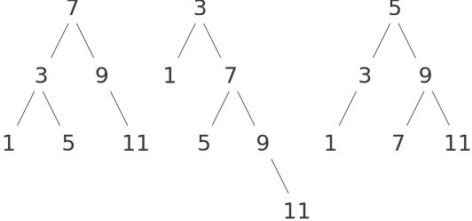
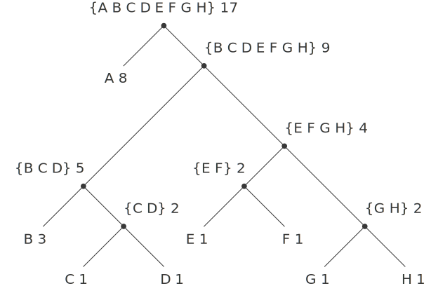

2.3 符号数据
===================

test
-----------

2.3.1 引号
------------

在 `Scheme` 中, 在变量前添加单引号以表示变量符号本身, 而不是对变量求值, 具体可参见下面的示例

::

  > (define a 1)
  > (define b 2)
  > (list a b)
  (1 2)
  > (list 'a 'b)
  (a b)
  > (list 'a b)
  (a 2)

判断一个符号是否在一个列表中的过程

.. code-block:: scheme

  (define (memq item x)
    (cond ((null? x) #f)
          ((eq? item (car x)) x)
          (else (memq item (cdr x)))))

验证效果

::

  > (memq 'apple '(pear banana prune))
  #f
  > (memq 'apple '(x (apple sauce) y apple pear))
  (apple pear)

练习 2.53
----------

::

  > (list 'a 'b 'c)
  (a b c)
  > (list (list 'george))
  ((george))
  > (cdr '((x1 x2) (y1 y2)))
  ((y1 y2))
  > (cadr '((x1 x2) (y1 y2)))
  (y1 y2)
  > (pair? (car '(a short list)))
  #f
  > (memq 'red '((red shoes) (blue socks)))
  #f
  > (memq 'red '(red shoes blue socks))
  (red shoes blue socks)

练习 2.54
-----------

.. code-block:: scheme

  ;; equal? 的实现
  ;; 对于同时不为 pair 的情况直接用 eq? 进行判断
  ;; 对于同时为 pair 的情况应同时满足前后两部分都满足 equal
  (define (my-equal? a b)
    (cond ((and (not (pair? a)) (not (pair? b)))
           (eq? a b))
          ((and (pair? a) (pair? b))
           (and (my-equal? (car a) (car b))
                (my-equal? (cdr a) (cdr b))))
          (else #f)))

测试验证

::

  > (my-equal? '(this is a list) '(this is a list))
  #t
  > (my-equal? '(this is a list) '(this (is a) list))
  #f

练习 2.55
-----------

单引号是 `quote` 的便捷表达方式, 因此下面的代码是等价的

.. code-block:: scheme

  (car ''abracadabra)
  (car '(quote abracadabra))

因此对其进行求值可得到符号 `quote`

2.3.2 实例: 符号求导
---------------------

**对抽象数据的求导程序**

求导规则如下

:math:`\frac{dc}{dx} = 0`

:math:`\frac{dx}{dx} = 1`

:math:`\frac{d(u + v)}{dx} = \frac{du}{dx} + \frac{dv}{dx}`

:math:`\frac{duv}{dx} = u\left( \frac{dv}{dx} \right) + v\left( \frac{du}{dx} \right)`

对于代数表达式的基本函数和谓词

.. code-block:: scheme

  (variable? e)            ;; e 是变量吗?
  (same-variable? v1 v2)   ;; v1 和 v2 是同一个变量吗?
  (sum? e)                 ;; e 是和式吗?
  (addend e)               ;; e 的被加数
  (augend e)               ;; e 的加数
  (make-sum a1 a2)         ;; 构造 a1 与 a2 的和式
  (product? e)             ;; e 是乘式吗?
  (multiplier e)           ;; e 的被乘数
  (multiplicand e)         ;; e 的乘数
  (make-product a1 a2)     ;; 构造 a1 与 a2 的乘式

根据求导规则构造求导过程

.. code-block:: scheme

  (define (deriv exp var)
    (cond ((number? exp) 0)
          ((variable? exp)
           (if (same-variable? exp var) 1 0))
          ((sum? exp)
           (make-sum (deriv (addend exp) var)
                     (deriv (augend exp) var)))
          ((product? exp)
           (make-sum
            (make-product
             (multiplier exp)
             (deriv (multiplicand exp) var))
            (make-product
             (deriv (multiplicer exp) var)
             (multiplicand exp))))
          (else (error "unknown expression type: DERIV" exp))))

同之前的有理数、线段等类似, 求导算法基于抽象数据进行表述, 因此只要设计正确的代数表达式的选择函数和构造函数, 该求导过程都能正确执行。

**代数表达式的表示**

基于 `Lisp` 的前缀形式实现代数表达式

.. code-block:: scheme

  ;; 使用内置的谓词 symbol? 判断是否为符号
  (define (variable? x) (symbol? x))

  ;; 变量相等则同为符号且满足 eq?
  (define (same-variable? v1 v2)
    (and (variable? v1) (variable? v2) (eq? v1 v2)))

  ;; 构造和式
  (define (make-sum a1 a2) (list '+ a1 a2))

  ;; 构造乘式
  (define (make-product m1 m2) (list '* m1 m2))

  ;; 根据和式的构造方法, 第一个元素为 + 的表即为和式
  (define (sum? x)
    (and (pair? x) (eq? (car x) '+)))

  ;; 被加数
  (define (addend s) (cadr s))

  ;; 加数
  (define (augend s) (caddr s))

  ;; 根据乘式的构造方法, 第一个元素为 * 的表即为乘式
  (define (product? x)
    (and (pair? x) (eq? (car x) '*)))

  ;; 被乘数
  (define (multiplier p) (cadr p))

  ;; 乘数
  (define (multiplicand p) (caddr p))

有了代数表达式的选择函数和构造函数, 就可以对求导过程进行验证了

::

  > (deriv '(+ x 3) 'x)
  (+ 1 0)
  > (deriv '(* x y) 'x)
  (+ (* x 0) (* 0 y))
  > (deriv '(* (* x y) (+ x 3)) 'x)
  (+ (* (* x y) (+ 1 0)) (* (+ 1 0) (+ x 3)))

因为上面的结果并没有化简, 因此可以改造 `make-sum` 过程

.. code-block:: scheme

  (define (make-sum a1 a2)
    (cond ((=number? a1 0) a2)
          ((=number? a2 0) a1)
          ((and (number? a1) (number? a2)) (+ a1 a2))
          (else (list '+ a1 a2))))
  (define (=number? exp num)
    (and (number? exp) (= exp num)))

同样对 `make-product` 进行改造

.. code-block:: scheme

  (define (make-product m1 m2)
    (cond ((or (=number? m1 0) (=number? m2 0)) 0)
          ((=number? m1 1) m2)
          ((=number? m2 1) m1)
          ((and (number? m1) (number? m2)) (* m1 m2))
          (else (list '* m1 m2))))

此时上面的测试结果将变为

::

  > (deriv '(+ x 3) 'x)
  1
  > (deriv '(* x y) 'x)
  y
  > (deriv '(* (* x y) (+ x 3)) 'x)
  (+ (* x y) (* y (+ x 3)))

练习 2.56
-----------

仿照前面的实现方式对乘幂进行实现

.. code-block:: scheme

  ;; 乘幂的判断、选择和构造函数
  (define (exponentiation? exp)
    (and (pair? exp) (eq? (car exp) '**)))
  (define (base exp) (cadr exp))
  (define (exponent exp) (caddr exp))
  (define (make-exponentiation b e)
    (cond ((= e 0) 1)
          ((= e 1) b)
          (else (list '** b e))))

  ;; 完善原来的求导过程
  (define (deriv exp var)
    (cond ((number? exp) 0)
          ((variable? exp)
           (if (same-variable? exp var) 1 0))
          ((sum? exp)
           (make-sum (deriv (addend exp) var)
                     (deriv (augend exp) var)))
          ((product? exp)
           (make-sum
            (make-product
             (multiplier exp)
             (deriv (multiplicand exp) var))
            (make-product
             (deriv (multiplier exp) var)
             (multiplicand exp))))
          ((exponentiation? exp)
           (let ((b (base exp))
                 (e (exponent exp)))
             (make-product
              e
              (make-product
               (make-exponentiation b (- e 1))
               (deriv b var)))))
          (else (error "unknown expression type: DERIV" exp))))

验证测试

::

  > (deriv '(** x 1) 'x)
  1
  > (deriv '(** x 2) 'x)
  (* 2 x)
  > (deriv '(** x 3) 'x)
  (* 3 (** x 2))
  > (deriv '(** x 4) 'x)
  (* 4 (** x 3))
  > (deriv '(** x 5) 'x)
  (* 5 (** x 4))

练习 2.57
-----------

对于这种多个参数的情况,  **练习 2.20** 中提供了带点尾部记法的 `define`, 因此对首先对构造和式、乘式以及选择加数、乘数的函数进行改造

.. code-block:: scheme

  ;; 中间用点号连接两个参数表示第二个参数以剩下的实际参数的表为值
  ;; 因此可以用 length 判断第二个参数是否有多个元素
  (define (make-sum a1 . a2)
    (if (= (length a2) 1)
        (cond ((=number? a1 0) a2)
              ((=number? (car a2) 0) a1)
              ((and (number? a1) (number? (car a2))) (+ a1 (car a2)))
              (else (list '+ a1 (car a2))))
        (cons '+ (cons a1 a2))))

  ;; 获取加数
  (define (augend s)
    (let ((a2 (cddr s)))
      (if (= (length a2) 1)
          (car a2)
          (apply make-sum a2))))

  ;; 构造乘式
  (define (make-product m1 . m2)
    (if (= (length m2) 1)
        (cond ((or (=number? m1 0) (=number? (car m2) 0)) 0)
              ((=number? m1 1) (car m2))
              ((=number? (car m2) 1) m1)
              ((and (number? m1) (number? (car m2))) (* m1 (car m2)))
              (else (list '* m1 (car m2))))
        (cons '* (cons m1 m2))))

  ;; 获取乘数
  (define (multiplicand p)
    (let ((m2 (cddr p)))
      (if (= (length m2) 1)
          (car m2)
          (apply make-product m2))))

求导过程不用修改, 直接验证测试

::

  > (deriv '(* x y (+ x 3)) 'x)
  (+ (* x y) (* y (+ x 3)))

练习 2.58
-----------

a.

将和式和乘式修改为中缀表示形式

.. code-block:: scheme

  (define (make-sum a1 a2)
    (cond ((=number? a1 0) a2)
          ((=number? a2 0) a1)
          ((and (number? a1) (number? a2)) (+ a1 a2))
          (else (list a1 '+ a2))))

  (define (make-product m1 m2)
    (cond ((or (=number? m1 0) (=number? m2 0)) 0)
          ((=number? m1 1) m2)
          ((=number? m2 1) m1)
          ((and (number? m1) (number? m2)) (* m1 m2))
          (else (list m1 '* m2))))

同时还应该修改对和式、乘式的判断及获取被加数、被乘数的过程

.. code-block:: scheme

  (define (sum? x)
    (and (pair? x) (eq? (cadr x) '+)))
  (define (addend s) (car s))

  (define (product? x)
    (and (pair? x) (eq? (cadr x) '*)))
  (define (multiplier p) (car p))

求导过程不变, 直接进行测试

::

  > (deriv '(x + (3 * (x + (y + 2)))) 'x)
  4

b.

.. code-block:: scheme

  ;; 修改和式的构造函数
  (define (make-sum a1 . a2)
    (if (= (length a2) 1)
        (cond ((and (number? a1) (number? (car a2))) (+ a1 (car a2)))
              ((=number? a1 0) a2)
              ((=number? (car a2) 0) a1)
              (else (list a1 '+ (car a2))))
        (cons a1 (cons '+ (apply make-sum a2)))))

  ;; 判断和式参与中缀表示
  (define (sum? x)
    (and (pair? x) (eq? (cadr x) '+)))

  ;; 根据中缀表示修改和式的选择函数
  (define (addend s) (car s))
  (define (augend s)
    (let ((a2 (cddr s)))
      (if (eq? (cdr a2) '())
          (car a2)
          a2)))

  ;; 修改乘式的构造函数
  (define (make-product m1 . m2)
    (if (= (length m2) 1)
        (cond ((or (=number? m1 0) (=number? (car m2) 0)) 0)
              ((=number? m1 1) (car m2))
              ((=number? (car m2) 1) m1)
              ((and (number? m1) (number? (car m2))) (* m1 (car m2)))
              (else (list m1 '* (car m2))))
        (cons m1 (cons '* (apply make-product m2)))))

  ;; 判断乘式采用中缀表示
  (define (product? x)
    (and (pair? x) (eq? (cadr x) '*)))

  ;; 根据中缀表示修改乘式的选择函数
  (define (multiplier p) (car p))
  (define (multiplicand p)
    (let ((m (cddr p)))
      (if (eq? (cdr m) '())
          (car m)
          m))

测试验证

::

  > (deriv '(x + 3 * (x + y + 2)) 'x)
  4

2.3.3 实例: 集合的表示
------------------------

集合的基本操作

.. code-block:: scheme

  ;; element-of-set?      用于确定某个给定元素是不是某个给定集合的成员
  ;; adjoin-set           添加一个元素到给定的集合中
  ;; union-set            计算两个集合的并集
  ;; intersection-set     计算两个集合的交集

**集合作为未排序的表**

将集合看做未排序的表时, 集合各个基本操作的实现

.. code-block:: scheme

  ;; 递归判断元素是否与集合中的某个值相同
  (define (element-of-set? x set)
    (cond ((null? set) #f)
          ((equal? x (car set)) #t)
          (else (element-of-set? x (cdr set)))))

  ;; 先判断集合中是否已经存在该元素, 不存在时才加入
  (define (adjoin-set x set)
    (if (element-of-set? x set)
        set
        (cons x set)))

  ;; 逐一判断 set1 中的元素是否在 set2 中, 存在合并, 否则递归处理
  (define (intersection-set set1 set2)
    (cond ((or (null? set1) (null? set2))
           '())
          ((element-of-set? (car set1) set2)
           (cons (car set1)
                 (intersection-set (cdr set1)
                                   set2)))
          (else (intersection-set (cdr set1)
                                  set2))))

练习 2.59
-------------

借助 `adjoin-set` 进行实现

.. code-block:: scheme

  (define (union-set set1 set2)
    (cond ((null? set1) set2)
          ((null? set2) set1)
          (else (union-set
                 (cdr set1)
                 (adjoin-set (car set1)
                             set2)))))

测试验证

::

  > (union-set '(1 2 3) '(2 3 4))
  (1 2 3 4)

练习 2.60
-------------

对于存在重复元素的集合, `element-of-set?` 不用修改, `adjoin-set` 直接合并即可, `union-set` 也不用修改, `intersection-set` 需要先去重再沿用之前的过程

.. code-block:: scheme

  (define (adjoin-set x set)
    (cons x set))

  ;; 清除集合中的重复元素
  (define (filter-set set)
    (cond ((null? set) '())
          ((element-of-set? (car set) (cdr set))
           (filter-set (cdr set)))
          (else (cons (car set) (filter-set (cdr set))))))

  ;; 求交集时先去重
  (define (intersection-set set1 set2)
    (let ((set1 (filter-set set1))
          (set2 (filter-set set2)))
      (cond ((or (null? set1) (null? set2))
             '())
            ((element-of-set? (car set1) set2)
             (cons (car set1)
                   (intersection-set (cdr set1)
                                     set2)))
            (else (intersection-set (cdr set1)
                                    set2)))))

因为现在 `adjoin-set` 是直接合并, 因此算法复杂度要比之前低一个数量级, 而其它操作虽然算法复杂度与之前相同, 但随着元素个数的增加以及重复元素的增加, 运行速度会越来越慢。

因此对于频繁增加元素且没有严格要求去重的场景可使用带重复元素的集合, 而对于频繁查询或频繁求交集、并集的场景则应使用无重复元素的集合。

**集合作为排序的表**

因为集合是排序的表(从小到大), 因此待检查的元素比最小的元素还小时, 也就没有必要进行后续的检查了

.. code-block:: scheme

  (define (element-of-set? x set)
    (cond ((null? set) #f)
          ((= x (car set)) #t)
          ((< x (car set)) #f) ;; 比最小的还小则直接返回 false
          (else (element-of-set? x (cdr set)))))

而对于求交集, 同样可以根据一个集合的最小元素是否比另一个集合的最小元素还小来判断其是否在交集中

.. code-block:: scheme

  (define (intersection-set set1 set2)
    (if (or (null? set1) (null? set2))
        '()
        (let ((x1 (car set1))
              (x2 (car set2)))
          (cond ((= x1 x2)
                 (cons x1 (intersection-set (cdr set1) (cdr set2))))
                ((< x1 x2)
                 (intersection-set (cdr set1) set2))
                ((< x2 x1)
                 (intersection-set set1 (cdr set2)))))))

练习 2.61
-----------

对于已排序的集合来说, 如果集合为空则返回以参数 `x` 为元素的列表, 当 `x` 比最小的元素还小时则直接合并两者, 与最小的元素相等时则直接返回列表, 否则合并列表的最小元素与剩下的元素组成的列表递归处理得到的结果。

.. code-block:: scheme

  (define (adjoin-set x set)
    (cond ((null? set) (list x))
          ((< x (car set)) (cons x set))
          ((= x (car set)) set)
          (else (cons (car set)
                      (adjoin-set x (cdr set))))))

测试验证

::

  > (adjoin-set 1 (list 2 3 5 6))
  (1 2 3 5 6)
  > (adjoin-set 4 (list 2 3 5 6))
  (2 3 4 5 6)
  > (adjoin-set 7 (list 2 3 5 6))
  (2 3 5 6 7)

练习 2.62
------------

其实就是归并排序的思路, 从两个排序集合中依次取出最小的元素进行比较, 将两者较小的元素进行合并, 然后取出现较小元素的集合的剩余元素进行递归处理

.. code-block:: scheme

  (define (union-set set1 set2)
    (cond ((null? set1) set2)
          ((null? set2) set1)
          (else
           (cond ((< (car set1) (car set2))
                  (cons (car set1)
                        (union-set (cdr set1) set2)))
                 ((= (car set1) (car set2))
                  (cons (car set1)
                        (union-set (cdr set1) (cdr set2))))
                 (else (cons (car set2)
                             (union-set set1 (cdr set2))))))))

测试验证

::

  > (union-set (list 1 2 3) (list 2 3 4))
  (1 2 3 4)
  > (union-set (list 1 2 3) (list 1 3 4))
  (1 2 3 4)
  > (union-set (list 2 3 4) (list 1 2 3))
  (1 2 3 4)
  > (union-set (list 2 3 4 5) (list 1 2 3))
  (1 2 3 4 5)
  > (union-set (list 1 2 3) (list 2 3 4 5))
  (1 2 3 4 5)
  > (union-set (list 4 5 7 8) (list 1 2 3 6 9))
  (1 2 3 4 5 6 7 8 9)
  > (union-set (list 1 2 3 6 9) (list 4 5 7 8))
  (1 2 3 4 5 6 7 8 9)

**集合作为二叉树**

对于平衡二叉树而言, 因为左右两边子树约为整个树的一半, 且左子树都比顶点小, 右子树都比顶点大, 因此当搜索规模为 `n` 的树时, 计算部署将以 :math:`\Theta(log n)` 速度增长。

使用表表示树

.. code-block:: scheme

  (define (entry tree) (car tree))
  (define (left-branch tree) (cadr tree))
  (define (right-branch tree) (caddr tree))
  (define (make-tree entry left right)
    (list entry left right))

基于上面的构造函数和选择函数再次实现 `element-of-set?`

.. code-block:: scheme

  ;; 对于一棵平衡二叉树而言, 先与顶点值判断大小以确定在左子树还是右子树
  ;; 然后在对应的子树进行递归处理即可
  (define (element-of-set? x set)
    (cond ((null? set) #f)
          ((= x (entry set)) #t)
          ((< x (entry set))
           (element-of-set? x (left-branch set)))
          ((> x (entry set))
           (element-of-set? x (right-branch set)))))

此时对于 `adjoin-set` 而言, 仍然是先与顶点值判断大小以确定加入哪个子树, 然后需要根据大小情况构造新的分支。

.. code-block:: scheme

  (define (adjoin-set x set)
    (cond ((null? set) (make-tree x '() '()))
          ((= x (entry set)) set)
          ((< x (entry set))
           (make-tree (entry set)
                      (adjoin-set x (left-branch set))
                      (right-branch set)))
          ((> x (entry set))
           (make-tree (entry set)
                      (left-branch set)
                      (adjoin-set x (right-branch set))))))

以上的操作都还需要进行平衡的操作, 以保证当前树是平衡二叉树。

练习 2.63
-----------

两种将树转换为表的方法

.. code-block:: scheme

  (define (tree->list-1 tree)
    (if (null? tree)
        '()
        (append (tree->list-1 (left-branch tree))
                (cons (entry tree)
                      (tree->list-1 (right-branch tree))))))

  (define (tree->list-2 tree)
    (define (copy-to-list tree result-list)
      (if (null? tree)
          result-list
          (copy-to-list (left-branch tree)
                        (cons (entry tree)
                              (copy-to-list (right-branch tree)
                                            result-list)))))
    (copy-to-list tree '()))

a.

两个过程对所有的树(即使形状不同)都产生相同的结果

一个集合的元素构成的不同形状的树

构造这三个形状的树

.. code-block:: scheme

  (define t1 (make-tree 7
                        (make-tree 3
                                   (make-tree 1 '() '())
                                   (make-tree 5 '() '()))
                        (make-tree 9
                                   '()
                                   (make-tree 11 '() '()))))

  (define t2 (make-tree 3
                        (make-tree 1 '() '())
                        (make-tree 7
                                   (make-tree 5 '() '())
                                   (make-tree 9
                                              '()
                                              (make-tree 11 '() '())))))

  (define t3 (make-tree 5
                        (make-tree 3
                                   (make-tree 1 '() '())
                                   '())
                        (make-tree 9
                                   (make-tree 7 '() '())
                                   (make-tree 11 '() '()))))

测试验证

::

  > (tree->list-1 t1)
  (1 3 5 7 9 11)
  > (tree->list-2 t1)
  (1 3 5 7 9 11)

  > (tree->list-1 t2)
  (1 3 5 7 9 11)
  > (tree->list-2 t2)
  (1 3 5 7 9 11)

  > (tree->list-1 t3)
  (1 3 5 7 9 11)
  > (tree->list-2 t3)
  (1 3 5 7 9 11)

b.

通过分析两种方法的代码可知, 对于有 `n` 个节点的树转换为表时, 方法一将会调用 `n` 次 `cons` 和 `append` 操作, 而方法二只需调用 `n` 次 `cons` 操作, 因此两者的增长量级不同, 方法一会更慢些。

练习 2.64
------------

.. code-block:: scheme

  (define (list->tree elements)
    (car (partial-tree
          elements (length elements))))

  (define (partial-tree elts n)
    (if (= n 0)
        (cons '() elts)
        (let ((left-size (quotient (- n 1) 2)))
          (let ((left-result (partial-tree elts left-size)))
            (let ((left-tree (car left-result))
                  (non-left-elts (cdr left-result))
                  (right-size (- n (+ left-size 1))))
              (let ((this-entry (car non-left-elts))
                    (right-result (partial-tree (cdr non-left-elts) right-size)))
                (let ((right-tree (car right-result))
                      (remaining-elts (cdr right-result)))
                  (cons (make-tree this-entry left-tree right-tree)
                        remaining-elts))))))))

a.

从至少包含 `n` 个元素的表中构造出一棵包含 `n` 个元素的平衡树, 其构造过程可分为如下几步:

1. 计算左子树的大小 `left-size`, 因为必然有一个顶点, 所以左子树的大小即为 `n - 1` 除以 `2` 的商
2. 有了左子树的大小 `left-size`, 则根据 `partial-tree` 过程的定义, 即可通过调用 `(partial-tree elts left-size)` 得到左子树及其剩余元素组成的序对结果 `left-result`
3. 有了左边的序对结果 `left-result` 之后, 即可从中获取左子树 `left-tree` 及其剩余的元素 `not-left-elts`, 同时因为已知左子树的大小, 再加上顶点, 就可以得到右子树的大小为 `n - (left-size + 1)`
4. 对于剩余的元素 `non-left-elts` 而言, 其第一个元素即为分好左右子树之后的顶点, 而其剩下的元素则为构造右子树的元素, 因此可通过调用 `(partial-tree (cdr non-left-elts) right-size)` 得到右子树及其剩余元素构成的序对结果 `right-result`
5. 有了右边的序对结果 `right-result` 之后, 即可从中获取右子树 `right-tree` 及其剩余的元素 `remaining-elts`
6. 现在有了左子树、右子树及顶点和剩余的元素, 即可得到最终的结果, 其中平衡树显然由 `(make-tree this-entry left-tree right-tree)` 得到, 最终结果则使用 `cons` 合并此树与 `remaining-elts` 即可。

::

  > (define t (list->tree (tree->list-2 t3)))
  > t
  (5 (1 () (3 () ())) (9 (7 () ()) (11 () ())))

           5
          / \
         /   \
        /     \
       /       \
      1         9
     / \       / \
    /   \     /   \
  '()    3   7    11

b.

对于 `list->tree` 过程而言, 最终要将每个元素构造成树, 即对于 `n` 个元素将调用 `n` 次 `make-tree`, 因此算法复杂度为 :math:`\Theta(n)` 。

练习 2.65
------------

利用 `2.63` 中的实现, 可以将树转换为排序列表, 然后再利用之前的对排序列表的求交集并集的操作, 最后再利用 `2.64` 中的实现, 将排序列表转换为平衡二叉树即可

.. code-block:: scheme

  ;; 为避免冲突, 将练习 2.62 中的实现改名为 union-sorted-set
  (define (union-sorted-set set1 set2)
    (cond ((null? set1) set2)
          ((null? set2) set1)
          (else
           (cond ((< (car set1) (car set2))
                  (cons (car set1)
                        (union-sorted-set (cdr set1) set2)))
                 ((= (car set1) (car set2))
                  (cons (car set1)
                        (union-sorted-set (cdr set1) (cdr set2))))
                 (else (cons (car set2)
                             (union-sorted-set set1 (cdr set2))))))))

  ;; 首先使用练习 2.63 中的 tree->list-2 将树转换为排序列表
  ;; 然后使用 union-sorted-set 对两个排序列表求并集
  ;; 最后使用 list->tree 把排序列表转换为平衡二叉树
  (define (union-set set1 set2)
    (let ((s1 (tree->list-2 set1))
          (s2 (tree->list-2 set2)))
      (list->tree (union-sorted-set s1 s2))))

  ;; 交集的实现与并集类似
  (define (intersection-sorted-set set1 set2)
    (if (or (null? set1) (null? set2))
        '()
        (let ((x1 (car set1))
              (x2 (car set2)))
          (cond ((= x1 x2)
                 (cons x1 (intersection-sorted-set (cdr set1) (cdr set2))))
                ((< x1 x2)
                 (intersection-sorted-set (cdr set1) set2))
                ((< x2 x1)
                 (intersection-sorted-set set1 (cdr set2)))))))

  (define (intersection-set set1 set2)
    (let ((s1 (tree->list-2 set1))
          (s2 (tree->list-2 set2)))
      (list->tree (intersection-sorted-set s1 s2))))

测试验证

::

  > (define t4 (make-tree 6
                          (make-tree 3
                                     (make-tree 1 '() '())
                                     '())
                          (make-tree 9
                                     (make-tree 7 '() '())
                                     (make-tree 11 '() '()))))

  > t4
  (6 (3 (1 () ()) ()) (9 (7 () ()) (11 () ())))
  > (union-set t3 t4)
  (6 (3 (1 () ()) (5 () ())) (9 (7 () ()) (11 () ())))
  > (intersection-set t3 t4)
  (7 (1 () (3 () ())) (9 () (11 () ())))

**集合与信息检索**

对于信息检索的场景而言, 需要将大量时间用在根据某个关键字在数据集上进行数据的访问和修改, 为了提高在这种场景下的访问效率, 首先需要更好的大集合的表示方法, 其次需要对数据集的访问提供足够的抽象。

一种最简单的实现是, 将集合看做未排序的表, 则此时的检索实现与 `element-of-set?` 完全一致。

.. code-block:: scheme

  (define (lookup given-key set-of-records)
  (cond ((null? set-of-records) false)
        ((equal? given-key
                 (key (car set-of-records)))
         (car set-of-records))
        (else
         (lookup given-key
                 (cdr set-of-records)))))

练习 2.66
-----------

假设记录的集合采用二叉树实现, 则查找过程直接使用前面针对二叉树而实现的 `element-of-set?` 即可

.. code-block:: scheme

  (define (lookup given-key tree-of-records)
    (cond ((null? tree-of-records) #f)
          ((= given-key (entry tree-of-records)) #t)
          ((< given-key (entry tree-of-records))
           (lookup given-key (left-branch tree-of-records)))
          ((> given-key (entry tree-of-records))
           (lookup given-key (right-branch tree-of-records)))))

2.3.4 实例: Huffman 编码树
----------------------------

一般而言, 如果我们需要区分 `n` 个不同的字符, 那么就需要为每个字符使用 :math:`log_2 n` 个二进制位。

然而像这样使用固定位数二进制对字符进行编码, 相对于变长编码会有很多冗余, 会造成空间的浪费。

但在变长编码中要解决的一个困难在于: 如何确定到达了一个字符的结束。

一种解决方式是以某种方式设计编码, 使得其中每个字符的完整编码都不是另一个字符编码的前缀, 这样的编码方式称为前缀码。

 **Huffman编码** 是一种利用被编码消息中符号出现的相对频度构造变长前缀码从而能够明显节约空间的特定编码方式, 其中树叶是被编码的符号, 被赋予了一个权重(即它的相对频度)。

Huffman编码树实例, 每个非叶结点代表一个集合, 其包含了这个结点下所有树叶上的符号, 每个非叶结点的权重是它下面所有叶结点的权重之和。

查找编码的过程: 从树根向下, 每次向左则加 0 , 向右则加 1, 直到找到与符号对应的叶结点。

序列解码的过程: 从树根开始, 通过序列中是 0 还是 1 来确定向左还是向右, 到达一个叶结点后就生成对应的符号, 然后重复这个过程。

**生成 Huffman 树**

**Huffman树** 的目标是使那些频度最低的符号出现在距离树根最远的地方。

构造过程为: 设定各个符合及其出现的频度作为初始数据, 然后开始寻找两个最低权重的结点, 将其合并为一个新的结点, 使其作为新结点的左右子结点。此时新结点的权重为原来两个结点的权重之和, 在初始数据中删除已归并的两个最小权重的结点, 并添加新结点到初始数据, 继而继续这个过程, 直到只剩下一个结点。

因为每步选择出的最小权重结点可能并不唯一, 此外在做归并时, 左右结点的顺序也是任意的, 因此上面的过程并不总能描述一棵唯一的树。

**Huffman 树的表示**

为了使用 **Huffman树** 完成消息的编码和解码, 需要定义树的构造函数和选择函数。

.. code-block:: scheme

   ;; 叶结点由符号和权重组成
   (define (make-leaf symbol weight)
    (list 'leaf symbol weight))

  (define (leaf? object)
    (eq? (car object) 'leaf))

  (define (symbol-leaf x) (cadr x))
  (define (weight-leaf x) (caddr x))

  ;; 编码树由左右分支, 符合集合, 权重组成
  (define (make-code-tree left right)
    (list left
          right
          (append (symbols left) (symbols right))
          (+ (weight left) (weight right))))

  ;; 根据编码树的构造方式实现选择函数
  (define (left-branch tree) (car tree))
  (define (right-branch tree) (cadr tree))
  (define (symbols tree)
    (if (leaf? tree)
        (list (symbol-leaf tree))
        (caddr tree)))
  (define (weight tree)
    (if (leaf? tree)
        (weight-leaf tree)
        (cadddr tree)))

**解码过程**

对于解码过程, 首先要有一棵 **Huffman编码树**, 即根据给定每个字符频度所构建的树; 其次要有根据这棵树生成的编码表。

.. code-block:: scheme

  ;; 解码是一个迭代处理的过程
  ;; 因为前缀码的特点, 每找到一个编码对应的字符后, 需要回到树根继续对剩余的编码进行处理
  (define (decode bits tree)
    (define (decode-1 bits current-branch)
      (if (null? bits)
          '()
          ;; 根据叶结点的值获取下一个分支
          (let ((next-branch
                 (choose-branch (car bits) current-branch)))
            ;; 是叶结点则取出符号并合并上对剩余编码表的解码结果
            ;; 否则对剩余的编码表进行处理
            (if (leaf? next-branch)
                (cons (symbol-leaf next-branch)
                      (decode-l (cdr bits) tree))
                (decode-1 (cdr bits) next-branch)))))
    ;; 初始情况下即为完整的编码表和
    (decode-1 bits tree))

  ;; 根据当前位置的位是 0 或 1 来选择左分支或右分支
  (define (choose-branch bit branch)
    (cond ((= bit 0) (left-branch branch))
          ((= bit 1) (right-branch branch))
          (else (error "bad bit -- CHOOSE-BRANCH" bit))))

**带权重元素的集合**

.. code-block:: scheme

  ;; 合并叶结点, 并按照权重升序排列表中的元素
  (define (adjoin-set x set)
    (cond ((null? set) (list x))
          ((< (weight x) (weight (car set))) (cons x set))
          (else (cons (car set)
                      (adjoin-set x (cdr set))))))

  ;; 构造树叶的初始排序集合
  (define (make-leaf-set pairs)
    (if (null? pairs)
        '()
        (let ((pair (car pairs)))
          (adjoin-set (make-leaf (car pair)
                                 (cadr pair))
                      (make-leaf-set (cdr pairs))))))

练习 2.67
----------

.. code-block:: scheme

  ;; Huffman 编码树的定义
  (define sample-tree
    (make-code-tree
     (make-leaf 'A 4)
     (make-code-tree
      (make-leaf 'B 2)
      (make-code-tree
       (make-leaf 'D 1)
       (make-leaf 'C 1)))))

  ;; 一个消息样例
  (define sample-message
    '(0 1 1 0 0 1 0 1 0 1 1 1 0))

直接调用 `decode` 进行解码

::

  > (decode sample-message sample-tree)
  (A D A B B C A)

练习 2.68
-----------

.. code-block:: scheme

  ;; 编码过程即为合并信息中的每一个字符的编码结果
  (define (encode message tree)
    (if (null? message)
        '()
        (append (encode-symbol (car message) tree)
                (encode (cdr message) tree))))

  ;; 对每个字符进行编码
  (define (encode-symbol symbol tree)
    (cond ((leaf? tree) '())  ;; 已经达到叶结点则结束
          ;; 在左子树的字符列表中找到了要编码的字符则添加 0
          ((lookup symbol (symbols (left-branch tree)))
           (cons '0 (encode-symbol symbol (left-branch tree))))
          ;; 在右子树的字符列表中找到了要编码的字符则添加 1
          ((lookup symbol (symbols (right-branch tree)))
           (cons '1 (encode-symbol symbol (right-branch tree))))
          ;; 左右子树中都没有要编码的字符则报错
          (else (error "bad symbol -- " symbol))))

测试验证

::

  > (define message '(A D A B B C A))
  > (encode message sample-tree)
  (0 1 1 0 0 1 0 1 0 1 1 1 0)

练习 2.69
-----------

.. code-block:: scheme

  ;; 根据符号-权重对偶的表来构建 Huffman树
  (define (generate-huffman-tree pairs)
    (successive-merge (make-leaf-set pairs)))

  ;; 根据已排序的树叶集合进行合并
  (define (successive-merge leaf-set)
    (if (= (length leaf-set) 1)
        ;; 集合中只剩下了一个结点时则直接返回该元素
        (car leaf-set)
        ;; 否则首先找到两个权重最小的结点, 以及剩下的结点构成的集合
        (let ((min-leaf-1 (car leaf-set))
              (min-leaf-2 (cadr leaf-set))
              (remaining-leaf-set (cddr leaf-set)))
          ;; 然后由两个权重最小的结点构造新的叶结点
          (let ((new-leaf (make-code-tree min-leaf-1 min-leaf-2)))
            ;; 然后将新的叶结点添加到剩余结点构成的集合中
            (let ((new-leaf-set (adjoin-set new-leaf remaining-leaf-set)))
              ;; 最后继续对新构造的叶结点集合进行处理
              (successive-merge new-leaf-set))))))

测试验证

::

  > (define pairs '((A 4) (B 2) (C 1) (D 1)))
  > pairs
  ((A 4) (B 2) (C 1) (D 1))
  > (define leaf-set (make-leaf-set pairs))
  > leaf-set
  ((leaf D 1) (leaf C 1) (leaf B 2) (leaf A 4))
  > (successive-merge leaf-set)
  ((leaf A 4)
    ((leaf B 2) ((leaf D 1) (leaf C 1) (D C) 2) (B D C) 4)
    (A B D C)
    8)
  > sample-tree
  ((leaf A 4)
    ((leaf B 2) ((leaf D 1) (leaf C 1) (D C) 2) (B D C) 4)
    (A B D C)
    8)

可以看到, 根据 `successive-merge` 过程得到的结果与 `sample-tree` 的值是一样的。

练习 2.70
-----------

::

  > (define pairs '((a 2) (na 16) (boom 1) (sha 3) (get 2) (yip 9) (job 2) (wah 1)))
  > (define tree (generate-huffman-tree pairs))
  > tree
  ((leaf na 16)
    ((leaf yip 9)
      (((leaf a 2)
         ((leaf wah 1) (leaf boom 1) (wah boom) 2)
         (a wah boom)
         4)
        ((leaf sha 3)
          ((leaf job 2) (leaf get 2) (job get) 4)
          (sha job get)
          7)
        (a wah boom sha job get)
        11)
      (yip a wah boom sha job get)
      20)
    (na yip a wah boom sha job get)
    36)
  > (define message '(get a job sha na na na na na na na na get a job sha na na na na na na na na wah yip yip yip yip yip yip yip yip yip sha boom))
  > (define bits (encode message tree))
  > bits
  (1 1 1 1 1 1 1 0 0 1 1 1 1 0 1 1 1 0 0 0 0 0 0 0 0 0 1 1 1 1
   1 1 1 0 0 1 1 1 1 0 1 1 1 0 0 0 0 0 0 0 0 0 1 1 0 1 0 1 0 1
   0 1 0 1 0 1 0 1 0 1 0 1 0 1 0 1 1 1 0 1 1 0 1 1)
  > (decode bits tree)
  (get a job sha na na na na na na na na get a job sha na na
   na na na na na na wah yip yip yip yip yip yip yip yip yip
   sha boom)
  > (length bits)
  84
  > (length message)
  36

可以看到基于 **Huffman** 编码对具有 `36` 个字符的消息需要 `84` 个二进制位。

如果对 `8` 个字符的字母表采用定长编码, 每个字符需要使用 `3` 个二进制位, 则对包含 `36` 个字符的歌曲编码需要 `108` 个二进制位, 可见使用 **Huffman** 编码可节省 `22%` 的空间。

练习 2.71
------------

`n` 为 `5` 时树的结构如下所示

::

           (31)
           / \
          /   \
        (15)  16
        / \
      (7)  8
      / \
    (3)  4
    /\
   1  2

由此类推可知 `n` 为 `10` 时的树的结构, 显然, 对于这样的树, 编码出现最频繁的符号只需一个二进制位, 而最不频繁的则需要 `n-1` 位。

练习 2.72
-----------

对于 `练习 2.68` 中的编码过程, 需要依次判断符号在左子树还是在右子树中, 查找过程的增长速度为 :math:`\Theta(n)`, 因此针对 `练习 2.71` 中的特殊情况, 编码最频繁的符号与最不频繁的符号所需的步数的增长速度为 :math:`\Theta(n)` 、 :math:`\Theta(n^2)`
