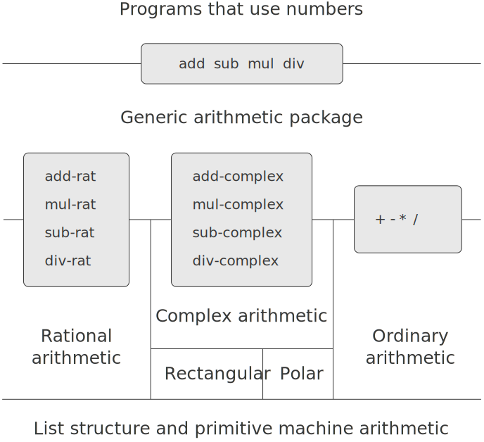

2.5 带有通用型操作的系统
===============================

算术运算包的系统结构

2.5.1 通用型算术运算
-----------------------

通用型算术包的加减乘除

.. code-block:: scheme

  (define (add x y) (apply-generic 'add x y))
  (define (sub x y) (apply-generic 'sub x y))
  (define (mul x y) (apply-generic 'mul x y))
  (define (div x y) (apply-generic 'div x y))

安装常规数的处理过程

.. code-block:: scheme

  ;; 常规数直接使用系统自带的加减乘除即可
  (define (install-scheme-number-package)
    (define (tag x)
      (attach-tag 'scheme-number x))
    (put 'add '(scheme-number scheme-number)
         (lambda (x y) (tag (+ x y))))
    (put 'sub '(scheme-number scheme-number)
         (lambda (x y) (tag (- x y))))
    (put 'mul '(scheme-number scheme-number)
         (lambda (x y) (tag (* x y))))
    (put 'div '(scheme-number scheme-number)
         (lambda (x y) (tag (/ x y))))
    (put 'make 'scheme-number
         (lambda (x) (tag x)))
    'done)

  ;; 直接使用常规数作为 scheme 数类型
  (define (make-scheme-number n)
    ((get 'make 'scheme-number) n))

安装有理数的处理过程

.. code-block:: scheme

  (define (install-rational-package)
    ;; 有理数的分子分母
    (define (numer x) (car x))
    (define (denom x) (cdr x))
    ;; 构造有理数时进行化简
    (define (make-rat n d)
      (let ((g (gcd n d)))
        (cons (/ n g) (/ d g))))
    ;; 有理数的加法
    (define (add-rat x y)
      (make-rat (+ (* (numer x) (denom y))
                   (* (numer y) (denom x)))
                (* (denom x) (denom y))))
    ;; 有理数的减法
    (define (sub-rat x y)
      (make-rat (- (* (numer x) (denom y))
                   (* (numer y) (denom x)))
                (* (denom x) (denom y))))
    ;; 有理数的乘法
    (define (mul-rat x y)
      (make-rat (* (numer x) (numer y))
                (* (denom x) (denom y))))
    ;; 有理数的除法
    (define (div-rat x y)
      (make-rat (* (numer x) (denom y))
                (* (denom x) (numer y))))
    ;; 构造有理数算术的键值对
    (define (tag x) (attach-tag 'rational x))
    (put 'add '(rational rational)
         (lambda (x y) (tag (add-rat x y))))
    (put 'sub '(rational rational)
         (lambda (x y) (tag (sub-rat x y))))
    (put 'mul '(rational rational)
         (lambda (x y) (tag (mul-rat x y))))
    (put 'div '(rational rational)
         (lambda (x y) (tag (div-rat x y))))
    (put 'make 'rational
         (lambda (n d) (tag (make-rat n d))))
    'done)

  ;; 构造有理数
  (define (make-rational n d)
    ((get 'make 'rational) n d))

安装复数的处理过程

.. code-block:: scheme

  (define (install-complex-package)
    ;; 从直角坐标形式包中导出复数的构造过程
    (define (make-from-real-imag x y)
      ((get 'make-from-real-imag
            'rectangular)
       x y))
    ;; 从极坐标形式包中导出复数的构造过程
    (define (make-from-mag-ang r a)
      ((get 'make-from-mag-ang 'polar)
       r a))
    ;; 复数的加减法, 内部采用直角坐标形式完成实部与虚部的加减法
    (define (add-complex z1 z2)
      (make-from-real-imag
       (+ (real-part z1) (real-part z2))
       (+ (imag-part z1) (imag-part z2))))
    (define (sub-complex z1 z2)
      (make-from-real-imag
       (- (real-part z1) (real-part z2))
       (- (imag-part z1) (imag-part z2))))
    ;; 复数的乘除法, 内部采用极坐标形式完成模的乘除与辅角的加减
    (define (mul-complex z1 z2)
      (make-from-mag-ang
       (* (magnitude z1) (magnitude z2))
       (+ (angle z1) (angle z2))))
    (define (div-complex z1 z2)
      (make-from-mag-ang
       (/ (magnitude z1) (magnitude z2))
       (- (angle z1) (angle z2))))
    ;; 构造复数算术的键值对
    (define (tag z) (attach-tag 'complex z))
    (put 'add '(complex complex)
         (lambda (z1 z2)
           (tag (add-complex z1 z2))))
    (put 'sub '(complex complex)
         (lambda (z1 z2)
           (tag (sub-complex z1 z2))))
    (put 'mul '(complex complex)
         (lambda (z1 z2)
           (tag (mul-complex z1 z2))))
    (put 'div '(complex complex)
         (lambda (z1 z2)
           (tag (div-complex z1 z2))))
    (put 'make-from-real-imag 'complex
         (lambda (x y)
           (tag (make-from-real-imag x y))))
    (put 'make-from-mag-ang 'complex
         (lambda (r a)
           (tag (make-from-mag-ang r a))))
    'done)

  ;; 从复数包中导出两种复数的构造函数
  (define (make-complex-from-real-imag x y)
    ((get 'make-from-real-imag 'complex) x y))
  (define (make-complex-from-mag-ang r a)
    ((get 'make-from-mag-ang 'complex) r a))

练习 2.77
------------

经常测试, 确实此时直接调用 `(magnitude z)` 求解直角坐标形式复数 `z` 的模时会报错。
::

  > (define z (make-complex-from-real-imag 3 4))
  > z
  (complex rectangular 3 . 4)
  > (magnitude z)

  Exception in error: invalid message argument (magnitude (complex))
  Type (debug) to enter the debugger.

根据 `magnitude` 过程的定义

.. code-block:: scheme

  (define (magnitude z)
    (apply-generic 'magnitude z))

其调用 `apply-generic` 过程, 并以 `magnitude` 和复数 `z` 为参数, 此时 `apply-generic` 将会根据 `op(magnitude)` 和 `type-tag(complex)` 作为 `get` 的参数查找对应的处理过程, 而此时并没有对应的处理过程, 因此会报错。

添加如下代码后, 为 `'magnitude' '(complex)'` 这个 `key` 设置了对应的操作, 因此就得到了正确的结果。

.. code-block:: scheme

  (put 'real-part '(complex) real-part)
  (put 'imag-part '(complex) imag-part)
  (put 'magnitude '(complex) magnitude)
  (put 'angle '(complex) angle)

再次测试

::

  > (magnitude z)
  5

分析整个调用过程

::

  > z
  (complex rectangular 3 . 4)

  --> (magnitude z)
  --> (apply-generic 'magnitude z)
  --> (get 'magnitude '(complex) (contents z))
  --> (magnitude (contents z))
  --> (apply-generic 'magnitude (contents z))
  --> (apply-generic 'magnitude (rectangular 3 . 4))
  --> (get 'magnitude '(rectangular) (3 . 4))
  --> (magnitude (3 . 4))
  --> (sqrt (+ (square 3) (square 4)))
  --> 5

因为 `apply-generic` 共被调用两次, 第一次调用识别参数为复数, 第二次调用识别复数为直角坐标形式, 并由此使用直角坐标形式复数获取模的方法得到了正确的结果。

练习 2.78
------------

.. code-block:: scheme

  (define (attach-tag type-tag content)
    (if (eq? type-tag 'scheme-number)
        content
        (cons type-tag content)))

  (define (type-tag datum)
    (cond ((number? datum) 'scheme-number)
          ((pair? datum) (car datum))
          (else
           (error "Bad tagged datum: TYPE-TAG" datum))))

  (define (contents datum)
    (cond ((number? datum) datum)
          ((pair? datum) (cdr datum))
          (else
           (error "Bad tagged datum: CONTENTS" datum))))

测试验证

::

  > (install-scheme-number-package)
  done
  > (define one (make-scheme-number 1))
  > (type-tag one)
  scheme-number
  > (contents one)
  1
  > (add one one)
  2
  > (sub one one)
  0
  > (mul one one)
  1
  > (div one one)
  1

练习 2.79
------------

添加如下代码即可

.. code-block:: scheme

  ;; 添加通用型谓词
  (define (equ? x y)
    (apply-generic 'equ? x y))

  ;; 在 scheme-number 安装包直接使用 = 进行判断即可
  (put 'equ? '(scheme-number scheme-number) =)

  ;; 在有理数安装包中判断两个有理数的分子分母交叉相乘的结果是否相等
  (put 'equ? '(rational rational)
       (lambda (x y) (= (* (numer x) (denom y))
                        (* (numer y) (denom x)))))

  ;; 在复数安装包中根据两种形式分别实现, 这里以直角坐标形式为例
  (put 'equ? '(complex complex)
       (lambda (z1 z2)
         (and (= (real-part z1) (real-part z2))
              (= (imag-part z1) (imag-part z2))
              (= (magnitude z1) (magnitude z2)))))

练习 2.80
------------

同上一题类似, 针对不同的情况分别进行实现

.. code-block:: scheme

  (define (=zero? x )
    (apply-generic '=zero? x))

  (put '=zero? '(scheme-number)
       (lambda (x) (= 0 x)))

  (put '=zero? '(rational)
       (lambda (x) (= 0 (number x))))

  (put '=zero? '(complex)
       (lambda (z)
         (and (= 0 (real-part z))
              (= 0 (imag-part z)))))

2.5.2 不同类型数据的组合
------------------------

显然, 在现实世界中一个算术系统并不会只有相同类型的数值进行加减乘除, 如果沿用之前的方式, 每一种操作都精确可控, 那么势必会编写大量冗余的代码。比如, 可以通过如下方式实现对复数和常规数的加法

.. code-block:: scheme

  (define (add-complex-to-schemenum z x)
    (make-from-real-imag (+ (real-part z) x)
                         (imag-part z)))

  (put 'add
       '(complex scheme-number)
       (lambda (z x)
         (tag (add-complex-to-schemenum z x))))

上面只是实现了第一个参数为复数且第二个参数为常规数的加法, 对于交换位置后的情况, 仍然需要一套类似的代码, 就更不要说还有复数与有理数的算术。

**强制**

通过强制类型转换即可避免上面那种针对参数处在不同位置而编写不同代码的情况。

.. code-block:: scheme

  ;; 常规数可以看做虚部为零的复数
  (define (scheme-number->complex n)
    (make-complex-from-real-imag
     (contents n) 0))

  ;; 将类型转换过程也安装到表格
  (put-coercion 'scheme-number 'complex
                scheme-number->complex)

因为有了强制类型转换, 因此需要修改原来的 `apply-generic` 过程, 看是否能将参数转换为同一种数值类型

.. code-block:: scheme

  (define (apply-generic op . args)
    (let ((type-tags (map type-tag args)))
      (let ((proc (get op type-tags)))
        (if proc
            (apply proc (map contents args))
            ;; 只考虑有两个参数的情况
            (if (= (length args) 2)
                (let ((type1 (car type-tags))
                      (type2 (cadr type-tags))
                      (a1 (car args))
                      (a2 (cadr args)))
                  (let ((t1->t2
                         (get-coercion type1 type2))
                        (t2->t1
                         (get-coercion type2 type1)))
                    (cond (t1->t2
                           (apply-generic op (t1->t2 a1) a2))
                          (t2->t1
                           (apply-generic op a1 (t2->t1 a2)))
                          (else
                           (error
                            "No method for these types"
                            (list op type-tags))))))
                (error
                 "No method for these types"
                 (list op type-tags)))))))

**类型的层次结构**

为避免针对每一对数值类型编写强制转换过程, 可以通过类型的层次结构, 即类似于面向对象中的继承, 只实现相邻层次的强制转换, 即可实现由低层类型到高层类型的转换。

数值类型塔

上面的类型塔中, 实现相邻的底层与高层的强制转换后, 即可实现从最底层的整数到最高层的复数的转换。

塔形结构的另一个优点是可以通过下降的方式对算术结果进行化简。

**层次结构的不足**

几何图形类型间的关系

由上图可知, 一个类型可能有多个子类型(三角形和四边形都是多边形的子类型), 一个类型也可能有多个超类型(等腰直角三角形既是等腰三角形又是直角三角形), 因此对于层次结构而言并不是都像类型塔那样可以方便的对层次结构提升或下降。

练习 2.81
------------

a.

如果在表格中找不到相应的操作, 会报与练习 2.77 类型的错误。

如果安装了 `Louis` 的强制过程, 调用求幂时会出现死循环导致程序僵死。

b.

`Louis` 并没有解决相同类型参数仍然强制转换的问题, 因为应用 `apply-generic` 后取得的仍然是相同类型的参数, 于是再次触发类型转换, 转换后还是相同类型的参数, 于是再次触发类型转换, 如此反复, 形成了死循环。

c.

.. code-block:: scheme

  (define (apply-generic op . args)
    (define (no-method type-tags)
       (error "No method for these types"
         (list op type-tags)))
    (let ((type-tags (map type-tag args)))
      (let ((proc (get op type-tags)))
        (if proc
            (apply proc (map contents args))
            (if (= (length args) 2)
                (let ((type1 (car type-tags))
                      (type2 (cadr type-tags))
                      (a1 (car args))
                      (a2 (cadr args)))
                  ;; 添加判断两个参数的类型是否相同
                  (if (equal? type1 type2)
                      (no-method type-tags)
                      (let ((t1->t2
                             (get-coercion type1 type2))
                            (t2->t1
                             (get-coercion type2 type1)))
                        (cond (t1->t2
                               (apply-generic op (t1->t2 a1) a2))
                              (t2->t1
                               (apply-generic op a1 (t2->t1 a2)))
                              (else (no-method type-tags))))))
                  (no-method type-tags))))))

测试验证, 首先定义一个通用型的求幂运算

.. code-block:: scheme

  (define (exp x y)
    (apply-generic 'exp x y))

然后在 `scheme` 数值包中放入求幂过程

.. code-block:: scheme

  (define (install-scheme-number-package)
    (define (tag x)
      (attach-tag 'scheme-number x))
    (put 'add '(scheme-number scheme-number)
         (lambda (x y) (tag (+ x y))))
    (put 'sub '(scheme-number scheme-number)
         (lambda (x y) (tag (- x y))))
    (put 'mul '(scheme-number scheme-number)
         (lambda (x y) (tag (* x y))))
    (put 'div '(scheme-number scheme-number)
         (lambda (x y) (tag (/ x y))))
    (put 'make 'scheme-number
         (lambda (x) (tag x)))
    (put 'equ? 'scheme-number =)
    (put '=zero? 'scheme-number
         (lambda (x) (= 0 x)))
    (put 'exp '(scheme-number scheme-number)
         (lambda (x y) (tag (expt x y))))
    'done)

最后进行测试

::

  > (install-scheme-number-package)
  done
  > (install-rectangular-package)
  done
  > (install-complex-package)
  done
  > (exp (make-scheme-number 2) (make-scheme-number 3))
  8
  > (add (make-scheme-number 2) (make-complex-from-real-imag 3 4))
  (complex rectangular 5 . 4)

练习 2.82
--------------

按照给定的策略, 首先用参数列表中的第一个参数为基准, 尝试将参数列表中的其它参数都强制转换为第一个参数的类型, 如果出现转换失败, 则继续以第二个参数为基准, 重复上面的过程。

.. code-block:: scheme

  ;; 查找可适用于每个参数的转换过程
  (define (find-coercion-procs args)
    (define (iter items)
      (if (null? items)
          #f
          ;; 在迭代过程中每次都取出第一个参数作为基准
          (let ((type (type-tag (car items))))
            ;; 对参数列表中的每一个参数都与基准做比较, 类型相同则返回自身, 否则查找强制转换过程
            (let ((coercion-procs
                   (map
                    (lambda (x)
                      (if (equal? (type-tag x) type)
                          (lambda (this) this)
                          (get-coercion (type-tag x) type)))
                    args)))
              ;; 判断强制转换程序列表是否满足要求
              ;; 满足则直接返回, 否则继续对后续参数进行处理
              (if (check-procs coercion-procs)
                  coercion-procs
                  (iter (cdr items)))))))
    (iter args))

对于程序列表的判断只需要判断其中是否包含 `#f` 即可

.. code-block:: scheme

  (define (check-procs procs)
    (cond ((null? procs) #t)
          ((car procs) (check-procs (cdr procs)))
          (else #f)))

一旦可以将所有参数都强制转换为同一种类型, 则需要通过强制转换程序列表和参数列表完成参数的转换

.. code-block:: scheme

  (define (transform-args args procs)
    (if (null? procs)
        '()
        (cons ((car procs) (car args))
              (transform-args (cdr args) (cdr procs)))))

基于上面的过程完成对 `apply-generic` 过程的推广

.. code-block:: scheme

  (define (apply-generic op . args)
    (let ((types (map type-tag args)))
      (let ((proc (get op types)))
        (if proc
            (apply proc (map contents args))
            (let ((coercion-procs (find-coercion-procs args)))
              (if coercion-procs
                  (let ((new-args (transform-args args coercion-procs)))
                    (let ((new-args-types (map type-tag new-args)))
                      ;; put 操作针对的是两个类型值
                      (let ((new-types (list (car new-args-types)
                                             (cadr new-args-types))))
                        (let ((the-proc (get op new-types)))
                          (if the-proc
                              (apply the-proc (map contents new-args))
                              (error "not found the-proc" new-args))))))
                  (error "find coercion procs error" args)))))))

这里需要将原来 `put` 操作对应的过程修改为支持多个参数, 以复数的加法为例

.. code-block:: scheme

  (put 'add '(complex complex)
    (lambda (z1 . z2)
      (tag (add-complex z1 z2))))

这里的 `add-complex` 也需要修改

.. code-block:: scheme

  (define (add-complex-base z1 z2)
    (make-from-real-imag
     (+ (real-part z1) (real-part z2))
     (+ (imag-part z1) (imag-part z2))))
  (define (add-complex z1 z2)
    (define (iter a b)
      (cond ((eq? '() b) a)
            ((eq? '() (cdr b)) (add-complex-base a (car b)))
            (else
             (iter (add-complex-base a (car b)) (cdr b)))))
    (iter z1 z2))

测试验证

::

  > (install-complex-package)
  done
  > (define a (make-scheme-number 2))
  > a
  2
  > (define b (make-complex-from-real-imag 3 4))
  > b
  (complex rectangular 3 . 4)
  > (apply-generic 'add a b b a)
  (complex rectangular 10 . 8)

如果一个操作涉及到多种类型的参数, 而在操作过程中又涉及到对某个特定类型数值的操作, 比如求有理数的分母、复数的实部等等, 如果按照上面的策略在执行具体操作之前将所有参数都转换为同一种参数类型, 则整个操作过程将会失败。

练习 2.83
--------------

首先创建构造实数的过程 `make-real`, 然后针对每个类型(复数除外)提升到上一层

.. code-block:: scheme

  (define (make-real x)
    (attach-tag 'real x))

  (define (integer->rational x)
    (make-rational x 1))
  (define (rational->real x)
    (make-real (/ (* 1.0 (number x)) (denom x))))
  (define (real->complex x)
    (make-from-real-imag x 0))

如果需要安装通用的 `raise` 过程, 则需要仿照前面 `add` 的构造过程

.. code-block:: scheme

  (define (install-raise-package)
    (define (integer->rational x)
      (make-rational x 1))
    (define (rational->real x)
      (make-real (/ (* 1.0 (numer x)) (denom x))))
    (define (real->complex x)
      (make-complex-from-real-imag x 0))
    (put 'raise '(scheme-number)
         (lambda (x) (integer->rational x)))
    (put 'raise '(rational)
         (lambda (x) (rational->real x)))
    (put 'raise '(real)
         (lambda (x) (real->complex x)))
    'done)

练习 2.84
--------------
首先构建获取参数层级的过程

.. code-block:: scheme

  (define (level x)
    (let ((type (type-tag x)))
      (cond ((equal? type 'scheme-number) 1)
            ((equal? type 'rational) 2)
            ((equal? type 'real) 3)
            ((equal? type 'complex) 4)
            (else 0))))

然后构建查找参数列表中最高层级的过程

.. code-block:: scheme

  (define (my-max args)
    (define (find-max i items)
      (cond ((null? items) i)
            ((< (car items) i) (find-max i (cdr items)))
            (else (find-max (car items) (cdr items)))))
    (find-max (car args) (cdr args)))

  (define (find-max-level args)
    (my-max (map level args)))

然后将所有参数都转换到最高层级

.. code-block:: scheme

  (define (transform-args-by-level args max-level)
    (define (iter arg)
      (if (= (level arg) max-level)
          arg
          (iter (raise arg))))
    (map iter args))

最后基于上面的辅助过程修改 `apply-generic` 过程

.. code-block:: scheme

  (define (apply-generic op . args)
    (let ((type-tags (map type-tag args)))
      (let ((proc (get op type-tags)))
        (if proc
            (apply proc (map contents args))
            (let ((max-level (find-max-level args)))
              (let ((new-args (transform-args-by-level args max-level)))
                (let ((new-args-types (map type-tag new-args)))
                  (let ((new-types (list (car new-args-types)
                                         (cadr new-args-types))))
                    (let ((the-proc (get op new-types)))
                      (if the-proc
                          (apply the-proc (map contents new-args))
                          (error "not found the-proc" new-args)))))))))))

测试验证

::

  > a
  2
  > b
  (complex rectangular 3 . 4)
  > (apply-generic 'add a b a)
  (complex rectangular 7.0 . 4)

练习 2.85
--------------

首先实现 `project` 过程, 仿照 `raise` 过程

.. code-block:: scheme

  (define (project x)
    (apply-generic 'project x))

  (define (install-project-package)
    (define (complex->real x)
      (make-real (real-part x)))
    (define (real->rational x)
      ;; 这里暂不考虑无理数、超越数等特殊实数
      (make-rational (round x) 1))
    (define (rational->integer x)
      (make-scheme-number (round (/ (* 1.0 (numer x)) (denom x)))))
    (put 'project '(complex)
         (lambda (x) (complex->real x)))
    (put 'project '(real)
         (lambda (x) (real->rational x)))
    (put 'project '(rational)
         (lambda (x) (rational->integer x)))
    'done)

测试验证

::

  > b
  (complex rectangular 3 . 4)
  > (install-project-package)
  done
  > (project b)
  (real . 3)
  > (project (project b))
  (rational 3 . 1)
  > (project (project (project b)))
  3.0

然后需要使用 `2.79` 中使用的通用型相等谓词, 因为当时只实现了对整数、有理数、复数的判断, 这里使用最简单的方式为实数添加校验

.. code-block:: scheme

  (put 'equ? '(real real)
       (lambda (r1 r2) (= (contents r1) (contents r2))))

测试验证

::

  > (define c (project b))
  > c
  (real . 3)
  > (define d (project c))
  > d
  (rational 3 . 1)
  > (equ? b b)
  #t
  > (equ? c c)
  #t
  > (equ? d d)
  #t

然后实现 `drop` 过程

.. code-block:: scheme

  (define (drop x)
    ;; 获取投影
    (let ((project-x (project x)))
      ;; 对投影做提升
      (let ((new-x (raise project-x)))
        ;; 首先判断下落再提升后得到的数值是否与原来的类型相同
        (if (equal? (type-tag x) (type-tag new-x))
            ;; 在类型相同的基础上做谓词判断
            (if (equ? x new-x)
                ;; 如果已经是最底层的数值类型了则直接返回
                (if (equal? (type-tag x) 'scheme-number)
                    x
                    ;; 否则递归处理
                    (drop project-x))
                x)
            x))))

测试验证

::

  > (define x (make-complex-from-real-imag 7/2 0))
  > x
  (complex rectangular 7/2 . 0)
  > (drop x)
  (real . 7/2)
  > (define x (make-complex-from-real-imag 7 0))
  > (drop x)
  7.0

最后实现对 `apply-generic` 结果的化简

.. code-block:: scheme

  (define (apply-generic op . args)
    (let ((type-tags (map type-tag args)))
      (let ((proc (get op type-tags)))
        (if proc
            (let ((result (apply proc (map contents args))))
              (if (or (eq? op 'add)
                      (eq? op 'sub)
                      (eq? op 'mul)
                      (eq? op 'div))
                  (drop result)
                  result))
            (let ((max-level (find-max-level args)))
              (let ((new-args (transform-args-by-level args max-level)))
                (let ((new-args-types (map type-tag new-args)))
                  (let ((new-types (list (car new-args-types)
                                         (cadr new-args-types))))
                    (let ((the-proc (get op new-types)))
                      (if the-proc
                          (let ((result (apply the-proc (map contents new-args))))
                            (if (or (eq? op 'add)
                                    (eq? op 'sub)
                                    (eq? op 'mul)
                                    (eq? op 'div))
                                (drop result)
                                result))
                          (error "not found the-proc" new-args)))))))))))

测试验证

::

  > (define x (make-complex-from-real-imag 3 4))
  > (define y (make-complex-from-real-imag 3 -4))
  > (apply-generic 'add x y x y)
  12.0

练习 2.86
--------------

一种显而易见的方式是仿照前面的 `raise` 和 `project` 过程, 将 `sine` 、 `cosine` 、 `arctan` 定义为通用计算过程

.. code-block:: scheme

  (define (sine x)
    (apply-generic 'sine x))
  (define (cosine x)
    (apply-generic 'cosine x))

然后分别在整数、有理数和实数的安装包中添加以上操作的处理

.. code-block:: scheme

  ;; scheme-number
  (put 'sine '(scheme-number)
       (lambda (x) (tag (sin x))))
  (put 'cosine '(scheme-number)
       (lambda (x) (tag (cos x))))

  ;; rational
  (put 'sine '(rational)
       (lambda (x) (tag (sin (div (numer x) (denom x))))))
  (put 'cosine '(rational)
       (lambda (x) (tag (cos (div (numer x) (denom x))))))

  ;; real
  (put 'sine '(scheme-number)
       (lambda (x) (tag (sin (contents x)))))
  (put 'cosine '(scheme-number)
       (lambda (x) (tag (cos (contents x)))))

最后需要对复数包进行改造

.. code-block:: scheme

  ;; 直角坐标形式
  (define (magnitude z)
    (sqrt (add (square (real-part z))
               (square (imag-part z)))))
  (define (make-from-mag-ang r a)
    (cons (mul r (cosine a)) (mul r (sine a))))

  ;; 极坐标形式
  (define (real-part z)
    (mul (magnitude z) (cosine (angle z))))
  (define (imag-part z)
    (mul (magnitude z) (sine (angle z))))
  (define (make-from-real-imag x y)
    (cons (sqrt (add (square x) (square y)))
          (atan y x)))

  ;; 通用复数包
  ;; 复数的加减法, 内部采用直角坐标形式完成实部与虚部的加减法
  (define (add-complex z1 z2)
    (make-from-real-imag
     (add (real-part z1) (real-part z2))
     (add (imag-part z1) (imag-part z2))))
  (define (sub-complex z1 z2)
    (make-from-real-imag
     (sub (real-part z1) (real-part z2))
     (sub (imag-part z1) (imag-part z2))))
  ;; 复数的乘除法, 内部采用极坐标形式完成模的乘除与辅角的加减
  (define (mul-complex z1 z2)
    (make-from-mag-ang
     (mul (magnitude z1) (magnitude z2))
     (add (angle z1) (angle z2))))
  (define (div-complex z1 z2)
    (make-from-mag-ang
     (div (magnitude z1) (magnitude z2))
     (sub (angle z1) (angle z2))))

通过上面的过程可以看到要为每种运算都实现通用的过程, 然后需要将每个包中涉及到运算的地方都修改为通用实现。如果在计算之前把输入都转换为 `scheme-number` 类型, 也就避免了将每个运算都做通用实现的必要。

.. code-block:: scheme

  ;; 首先实现将除复数外所有类型转换为 scheme-number 类型的通用过程
  (define (get-scheme-number x)
    (apply-generic 'get-scheme-number x))
  (define (install-type->scheme-number-package)
    (put 'get-scheme-number '(real)
         (lambda (x) (make-scheme-number (contents x))))
    (put 'get-scheme-number '(rational)
         (lambda (x) (make-scheme-number (contents (div (numer x) (denom x))))))
    (put 'get-scheme-number '(scheme-number)
         (lambda (x) x))
    'done)

  ;; 然后通过装饰器实现对每个运算的处理
  (define (decorator f)
    ;; 将参数列表全部转换为 scheme-number
    (define (transform args)
      (map (lambda (arg)
             (if (equal? 'scheme-number (type-tag arg))
                 arg
                 (get-scheme-number arg)))
           args))
    ;; 然后返回这样一个过程:
    ;; 它接收多个参数, 将这些参数先转换为 scheme-number 类型
    ;; 然后调用 f 进行处理, 最后将结果转换为 scheme-number 类型
    (lambda (first . other)
      (let ((args (map contents (transform (cons first other)))))
        (make-scheme-number (apply f args)))))

  ;; 最后将涉及到的九种运算全部使用装饰器修饰以实现转换的效果
  (define new-square (decorator square))
  (define new-sqrt (decorator sqrt))
  (define new-add (decorator +))
  (define new-sub (decorator -))
  (define new-mul (decorator *))
  (define new-div (decorator /))
  (define sine (decorator sin))
  (define cosine (decorator cos))
  (define new-atan (decorator atan))

  ;; 至此, 将基于装饰器的操作替换原来的即可

2.5.3 实例: 符号代数
----------------------

一般来说, 一个代数表达式可以看成一种具有层次结构的东西, 它是将运算符作用于一些运算对象而形成的一棵树。

**多项式算术**

在这里将多项式定义为项的和式, 而每个项或者为系数, 或者为未知数的乘方, 或者是一个系数与一个未知数乘方的乘积。

因为系数也定义为一个代数表达式, 因此下面两个都为多项式。

:math:`5x^{2} + 3x + 7`

:math:`(y^{2} + 1)x^{3} + (2y)x + 1`

因此可以构建多项式的构造函数和选择函数

.. code-block:: scheme

  ;; 构造函数
  (make-poly)
  ;; 获取变量
  (variable)
  ;; 获取项表
  (term-list)

由此定义多项式的加法和乘法

.. code-block:: scheme

  (define (add-poly p1 p2)
    (if (same-variable? (variable p1) (variable p2))
        (make-poly
         (variable p1)
         (add-terms (term-list p1)
                    (term-list p2)))
        (error "Polys not in same var: ADD-POLY"
               (list p1 p2))))

  (define (mul-poly p1 p2)
    (if (same-variable? (variable p1) (variable p2))
        (make-poly
         (variable p1)
         (mul-terms (term-list p1)
                    (term-list p2)))
        (error "Polys not in same var: MUL-POLY"
               (list p1 p2))))

如果将多项式结合到前面的算术系统, 则可通过下面的过程完成多项式包的安装

.. code-block:: scheme

  (define (install-polynomial-package)
    ;; 多项式的构造函数和选择函数
    (define (make-poly variable term-list)
      (cons variable term-list))
    (define (variable p) (car p))
    (define (term-list p) (cdr p))
    (define (variable? x) (symbol? x))
    (define (same-variable? v1 v2)
      (and (variable? v1) (variable? v2) (eq? v1 v2)))

    (define (add-poly p1 p2)
      (if (same-variable? (variable p1) (variable p2))
          (make-poly
           (variable p1)
           (add-terms (term-list p1)
                      (term-list p2)))
          (error "Polys not in same var: ADD-POLY"
                 (list p1 p2))))

    (define (mul-poly p1 p2)
      (if (same-variable? (variable p1) (variable p2))
          (make-poly
           (variable p1)
           (mul-terms (term-list p1)
                      (term-list p2)))
          (error "Polys not in same var: MUL-POLY"
                 (list p1 p2))))

    ;; interface to rest of the system
    (define (tag p) (attach-tag 'polynomial p))
    (put 'add '(polynomial polynomial)
         (lambda (p1 p2)
           (tag (add-poly p1 p2))))
    (put 'mul '(polynomial polynomial)
         (lambda (p1 p2)
           (tag (mul-poly p1 p2))))
    (put 'make 'polynomial
         (lambda (var terms)
           (tag (make-poly var terms))))
    'done)

对于多项式中的项还需要一些辅助函数

.. code-block:: scheme

  ;; 返回空项表的构造函数
  (the-empty-termlist)
  ;; 将新项添加到项表的构造函数
  (adjoin-term)
  ;; 检查项表是否为空的谓词
  (empty-termlist?)
  ;; 提取项表中最高次数项的选择函数
  (first-term)
  ;; 提取除最高次项之外其它项表的选择函数
  (rest-terms)

  ;; 根据给定次数和系数构造项的构造函数
  (make-term)
  ;; 返回项的次数的选择函数
  (order)
  ;; 返回项的系数的选择函数
  (coeff)

有了上面的辅助函数, 实现对两个多项式的求和

.. code-block:: scheme

  (define (add-terms L1 L2)
    (cond ((empty-termlist? L1) L2)
          ((empty-termlist? L2) L1)
          (else
           ;; 首先找到两个多项式的最高次项
           (let ((t1 (first-term L1))
                 (t2 (first-term L2)))
             ;; 然后判断两者的次数是否相同
             ;; 不相同则将最高次项添加到对剩余项的递归调用的结果中
             ;; 相同则将最高次项的系数相加后构造为新的项再添加到对剩余项的递归调用的结果中
             (cond ((> (order t1) (order t2))
                    (adjoin-term
                     t1
                     (add-terms (rest-terms L1)
                                L2)))
                   ((< (order t1) (order t2))
                    (adjoin-term
                     t2
                     (add-terms
                      L1
                      (rest-terms L2))))
                   (else
                    (adjoin-term
                     (make-term
                      (order t1)
                      (add (coeff t1)
                           (coeff t2)))
                     (add-terms
                      (rest-terms L1)
                      (rest-terms L2)))))))))

实现两个多项式的相乘

.. code-block:: scheme

  ;; 依次取出第一个多项式的最高次项与第二个多项式做乘积再累加得到的结果
  (define (mul-terms L1 L2)
    (if (empty-termlist? L1)
        (the-empty-termlist)
        (add-terms
         (mul-term-by-all-terms
          (first-term L1) L2)
         (mul-terms (rest-terms L1) L2))))

  (define (mul-term-by-all-terms t1 L)
    (if (empty-termlist? L)
        (the-empty-termlist)
        ;; 依次取出最高次项做乘积(系数相乘次数相加)
        (let ((t2 (first-term L)))
          (adjoin-term
           (make-term
            (+ (order t1) (order t2))
            (mul (coeff t1) (coeff t2)))
           (mul-term-by-all-terms
            t1
            (rest-terms L))))))

因为在上面的过程中使用的加和乘基于通用型过程 `add` 和 `mul`, 且安装了多项式的算术包, 所以即使系数为复数或系数中包含另外一个未知数仍然可以正常处理。

**项表的表示**

对于稠密多项式, 可以直接使用系数表示项表; 而对于稀疏多项式, 则可以使用次数与系数的序对表示项表。

对于次数与系数的序对方式表示项表, 则前面项表的辅助函数可由如下过程实现

.. code-block:: scheme

  (define (adjoin-term term term-list)
    (if (=zero? (coeff term))
        term-list
        (cons term term-list)))
  (define (the-empty-termlist) '())
  (define (first-term term-list) (car term-list))
  (define (rest-terms term-list) (cdr term-list))
  (define (empty-termlist? term-list)
    (null? term-list))
  (define (make-term order coeff)
    (list order coeff))
  (define (order term) (car term))
  (define (coeff term) (cadr term))

安装了多项式包后可由如下方式构建多项式

.. code-block:: scheme

  (define (make-polynomial var terms)
    ((get 'make 'polynomial) var terms))

练习 2.87
-------------

对多项式判断是否为零, 则只需要判断项表中每项的系数是否为零

.. code-block:: scheme

  (define (zero-poly? p)
    (define (zero-terms? termlist)
      (cond ((empty-termlist? termlist) #t)
            ((=zero? (coeff (first-term termlist)))
             (zero-terms? (rest-terms termlist)))
            (else #f)))
    (zero-terms? (term-list p)))

  ;; 然后在多项式安装包中添加针对多项式的处理
  (put '=zero? '(polynomial)
       (lambda (p) (zero-poly? p)))

练习 2.88
-------------

.. code-block:: scheme

  (define (negate x) (apply-generic 'negate x))

  ;; scheme-number 包添加
  (put 'negate '(scheme-number)
       (lambda (x) (tag (- x))))

  ;; rational 包添加
  (put 'negate '(rational)
       (lambda (x) (make-rational (- (number x)) (denom x))))

  ;; complex 包添加
  (put 'negate '(complex)
       (lambda (z)
         (make-from-real-imag (- (real-part z)
                                 (imag-part z)))))
  ;; polynomial 包添加
  (define (negate-terms termlist)
    (if (empty-termlist? termlist)
        '()
        (let ((first (first-term termlist)))
          (adjoin-term (make-term (order first) (negate (coeff first)))
                       (negate-terms (rest-terms termlist))))))

  (put 'negate '(polynomial)
       (lambda (p) (make-polynomial (variable p)
                                    (negate-terms (term-list p)))))
  (put 'sub '(polynomial polynomial)
       ;; 因为 negate 与 add-poly 的参数分别为 polynomial 和 poly 类型
       ;; 因此需要先使用 tag 转换为 polynomial 类型再基于 contents 转换回 poly 类型
       (lambda (p1 p2) (tag (add-poly p1 (contents (negate (tag p2)))))))
  'done)

测试验证

::

  > (define p1 (make-polynomial 'x (list (list 2 3) (list 1 2) (list 0 7))))
  > (define p2 (make-polynomial 'x (list (list 4 1) (list 2 3) (list 0 5))))
  > p1
  (polynomial x (2 3) (1 2) (0 7))
  > p2
  (polynomial x (4 1) (2 3) (0 5))
   > (add p1 p2)
  (polynomial x (4 1) (2 6) (1 2) (0 12))
  > (sub p1 p2)
  (polynomial x (4 -1) (1 2) (0 2))

练习 2.89
-------------

对于稠密多项式, 项表由最高次数的系数到零次幂的系数构成, 则需要修改 `first-term` 过程

.. code-block:: scheme

  (define (first-term term-list)
    (make-term (- (length term-list) 1) (car term-list)))

此外需要对添加新项到项表的过程进行修改

.. code-block:: scheme

  (define (adjoin-term term term-list)
    ;; 找到项表中与新项的次数相同的系数, 对其求和作为对应次数的新系数
    (define (iter result tlist)
      (cond ((null? tlist) result)
            ((= 1 (- (length tlist)
                     (order term)))
             (iter (append result (list (+ (car tlist)
                                           (coeff term))))
                   (cdr tlist)))
            (else (iter (append result (list (car tlist)))
                        (cdr tlist)))))
    ;; 系数为零则直接返回原项表
    ;; 新项的次数恰好与项表长度相同时直接合并
    ;; 新项的次数比项表长度大时需要补零合并
    ;; 新项的次数比项表长度小时需要迭代处理
    (cond ((= 0 (coeff term)) term-list)
          ((= (order term) (length term-list)) (cons (coeff term) term-list))
          ((> (order term) (length term-list)) (adjoin-term term (cons 0 term-list)))
          (else (iter '() term-list))))

测试验证

::

  > (define term (make-term 5 7))
  > (adjoin-term term term-list)
  (7 0 4 3 2 1)
  > (define term (make-term 4 7))
  > (adjoin-term term term-list)
  (7 4 3 2 1)
  > (define term (make-term 3 7))
  > (adjoin-term term term-list)
  (11 3 2 1)
  > (define term (make-term 2 7))
  > (adjoin-term term term-list)
  (4 10 2 1)
  > (define term (make-term 0 7))
  > (adjoin-term term term-list)
  (4 3 2 8)

练习 2.90
-------------

仿照复数的直角坐标形式以及极坐标形式分别实现稀疏多项式和稠密多项式

.. code-block:: scheme

  ;; 对于稠密和稀疏多项式而言, 如下过程是通用的
  (define (the-empty-termlist) '())
  (define (rest-terms term-list) (cdr term-list))
  (define (empty-termlist? term-list)
    (null? term-list))
  (define (make-term order coeff)
    (list order coeff))
  (define (order term) (car term))
  (define (coeff term) (cadr term))

  ;; 对于不通用的过程则可以在各自的安装包中分别实现
  (define (install-sparse-polynomial-package)
    (define (adjoin-term term term-list)
      (if (=zero? (coeff term))
          term-list
          (cons term term-list)))
    (define (first-term term-list) (car term-list))
    (define (tag t) (attach-tag 'sparse t))
    (put 'adjoin-term 'sparse
         (lambda (term term-list) (tag (adjoin-term term term-list))))
    (put 'add-terms 'sparse
         (lambda (L1 L2) (tag (add-terms L1 L2))))
    (put 'mul-terms 'sparse
         (lambda (L1 L2) (tag (mul-terms L1 L2))))
    (put 'make-term 'sparse
         (lambda (order coeff) (tag (make-term order coeff))))
    'done)

  (define (make-term-sparse order coeff)
    ((get 'make-term 'sparse) order coeff))

  (define (install-dense-polynomial-package)
    (define (first-term term-list)
      (make-term (- (length term-list) 1) (car term-list)))
    (define (adjoin-term term term-list)
      (define (iter result tlist)
        (cond ((null? tlist) result)
              ((= 1 (- (length tlist)
                       (order term)))
               (iter (append result (list (+ (car tlist)
                                             (coeff term))))
                     (cdr tlist)))
              (else (iter (append result (list (car tlist)))
                          (cdr tlist)))))
      (cond ((= 0 (coeff term)) term-list)
            ((= (order term) (length term-list)) (cons (coeff term) term-list))
            ((> (order term) (length term-list)) (adjoin-term term (cons 0 term-list)))
            (else (iter '() term-list))))
    (define (tag t) (attach-tag 'dense t))
    (put 'adjoin-term 'dense
         (lambda (term term-list) (tag (adjoin-term term term-list))))
    (put 'add-terms 'dense
         (lambda (L1 L2) (tag (add-terms L1 L2))))
    (put 'mul-terms 'dense
         (lambda (L1 L2) (tag (mul-terms L1 L2))))
    (put 'make-term 'dense
         (lambda (order coeff) (tag (make-term order coeff))))
    'done)

  (define (make-term-dense order coeff)
    ((get 'make-term 'dense) order coeff))

测试验证

将 `2.88` 中的稀疏多项式修改为稠密多项式的形式, 测试验证加法和乘法

::

  > (define p3 (make-polynomial 'x (list 3 2 7)))
  > (define p4 (make-polynomial 'x (list 1 0 3 0 5)))
  > (add p3 p4)
  (polynomial x 1 0 6 2 12)
  > (mul p3 p4)
  (polynomial x 3 2 16 6 36 10 35)

练习 2.91
-------------

.. code-block:: scheme

  (define (div-terms L1 L2)
    (if (empty-termlist? L1)
        (list (the-empty-termlist)
              (the-empty-termlist))
        (let ((t1 (first-term L1))
              (t2 (first-term L2)))
          (if (> (order t2) (order t1))
              (list (the-empty-termlist) L1)
              (let ((new-c (div (coeff t1)
                                (coeff t2)))
                    (new-o (- (order t1)
                              (order t2))))
                (let ((rest-of-result (div-terms
                                       ;; 对 L1 与计算得到的结果取反后再求和即为求差
                                       (add-terms
                                        L1
                                        ;; 对结果取反
                                        (negate-terms
                                         ;; L2 与 商相乘
                                         (mul-terms L2
                                                    ;; 使用 new-o, new-c 构建 term
                                                    ;; 使用 list 构建一个新的 term-list
                                                    (list (make-term new-o new-c)))))
                                       L2)))
                  (list (adjoin-term (make-term new-o new-c) (car rest-of-result))
                        (cadr rest-of-result))))))))

  (define (div-poly p1 p2)
    (if (same-variable? (variable p1) (variable p2))
        (make-poly
         (variable p1)
         (div-terms (term-list p1)
                    (term-list p2)))
        (error "Polys not in same var: ADD-POLY"
               (list p1 p2))))

测试验证, 以 :math:`\frac{x^5 - 1}{x^2 - 1}` 为例

::

  > (define l1 (list (list 5 1) (list 0 -1)))
  > (define l2 (list (list 2 1) (list 0 -1)))
  > (div-terms l1 l2)
  (((3 1) (1 1)) ((1 1) (0 -1)))

**符号代数中类型的层次结构**

因为多项式的系数可能也是一个多项式, 因此多项式是一类"递归的数据抽象"。而此时它既可以看做是 `x` 的多项式也可以看做是 `y` 的多项式, 因此在对多项式进行算术运算时, 可以将一个多项式变换为另一个多项式的类型(关于 `x` 的多项式与关于 `y` 的多项式进行操作时, 先把关于 `x` 的多项式变换为关于 `y` 的多项式), 也可以通过类型塔的方式将所有的多项式都变换到一种“规范形式”(是具有最高优先级的未知数为主变元, 将优先级低的未知数隐藏到系数里), 但后面这种可能会导致多项式扩大, 操作效率更低。

练习 2.92
-------------

::

  通过加入强制性的变量序扩充多项式程序包，使多项式的加法与乘法能对具有不同变量的多项式进行。

即要解决本节开始时给处理的示例, 形如 :math:`(y^{2} + 1)x^{3} + (2y)x + 1` 的多项式的运算。

按照上面提到的一种解决方案: 将一个多项式变换到另一个多项式类型, 通过重新安排多项式里的项, 使两个多项式都具有同样的主变元。

将上面的示例看做 `x` 的多项式, 则可分别对每个项构建关于 `y` 的多项式

::

  > (define py1 (make-polynomial 'y (list (list 2 1) (list 0 1))))
  > (define py2 (make-polynomial 'y (list (list 1 2))))
  > (define py3 (make-polynomial 'y (list (list 0 1))))
  > (define px (make-polynomial 'x (list (list 3 py1) (list 1 py2) (list 0 py3))))
  > px
  (polynomial
    x
    (3 (polynomial y (2 1) (0 1)))
    (1 (polynomial y (1 2)))
    (0 (polynomial y (0 1))))

也可以将上面的示例看做 `y` 的多项式: :math:`(x^3)y^2 + (2x)y + x^3 + 1`, 分别对每个项构建关于 `x` 的多项式

::

  > (define px1 (make-polynomial 'x (list (list 3 1))))
  > (define px2 (make-polynomial 'x (list (list 1 2))))
  > (define px3 (make-polynomial 'x (list (list 3 1) (list 0 1))))
  > (define py (make-polynomial 'y (list (list 2 px1) (list 1 px2) (list 0 px3))))
  > py
  (polynomial
    y
    (2 (polynomial x (3 1)))
    (1 (polynomial x (1 2)))
    (0 (polynomial x (3 1) (0 1))))

因此, 对两个多项式进行加减乘除时, 首先要判断两个多项式是否为基于同一个变量的多项式, 如果不是, 则需要确定一个主变元, 然后将其中基于非主变元的多项式转换为基于主变元的多项式, 比如将关于 `y` 的多项式转换为关于 `x` 的多项式, 最后再对基于同一个变量的多项式进行运算。

判断是否为相同变量的多项式可以使用前面的 `same-variable?`, 对于不相同的情况, 需要根据不同变量的优先级来确定转换关系, 所以需要实现一个判断变量优先级的过程

.. code-block:: scheme

  (define (variable-level v)
    (if (eq? v 'x)
        1
        0))

然后即可基于此对两个不同变量的多项式进行排序, 排在后面的多项式需要进行转换

.. code-block:: scheme

  (define (order-polys p1 p2)
    (let ((vl1 (variable-level (variable (contents p1))))
          (vl2 (variable-level (variable (contents p2)))))
      (if (> vl2 vl1)
          (cons p2 p1)
          (cons p1 p2))))

转换的过程即为对多项式的每一项进行转换, 然后将每一项的转换结果累加即得到转换后的多项式。

针对多项式的每一项进行变换, 如基于 `y` 的多项式的第一项 `(2 (polynomial x (3 1)))` 变换成基于 `x` 的项 `(3 (polynomial y (2 1)))` 。

在这个过程中, 因为项 `term` 的系数也是多项式, 因此需要先获取项的系数, 再取其项表, 然后对项表中的每一项 `x` 执行这样的操作: 取 `term` 的次数作为新项的次数, 取 `x` 的系数作为新项的系数; 然后用新项与 `y` 构造新的多项式; 最后以 `x` 的次数作为转换后的多项式项的次数, 用前面新构造的多项式作为转换后多项式项的系数; 有了转换后的多项式项的次数和系数, 再从 `term` 中获取其系数(多项式)的变量, 即可构造出完整的转换后的多项式。

.. code-block:: scheme

  (define (change-term var term)
    (make-polynomial (variable (contents (coeff term)))
                     (map (lambda (x)
                            (list (order x)
                                  (make-polynomial
                                   var
                                   (list
                                    (list (order term) (coeff x))))))
                          (term-list (contents (coeff term))))))

测试验证

::

  > fterm
  (2 (polynomial x (3 1)))
  > (change-term 'y fterm)
  (polynomial x (3 (polynomial y (2 1))))
  > term
  (0 (polynomial x (3 1) (0 1)))
  > (change-term 'y term)
  (polynomial
    x
    (3 (polynomial y (0 1)))
    (0 (polynomial y (0 1))))

然后即可基于此实现对多项式的变换过程

.. code-block:: scheme

  (define (change-poly p)
    ;; 迭代处理项表
    (define (change-iter term-list)
      (if (empty-termlist? term-list)
          '()
          (cons (change-term (variable (contents p))
                             (first-term term-list))
                (change-iter (rest-terms term-list)))))
    ;; 对项表变换后的结果进行累加
    (define (add-poly-list result poly-list)
      (if (null? poly-list)
          result
          (add-poly-list (add result (car poly-list))
                         (cdr poly-list))))
    (add-poly-list 0 (change-iter (term-list (contents p)))))

这里需要注意的是, 对于 `add` 操作, 需要处理实数与多项式相加的情况, 因此需要在原来的 `add` 基础上进行对多项式与非多项式相加操作的支持。

.. code-block:: scheme

  (define (mixed-add x p)
    ;; 首先找到次数为零的项
    (define (zero-order-term term-list)
      (cond ((empty-termlist? term-list) #f)
            ((= 0 (order (first-term term-list))) (first-term term-list))
            (else (zero-order-term (rest-terms term-list)))))
    (let ((termlist (term-list (contents p))))
      (let ((zero-term (zero-order-term termlist)))
        (if zero-term
            ;; 如果存在次数为零的项, 则将该项的系数与 x 相加, 得到的结果构建新项再合并到项表中
            (make-polynomial (variable (contents p))
                             (adjoin-term (make-term 0
                                                     (add x (coeff zero-term)))
                                          termlist))
            ;; 如果不存在, 直接构建次数为零系数为 x 的项, 得到的结果合并到项表中
            (make-polynomial (variable (contents p))
                             (adjoin-term (make-term 0 x) termlist))))))

测试验证

::

  > poly-list
  ((polynomial x (3 (polynomial y (2 1))))
    (polynomial x (1 (polynomial y (1 2))))
    (polynomial
      x
      (3 (polynomial y (0 1)))
      (0 (polynomial y (0 1)))))
  > (mixed-add 0 (car poly-list))
  (polynomial x (3 (polynomial y (2 1))))
  > (mixed-add 2 (car poly-list))
  (polynomial x (0 2) (3 (polynomial y (2 1))))

为了使原来的 `add` 兼容这种情况, 需要在原来的多项式安装包中添加针对多项式与非多项式相加时的处理逻辑

.. code-block:: scheme

  (put 'add '(scheme-number polynomial)
       (lambda (x p) (tag (mixed-add x (tag p)))))

此时即可实现将基于 `y` 的多项式转换为基于 `x` 的多项式

::

  > (change-poly py)
  (polynomial
    x
    (3 (polynomial y (2 1) (0 1)))
    (1 (polynomial y (1 2)))
    (0 (polynomial y (0 1))))
  > px
  (polynomial
    x
    (3 (polynomial y (2 1) (0 1)))
    (1 (polynomial y (1 2)))
    (0 (polynomial y (0 1))))

可以看到, 转换后的多项式与基于 `x` 的多项式是相同的。

最后, 修改原来的 `add-poly` 过程, 添加对多项式是否为相同变量的判断, 如果不是相同的变量, 先进行变换再进行运算

.. code-block:: scheme

  (define (add-poly p1 p2)
    (if (same-variable? (variable (contents p1)) (variable (contents p2)))
        (make-poly (variable (contents p1))
                   (add-terms (term-list (contents p1))
                              (term-list (contents p2))))
        (let ((ordered-polys (order-polys p1 p2)))
          (let ((high-p (car ordered-polys))
                (low-p (cdr ordered-polys)))
            (let ((raised-p (change-poly low-p)))
              (if (same-variable? (variable (contents high-p))
                                  (variable (contents raised-p)))
                  (add-poly high-p raised-p)
                  (error "Poly not in same variable, and can't change either: ADD-POLY"
                         (list high-p (cdr raised-p)))))))))

测试验证

::

  > (add-poly px py)
  (x (3 (polynomial y (2 2) (0 2)))
     (1 (polynomial y (1 4)))
     (0 (polynomial y (0 2))))

同理可实现具有不同变量的多项式的乘法。

参考出处及完整的实现可参见 `SchemeWIKI <http://community.schemewiki.org/?sicp-ex-2.92>`_ 。

**扩充练习: 有理函数**

有理函数就是分子分母都是多项式的分式, 例如:

:math:`\frac{x + 1}{x^3 - 1}`

对原系统进行扩充后应能做有理函数的加减乘除, 并可以完成下面的计算:

:math:`\frac{x + 1}{x^3 - 1} + \frac{x}{x^2 - 1} = \frac{x^3 + 2x^2 + 3x + 1}{x^4 + x^3 - x - 1}`

练习 2.93
-------------

为了不影响原有的有理数包, 这里单独新建一个有理算术包, 与有理数包的不同之处只是在于将原来的加减乘除改为通用型操作实现, 另外对于构造函数因为暂不考虑化简, 因此直接使用 `cons` 进行构造。

这里要注意的是: 因为采用了通用型操作, 因此需要确保使用上一题中的完整实现。

.. code-block:: scheme

  (define (install-rational-functions-package)
    ;; internal procedures
    (define (numer x) (car x))
    (define (denom x) (cdr x))
    (define (make-rat-func n d)
      (cons n d))
    (define (add-rat-func x y)
      (make-rat-func (add (mul (numer x) (denom y))
                          (mul (numer y) (denom x)))
                     (mul (denom x) (denom y))))
    (define (sub-rat-func x y)
      (make-rat-func (sub (mul (numer x) (denom y))
                          (mul (numer y) (denom x)))
                     (mul (denom x) (denom y))))
    (define (mul-rat-func x y)
      (make-rat-func (mul (numer x) (numer y))
                     (mul (denom x) (denom y))))
    (define (div-rat-func x y)
      (make-rat-func (mul (numer x) (denom y))
                     (mul (denom x) (numer y))))
    ;; interface to rest of the system
    (define (tag x) (attach-tag 'rational-function x))
    (put 'add '(rational-function rational-function)
         (lambda (x y) (tag (add-rat-func x y))))
    (put 'sub '(rational-function rational-function)
         (lambda (x y) (tag (sub-rat-func x y))))
    (put 'mul '(rational-function rational-function)
         (lambda (x y) (tag (mul-rat-func x y))))
    (put 'div '(rational-function rational-function)
         (lambda (x y) (tag (div-rat-func x y))))
    (put 'make 'rational-function
         (lambda (n d) (tag (make-rat-func n d))))
    (put 'equ? '(rational-function rational-function)
         (lambda (x y) (= (mul (numer x) (denom y))
                          (mul (numer y) (denom x)))))
    (put '=zero? '(rational-function)
         (lambda (x) (= 0 (numer x))))
    (put 'negate '(rational-function)
         (lambda (x) (make-rat-func (- (number x)) (denom x))))
    'done)

  (define (make-rational-function n d)
    ((get 'make 'rational-function) n d))

测试验证

::

  > (define p1 (make-polynomial 'sparse 'x '((2 1) (0 1))))
  > (define p2 (make-polynomial 'sparse 'x '((3 1) (0 1))))
  > (define rf (make-rational-function p2 p1))
  > rf
  (rational-function (polynomial x sparse (3 1) (0 1))
    polynomial x sparse (2 1) (0 1))
  > (add rf rf)
  (rational-function
    (polynomial x sparse (5 2) (3 2) (2 2) (0 2)) polynomial x
    sparse (4 1) (2 2) (0 1))

可以看到加法过程并没有将分式化简到最简形式。

练习 2.94
-------------

对于除法, 因为有结果可能有余数, 因此需要修改 `apply-generic` 过程, 使其对于 `rational-function` 类型不调用 `drop` 过程, 直接返回由商和余数构成的结果。

.. code-block:: scheme

  (define (apply-generic op . args)
    (let ((type-tags (map type-tag args)))
      (let ((proc (get op type-tags)))
        (if proc
            (let ((result (apply proc (map contents args))))
              (if (or (eq? op 'add)
                      (eq? op 'sub)
                      (eq? op 'mul)
                      (eq? op 'div))
                  (if (or (equal? 'polynomial (type-tag result))
                          (equal? 'rational-function (type-tag result))
                          (and (pair? result)
                               (equal? 'polynomial (type-tag (car result)))))
                      result
                      (drop result))
                  result))
            (let ((max-level (find-max-level args)))
              (let ((new-args (transform-args-by-level args max-level)))
                (let ((new-args-types (map type-tag new-args)))
                  (let ((new-types (list (car new-args-types)
                                         (cadr new-args-types))))
                    (let ((the-proc (get op new-types)))
                      (if the-proc
                          (let ((result (apply the-proc (map contents new-args))))
                            (if (or (eq? op 'add)
                                    (eq? op 'sub)
                                    (eq? op 'mul)
                                    (eq? op 'div))
                                (if (equal? 'polynomial (type-tag result))
                                    result
                                    (drop result))
                                result))
                          (error "not found the-proc" new-args)))))))))))

测试验证

::

  > (div p1 p2)
  ((polynomial x sparse) (polynomial x sparse (2 1) (0 1)))

在系统中安装通用型操作 `greatest-common-divisor`

.. code-block:: scheme

  (define (greatest-common-divisor a b)
    (apply-generic 'greatest-common-divisor a b))

对于常规数直接调用 `gcd` 即可

.. code-block:: scheme

  (put 'greatest-common-divisor '(scheme-number scheme-number)
       (lambda p1 p2) (gcd p1 p2))

对于多项式则需要 `gcd-terms` 以及 `gcd-poly` 组合实现

.. code-block:: scheme

  ;; 定义取余数的辅助函数
  (define (remainder-terms p1 p2)
    (cadr (div-terms p1 p2)))

  ;; 模仿 gcd 实现对多项式的辗转相除取余
  (define (gcd-terms p1 p2)
    (if (empty-termlist? p2)
        p1
        (gcd-terms p2 (remainder-terms p1 p2))))
  ;; 暂只实现具有相同变量的多项式求最大公因子
  (define (gcd-poly p1 p2)
    (if (same-variable? (variable p1) (variable p2))
        (make-poly (variable p1)
                   (gcd-terms (term-list p1)
                              (term-list p2)))
        (error "not the same variable -- GCD-POLY" (list p1 p2))))

  ;; 对于多项式调用 gcd-poly 实现
  (put 'greatest-common-divisor '(polynomial polynomial)
       (lambda (p1 p2) (tag (gcd-poly p1 p2))))

测试验证

::

  > (define p1 (make-polynomial 'sparse 'x '((4 1) (3 -1) (2 -2) (1 2))))
  > (define p2 (make-polynomial 'sparse 'x '((3 1) (1 -1))))
  > (greatest-common-divisor p1 p2)
  (polynomial x sparse (2 -1) (1 1))

练习 2.95
-------------

经过测试, `Q1` 与 `Q2` 的 `GCD` 结果并不与 `P1` 相同。

::

  > (define P1 (make-polynomial 'sparse 'x '((2 1) (1 -2) (0 1))))
  > (define P2 (make-polynomial 'sparse 'x '((2 11) (0 7))))
  > (define P3 (make-polynomial 'sparse 'x '((1 13) (0 5))))
  > (define Q1 (mul P1 P2))
  > (define Q2 (mul P1 P3))
  > Q1
  (polynomial x sparse (4 11) (3 -22) (2 18) (1 -14) (0 7))
  > Q2
  (polynomial x sparse (3 13) (2 -21) (1 3) (0 5))
  > (greatest-common-divisor Q1 Q2)
  (polynomial x sparse (2 1458/169) (1 -2916/169)
    (0 1458/169))

在代码中添加输出信息来跟踪数据的处理情况

.. code-block:: scheme

  (define (gcd-terms p1 p2)
    (display "p1: ") (display p1) (newline)
    (display "p2: ") (display p2) (newline)
    (if (empty-termlist? p2)
        p1
        (gcd-terms p2 (remainder-terms p1 p2))))

`gcd-terms` 调用 `remainder-terms`, 继而调用 `div-terms`

.. code-block:: scheme

  (define (div-terms L1 L2)
    (define (div-help L1 L2 quotient)
      (display "L1: ") (display L1) (newline)
      (display "L2: ") (display L2) (newline)
      (if (empty-termlist? L1)
          (list (the-empty-termlist L1) (the-empty-termlist L1))
          (let ((t1 (first-term L1))
                (t2 (first-term L2)))
            (display "t1: ") (display t1) (newline)
            (display "t2: ") (display t2) (newline)
            (if (> (order t2) (order t1))
                (list (cons (type-tag L1) quotient) L1)
                (let ((new-c (div (coeff t1) (coeff t2)))
                      (new-o (- (order t1) (order t2))))
                  (display "new-c: ") (display new-c) (newline)
                  (display "new-o: ") (display new-o) (newline)
                  (div-help
                   (add-terms L1
                              (mul-term-by-all-terms
                               (make-term 0 -1)
                               (mul-term-by-all-terms (make-term new-o new-c)
                                                      L2)))
                   L2
                   (append quotient (list (list new-o new-c)))))))))
    (div-help L1 L2 '()))

再次调用 `greatest-common-divisor`

::

  > (greatest-common-divisor Q1 Q2)
  p1: (sparse (4 11) (3 -22) (2 18) (1 -14) (0 7))
  p2: (sparse (3 13) (2 -21) (1 3) (0 5))
  L1: (sparse (4 11) (3 -22) (2 18) (1 -14) (0 7))
  L2: (sparse (3 13) (2 -21) (1 3) (0 5))
  t1: (4 11)
  t2: (3 13)
  new-c: 11/13
  new-o: 1
  L1: (sparse (3 -55/13) (2 201/13) (1 -237/13) (0 7))
  L2: (sparse (3 13) (2 -21) (1 3) (0 5))
  t1: (3 -55/13)
  t2: (3 13)
  new-c: -55/169
  new-o: 0
  L1: (sparse (2 1458/169) (1 -2916/169) (0 1458/169))
  L2: (sparse (3 13) (2 -21) (1 3) (0 5))
  t1: (2 1458/169)
  t2: (3 13)
  p1: (sparse (3 13) (2 -21) (1 3) (0 5))
  p2: (sparse (2 1458/169) (1 -2916/169) (0 1458/169))
  L1: (sparse (3 13) (2 -21) (1 3) (0 5))
  L2: (sparse (2 1458/169) (1 -2916/169) (0 1458/169))
  t1: (3 13)
  t2: (2 1458/169)
  new-c: 2197/1458
  new-o: 1
  L1: (sparse (2 5) (1 -10) (0 5))
  L2: (sparse (2 1458/169) (1 -2916/169) (0 1458/169))
  t1: (2 5)
  t2: (2 1458/169)
  new-c: 845/1458
  new-o: 0
  L1: (sparse)
  L2: (sparse (2 1458/169) (1 -2916/169) (0 1458/169))
  p1: (sparse (2 1458/169) (1 -2916/169) (0 1458/169))
  p2: (sparse)
  (polynomial x sparse (2 1458/169) (1 -2916/169)
    (0 1458/169))

可以看到, 在对整数做除法时会出现分数, 进而导致了上面对 `Q1` 和 `Q2` 求解得到的最大公因子不为 `P1` 的情况。

练习 2.96
-------------

a.

根据提示中给出的方法, 先乘一个整数因子, 避免出现分数, 从而得到一个正常的结果(虽然系数中含有公因子)

.. code-block:: scheme

  (define (pseudoremainder-terms p1 p2)
    (let ((o1 (order (first-term p1)))
          (o2 (order (first-term p2)))
          (c2 (coeff (first-term p2))))
      (cadr (div-terms
             (mul-term-by-all-terms
              (make-term 0 (expt c2
                                 (+ 1 (- o1 o2))))
              p1)
             p2))))

  (define (gcd-terms p1 p2)
    (display "p1: ") (display p1) (newline)
    (display "p2: ") (display p2) (newline)
    (if (empty-termlist? p2)
        p1
        (gcd-terms p2 (pseudoremainder-terms p1 p2))))

测试验证

::

  > (greatest-common-divisor Q1 Q2)
  p1: (sparse (4 11) (3 -22) (2 18) (1 -14) (0 7))
  p2: (sparse (3 13) (2 -21) (1 3) (0 5))
  L1: (sparse (4 1859) (3 -3718) (2 3042) (1 -2366) (0 1183))
  L2: (sparse (3 13) (2 -21) (1 3) (0 5))
  t1: (4 1859)
  t2: (3 13)
  new-c: 143
  new-o: 1
  L1: (sparse (3 -715) (2 2613) (1 -3081) (0 1183))
  L2: (sparse (3 13) (2 -21) (1 3) (0 5))
  t1: (3 -715)
  t2: (3 13)
  new-c: -55
  new-o: 0
  L1: (sparse (2 1458) (1 -2916) (0 1458))
  L2: (sparse (3 13) (2 -21) (1 3) (0 5))
  t1: (2 1458)
  t2: (3 13)
  p1: (sparse (3 13) (2 -21) (1 3) (0 5))
  p2: (sparse (2 1458) (1 -2916) (0 1458))
  L1: (sparse (3 27634932) (2 -44641044) (1 6377292) (0 10628820))
  L2: (sparse (2 1458) (1 -2916) (0 1458))
  t1: (3 27634932)
  t2: (2 1458)
  new-c: 18954
  new-o: 1
  L1: (sparse (2 10628820) (1 -21257640) (0 10628820))
  L2: (sparse (2 1458) (1 -2916) (0 1458))
  t1: (2 10628820)
  t2: (2 1458)
  new-c: 7290
  new-o: 0
  L1: (sparse)
  L2: (sparse (2 1458) (1 -2916) (0 1458))
  p1: (sparse (2 1458) (1 -2916) (0 1458))
  p2: (sparse)
  (polynomial x sparse (2 1458) (1 -2916) (0 1458))

b.

.. code-block:: scheme

  ;; 对 termlist 查找最大公因子
  (define (gcd-coeff L)
    (if (empty-termlist? L)
        '()
        (gcd-coeff-iter (coeff (first-term L))
                        (rest-terms L))))

  ;; 递归求解 termlist 每项系数的最大公因子
  (define (gcd-coeff-iter c L)
    (if (empty-termlist? L)
        c
        (gcd-coeff-iter (gcd c (coeff (first-term L)))
                        (rest-terms L))))
  (define (gcd-terms p1 p2)
    (if (empty-termlist? p2)
        ;; 对结果查找最大公因子后做除法
        (mul-term-by-all-terms (make-term 0 (/ 1 (gcd-coeff p1)))
                               p1)
        (gcd-terms p2 (pseudoremainder-terms p1 p2))))

测试验证

::

  > (greatest-common-divisor Q1 Q2)
  (polynomial x sparse (2 1) (1 -2) (0 1))

练习 2.97
-------------

a.

只需要在 `reduce-terms` 内部调用 `gcd-terms` 即可

.. code-block:: scheme

  (define (reduce-terms n d)
    (let ((gcd-of-terms (gcd-terms n d)))
      (list (car (div-terms n gcd-of-terms))
            (car (div-terms d gcd-of-terms)))))

对于 `reduce-poly` 则仿照 `gcd-poly` 实现即可

.. code-block:: scheme

  (define (reduce-poly p1 p2)
    (if (same-variable? (variable p1) (variable p2))
        (let ((result (reduce-terms (term-list p1) (term-list p2))))
          (list (make-poly (variable p1) (car result))
                (make-poly (variable p1) (cadr result))))
        (error "not the same variable -- REDUCE-POLY" (list p1 p2))))

b.

将 `reduce` 定义为通用型过程

.. code-block:: scheme

  (define (reduce n d)
    (apply-generic 'reduce n d))

然后在 `scheme-number` 包和 `polynomial` 包中分别添加对应的实现

.. code-block:: scheme

  ;; scheme-number-package
  (define (reduce-integer n d)
    (let ((g (gcd n d)))
      (list (/ n g) (/ d g))))
  (put 'reduce '(scheme-number scheme-number)
       (lambda (p1 p2) (reduce-integer p1 p2)))

  ;; polynomial-package
  (put 'reduce '(polynomial polynomial)
       (lambda (p1 p2)
         (let ((r (reduce-poly p1 p2)))
           (list (tag (car r))
                 (tag (cadr r))))))

此时需修改 `rational-function` 包对于 `make-rat-func` 的实现

.. code-block:: scheme

  (define (make-rat-func n d)
    (let ((r (reduce n d)))
      (cons (car r)
            (cadr r))))

测试验证

::

  > (define p1 (make-polynomial 'sparse 'x '((1 1) (0 1))))
  > (define p2 (make-polynomial 'sparse 'x '((3 1) (0 -1))))
  > (define p3 (make-polynomial 'sparse 'x '((1 1))))
  > (define p4 (make-polynomial 'sparse 'x '((2 1) (0 -1))))
  > (define rf1 (make-rational p1 p2))
  > (define rf1 (make-rational-function p1 p2))
  > (define rf2 (make-rational-function p3 p4))
  > (add rf1 rf2)
  (rational-function (polynomial x sparse (3 -1) (2 -2) (1 -3) (0 -1))
    polynomial x sparse (4 -1) (3 -1) (1 1) (0 1))

可以看到结果已化简为最简形式。
