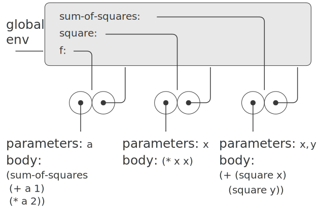
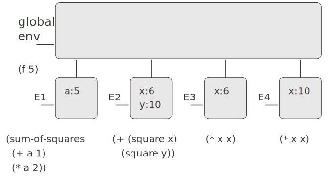

3.2 求值的环境模型
=========================

因为赋值的存在, 变量已经不能再看作仅仅是某个值的名字。此时的一个变量必须以某种方式指定了一个“位置”, 相应的值可以存储在那里。在新的求值模型里, 这种位置将维持在称为环境的结构中。

接下来的示例可以类比于 `Python` 命名空间的 `LEGB` 规则。

*3.2.1 求值规则*
----------------------

如果要对一个组合表达式求值:
1) 求值这一组合式里的各个子表达式;
2) 将运算符子表达式的值应用于运算对象子表达式的值。

在求值的环境模型里, 一个过程总是一个对偶, 由一些代码和一个指向环境的指针组成。过程只能通过一种方式创建, 那就是通过求值一个 `lambda` 表达式。这样产生出的过程代码来自这一 `lambda` 表达式的正文, 其环境就是求值这个 `lambda` 表达式, 产生出这个过程时的那个环境。

.. code-block:: scheme

  (define (square x)
    (* x x))

  ;; 等价于
  (define square
    (lambda (x) (* x x)))

在将一个过程应用于一组实际参数时, 将会建立起一个新环境, 其中包含了将所有形式参数约束于对应的实际参数的框架, 该框架的外围环境就是所用的那个过程的环境。

过程应用的环境模型可以总结两条规则:

1) 将一个过程应用于实际参数, 将构造出一个新框架, 其中将过程的形式参数约束到调用时的实际参数, 而后在构造起的这一新环境的上下文中求值过程体。这个新框架的外围环境就是作为被应用的那个过程对象的一部分的环境。

2) 相对于一个给定环境求值一个 `lambda` 表达式, 将创建起一个过程对象, 这个过程对象是一个序对, 由该 `lambda` 表达式的正文和一个指向环境的指针组成, 这一指针指向的就是创建这个过程对象时的环境。

*3.2.2 简单过程的应用*
-------------------------

.. code-block:: scheme

  (define (square x)
    (* x x))

  (define (sum-of-squares x y)
    (+ (square x) (square y)))

  (define (f a)
    (sum-of-squares (+ a 1) (* a 2)))

对于以上过程, 组合式 `(f 5)` 求值得到 136 的过程如下所示:

上图展示出在全局环境中对 `f` 、 `square` 、 `sum-of-squares` 的定义求值后创建起的三个过程对象, 每个过程对象都有一些代码和一个指向全局环境的指针组成。

上图展示出对 `(f 5)` 求值创建的环境结构。

首先对 `f` 调用创建了环境 `E1` , 在 `E1` 中代入实参得到 6 和 10, 但并没有找到 `sum-of-squares` 的约束, 因此在全局环境中继续寻找, 得到了 `sum-of-squares` 的定义。

然后调用 `sum-of-squares` 创建环境 `E2`, 在 `E2` 中代入实参, 但并没有找到 `square` 的约束, 因此在全局环境中继续寻找, 得到了 `square` 的定义。

然后调用 `square` 分别创建环境 `E3` 和 `E4`, 代入实参得到 36 和 100。

各个子表达式求值后返回的值再进行相加作为结果返回。

*练习 3.9*
----------------

对于递归版本:

::

          ________________________
  全局环境  |                       |
  ------->| factorial : *         |
          |             |         |
          |_____________|_________|
                        |     ^
                        |     |
                    参数 : n
                   过程体 : (if (= n 1)
                              1
                              (* n (factorial (- n 1))))

首先调用 `(factorial 6)` 创建环境 `E1`, 代入实参得到 `(* 6 (factorial 5))`

然后调用 `(factorial 5)` 创建环境 `E2`, 代入实参得到 `(* 6 (* 5 (factorial 4)))`

然后调用 `(factorial 4)` 创建环境 `E3`, 代入实参得到 `(* 6 (* 5 (* 4 (factorial 3))))`

然后调用 `(factorial 3)` 创建环境 `E4`, 代入实参得到 `(* 6 (* 5 (* 4 (* 3 (factorial 2)))))`

然后调用 `(factorial 2)` 创建环境 `E5`, 代入实参得到 `(* 6 (* 5 (* 4 (* 3 (* 2 (factorial 1))))))`

然后调用 `(factorial 1)` 创建环境 `E6`, 代入实参得到 `(* 6 (* 5 (* 4 (* 3 (* 2 1)))))`, 即 720

对于迭代版本:

::

          ___________________________________
  全局环境  |                                  |
  ------->| factorial : *                    |
          | fact-iter : |               *    |
          |_____________|_______________|____|
                        |       ^       |  ^
                        |       |       |  |
                        |       |    变量: (product counter max-count)
                        |       |   过程体: (if (> counter max-count)
                        |       |                 prod
                        |       |                 (fact-iter (* counter product)
                        |       |                            (+ counter 1)
                        |       |                            max-count))
                        |       |
                     参数: n
                    过程体: (fact-iter 1 1 n)

首先调用 `(factorial 6)` 创建环境 `E1`, 代入实参得到 `(fact-iter 1 1 6)`

然后在全局环境中查找 `fact-iter`, 然后调用 `(fact-iter 1 1 6)` 创建环境 `E2`, 代入实参得到 `(fact-iter 1 2 6)`

然后调用 `(fact-iter 1 2 6)`, 创建环境 `E3`, 代入实参得到 `(fact-iter 2 3 6)`

然后调用 `(fact-iter 2 3 6)`, 创建环境 `E4`, 代入实参得到 `(fact-iter 6 4 6)`

然后调用 `(fact-iter 6 4 6)`, 创建环境 `E5`, 代入实参得到 `(fact-iter 24 5 6)`

然后调用 `(fact-iter 24 5 6)`, 创建环境 `E6`, 代入实参得到 `(fact-iter 120 6 6)`

然后调用 `(fact-iter 120 6 6)`, 创建环境 `E7`, 代入实参得到 `(fact-iter 720 7 6)`

然后调用 `(fact-iter 720 7 6)`, 创建环境 `E8`, 代入实参得到 `720`

*3.2.3 将框架看作局部状态的展台*
--------------------------------

对于如下过程而言

.. code-block:: scheme

  (define (make-withdraw balance)
    (lambda (amount)
      (if (>= balance amount)
          (begin (set! balance
                       (- balance amount))
                 balance)
          "Insufficient funds")))

当定义了 `W1` 时

.. code-block:: scheme

  (define W1 (make-withdraw 100))

将会创建环境 `E1`, 使得形参 `balance` 约束到实参 100, 进而求值 `make-withdraw` 过程, 返回 `lambda` 表达式。

这样在求值 `(W1 50)` 时, 将会在上面返回的 `lambda` 表达式中代入实参, 此时 `amount` 约束为 50, `balance` 来源于环境 `E1` 为 100, 使用 `set!` 赋值后, 环境 `E1` 中的 `balance` 被设置为 50, 则当下次调用时, 如 `(W1 25)`, 则仍然会建立起 `amount` 的一个约束, 而它的外围环境仍然是 `E1`, 因此环境 `E1` 就起到了保存过程对象的局部状态变量的“位置”的作用。

如果再次调用 `(define W2 (make-withdraw 100))` 则会创建另外一个环境 `E2`, 与前面 `E1` 相互独立, 互不影响。

*练习 3.10*
------------------

对于如下过程

.. code-block:: scheme

  (define (make-withdraw initial-amount)
    (let ((balance initial-amount))
      (lambda (amount)
        (if (>= balance amount)
            (begin (set! balance
                         (- balance amount))
                   balance)
            "Insufficient funds"))))

因为 `(let ((⟨var⟩ ⟨exp⟩)) ⟨body⟩)` 实际上是 `((lambda (⟨var⟩) ⟨body⟩) ⟨exp⟩)` 的语法糖, 因此当调用 `(define W1 (make-withdraw 100))` 时, 首先创建环境 `E1`, 使得形参 `initial-amount` 代入实参 100, 然后返回了 `lambda` 表达式, 此时调用 `lambda` 过程, 使得形参 `balance` 代入实参 100, 返回了 `lambda` 表达式。

当调用 `(W1 50)` 时, 与上面不使用 `let` 方式的调用过程相同, 会修改 `E2` 环境中的 `balance` 的值。

当调用 `(define W2 (make-withdraw 100))` 时, 会依次创建环境 `E3` 、 `E4`, 同样与 `W1` 的 `E1` 和 `E2` 环境保持独立。

因此 `make-withdraw` 的两个版本会有相同的行为, 只不过使用 `let` 方式的版本会多一层嵌套的环境。

*3.2.4 内部定义*
---------------------

对于如下过程

.. code-block:: scheme

  (define (sqrt x)
    (define (good-enough? guess)
      (< (abs (- (square guess) x)) 0.001))
    (define (improve guess)
      (average guess (/ x guess)))
    (define (sqrt-iter guess)
      (if (good-enough? guess)
          guess
          (sqrt-iter (improve guess))))
    (sqrt-iter 1.0))

因为使用了内部定义的方式, 因此其环境模型就类似于上一题中使用 `let` 的方式形成了嵌套的环境。

当求值 `(sqrt 2)` 时, 首先创建环境 `E1`, 里面包含了 `good-enough?` 、 `improve` 、 `sqrt-iter` 三个局部过程, 然后求值 `(sqrt-iter 1.0)`, 此时将创建环境 `E2`, `sqrt-iter` 中的形参 `guess` 代入实参为 1.0, 继而调用 `good-enough?`, 此时将创建环境 `E3`, `good-enough?` 中的形参 `guess` 代入实参为 1.0。

*练习 3.11*
--------------------

对于如下过程

.. code-block:: scheme

  (define (make-account balance)
    (define (withdraw amount)
      (if (>= balance amount)
          (begin (set! balance
                       (- balance
                          amount))
                 balance)
          "Insufficient funds"))
    (define (deposit amount)
      (set! balance (+ balance amount))
      balance)
    (define (dispatch m)
      (cond ((eq? m 'withdraw) withdraw)
            ((eq? m 'deposit) deposit)
            (else (error "Unknown request:
                          MAKE-ACCOUNT"
                         m))))
    dispatch)

调用 `(define acc (make-account 50))` 时, 首先创建环境 `E1`, 其中包含三个局部过程 `withdraw`, `deposit`, `dispatch`, 以及将形参 `balance` 代入实参 50, 最后返回 `dispatch`

调用 `((acc 'deposit) 40)` 时, 创建环境 `E2`, 将形参 `m` 代入实参 `deposit`, 根据过程体的定义返回 `deposit` 过程, 然后调用 `deposit`, 创建环境 `E3`, 代入实参 40, 对环境 `E1` 中的 `balance` 重新赋值并返回结果, 得到 90

调用 `((acc 'withdraw) 60)` 时, 创建环境 `E2`, 将形参 `m` 代入实参 `withdraw`, 根据过程体的定义返回 `withdraw` 过程, 然后调用 `withdraw`, 创建环境 `E3`, 代入实参 60, 对环境 `E1` 中的 `balance` 重新赋值并返回结果, 得到 30

`acc` 的局部状态保存在环境 `E1` 中, 如果定义另外一个账户 `(define acc2 (make-account 100))`, 则 `acc` 与 `acc2` 分别拥有自己的环境 `E1`, 可以保证两者的数据并不会冲突。
