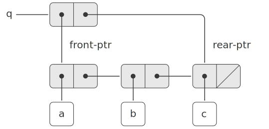
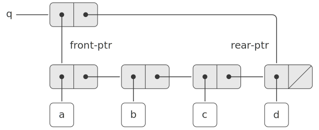
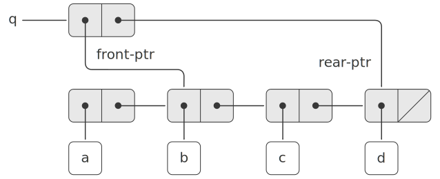
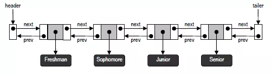
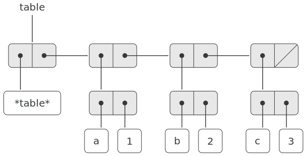
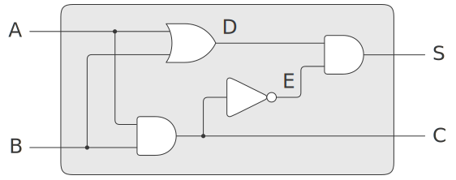
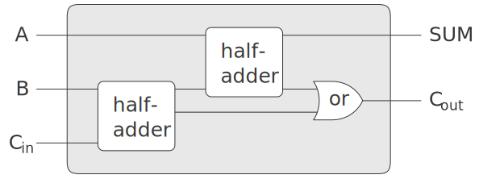

3.3 用变动数据做模拟
===========================

为了模拟具有不断变化状态的复合对象, 数据抽象不仅要包含选择函数和构造函数, 还需要有改变函数。即在将序对作为构造复合数据的通用“粘合剂”时, 还需要定义对序对的改变函数, 使序对能够作为构造变动数据对象的基本构件。

*3.3.1 变动的表结构*
----------------------

使用 `set-car!` 与 `set-cdr!` 对序对进行修改。使用效果如下所示:

::

  > (define x '((a b) c d))
  > x
  ((a b) c d)
  > (define y '(e f))
  > y
  (e f)
  > (set-car! x y)
  > x
  ((e f) c d)

  > (define x '((a b) c d))
  > (set-cdr! x y)
  > x
  ((a b) e f)

  ;; 对于直接使用 cons 方式构造序对 z 并不会修改 x 的值
  > (define z (cons y (cdr x)))
  > z
  ((e f) c d)
  > x
  ((a b) c d)

由此可得 `cons` 的一种基于 `set-car!` 和 `set-cdr!` 的实现

.. code-block:: scheme

  (define (cons x y)
    (let ((new (get-new-pair)))
      (set-car! new x)
      (set-cdr! new y)
      new))

*练习 3.12*
---------------

.. code-block:: scheme

  (define (append! x y)
    (set-cdr! (last-pair x) y)
    x)

  (define (last-pair x)
    (if (null? (cdr x))
        x
        (last-pair (cdr x))))

测试:

::

  > (define x (list 'a 'b))
  > (define x '(a b))
  > (define y '(c d))
  > (define z (append x y))
  > z
  (a b c d)
  > (cdr x)
  (b)
  > (define w (append! x y))
  > w
  (a b c d)
  > (cdr x)
  (b c d)

在使用 `append` 方式实现时

::

  x-->'a-->'b-->'()

  y-->'c-->'d-->'()

  z-->'a-->'b-->'c-->'d-->'()

在使用 `append!` 方式实现时

::

  w-->*
      |
      |
  x-->'a-->'b-->*
                |
                |
            y-->'c-->'d-->'()

  z-->'a-->'b-->'c-->'d-->'()

*练习 3.13*
--------------

.. code-block:: scheme

  (define (make-cycle x)
    (set-cdr! (last-pair x) x)
    x)

  (define z (make-cycle (list 'a 'b 'c)))

如果按照 `make-cycle` 的定义去计算 `z`, 将会在 `z` 的末尾加上 `z`, 而在末尾这个 `z` 的末尾又会加上 `z`, 进而造成死循环。

*练习 3.14*
---------------

.. code-block:: scheme

  (define (mystery x)
    (define (loop x y)
      (if (null? x)
          y
          (let ((temp (cdr x)))
            (set-cdr! x y)
            (loop temp x))))
    (loop x '()))

`mystery` 实现的功能是对 `x` 进行翻转

::

  > (define v '(a b c))
  > (define w (mystery v))
  > v
  (a)
  > w
  (c b a)

执行 `mystery` 之前

::

  v-->'a-->'b-->'c-->'()

执行 `mystery` 之后

::

  初始值
  x-->'a-->'b-->'c-->'()

  y-->'()

  第一次
  x-->*
      |
      |
      'b-->'c-->'()

  y-->*
      |
      |
      'a-->'()

  v-->*
      |
      |
      'a-->'()

  第二次
  x-->*
      |
      |
      'c-->'()

  y--*
     |
     |
     'b-->'a-->'()

  第三次
  x-->*
      |
      |
      '()

  y-->*
      |
      |
      'c-->'b-->'a-->'()

**共享和相等**

以两种方式构建的 `z1` 和 `z2` 虽然输出相同但结构并不相同

::

  > (define x '(a b))
  > (define z1 (cons x x))
  > (define z2 (cons '(a b) '(a b)))
  > z1
  ((a b) a b)
  > z2
  ((a b) a b)

这种结构上的不同之处在调用如下过程时才会明显的显示出来

.. code-block:: scheme

  (define (set-to-wow! x)
    (set-car! (car x) 'wow)
    x)

::

  > (set-to-wow! z1)
  ((wow b) wow b)
  > (set-to-wow! z2)
  ((wow b) a b)

对于这种情况, 可以使用 `eq?` 来校验是否为同一个对象

::

  > (define z1 (cons x x))
  > (define z2 (cons '(a b) '(a b)))
  > (eq? (car z1) (cdr z1))
  #t
  > (eq? (car z2) (cdr z2))
  #f

*练习 3.15*
----------------

::

  调用 set-to-wow! 之前

  z1-->*-->*-->'()
      |    |
      |<---|
      |
      x-->'a-->'b-->'()

  z2-->*---->*---->'()
       |     |
       |     |
       |     |
       | y-->'a-->'b--'()
       |
   x-->'a-->'b-->'()

  调用 set-to-wow! 之后

  z1-->*-->*--'()
      |    |
      |<---|
      |
      x-->'wow-->'b-->'()

  z2-->*---->*---->'()
       |     |
       |     |
       |     |
       | y-->'a-->'b--'()
       |
   x-->'wow-->'b-->'()

*练习 3.16*
---------------

.. code-block:: scheme

  (define (count-pairs x)
    (if (not (pair? x))
        0
        (+ (count-pairs (car x))
           (count-pairs (cdr x))
           1)))

::

  > (define x '(a b c))
  > (count-pairs x)
  3
  > (define x '((a b) c))
  > (count-pairs x)
  > (define x '(((a) (b) (c))))
  > (count-pairs x)
  7

使用 *3.13* 中的 `make-cycle` 过程构造一个死循环的结构将会使 `count-pairs` 无法返回结果

*练习 3.17*
--------------------

.. code-block:: scheme

  (define (count-pairs x)
    (length (set-pairs x)))

  ;; 设定使用 result 记录已经出现过的序对
  ;; 然后遍历 pairs
  ;; 依次判断其子序对是否在 result 中是否已经出现过
  (define (set-pairs x)
    (define (not-found? pairs result)
      (if (pair? result)
          (if (equal? (car result) pairs)
              #f
              (not-found? pairs (cdr result)))
          #t))
    (define (iter pairs result)
      (if (and (pair? pairs)
               (not-found? pairs result))
          (iter (car pairs)
                (iter (cdr pairs)
                      (cons pairs result)))
          result))
    (iter x '()))

*练习 3.18*
-----------------

.. code-block:: scheme

  (define (find-cycle? x)
    (let ((y '(())))
      (define (iter pairs)
        (if (null? pairs)
            #f
            (if (equal? (car pairs) y)
                #t
                (and (set-car! pairs y)
                     (iter (cdr pairs) y)))))
      (iter x)))

测试验证

::

  > (define x '(1 2 3))
  > (find-cycle? x)
  #f
  > (set-cdr! (last-pair x) x)
  > (find-cycle? x)
  #t

*练习 3.19*
---------------

如果存在环, 则可以想像两个人在环形的操场上跑步, 速度快的人势必会在超过速度慢的人之后又在某个时间点从后面追上他, 则此时两者位置相同; 而如果是在直线的跑道上, 则速度快的人直接到了重点, 两者只在起点处在相同的位置, 其它时刻都不会在相同的位置。

因此可以设计步长分别为 1 和 2 对序对进行遍历, 看是否能出现重合, 如果出现则说明存在环。

.. code-block:: scheme

  (define (new-find-cycle? pairs)
    ;; 根据不同的步长在序对中查找对应的记录
    (define (find-next n lst)
      (cond ((= 0 n)
             lst)
            ((null? lst)
             '())
            (else (find-next (- n 1)
                             (cdr lst)))))
    ;; 迭代处理, 比较移动不同步长后得到的记录是否相同, 并由此判断是否存在环
    (define (iter x y)
      (let ((step-1 (find-next 1 x))
            (step-2 (find-next 2 y)))
        (cond ((or (null? step-1)
                   (null? step-2))
               #f)
              ((eq? step-1 step-2)
               #t)
              (else (iter step-1 step-2)))))
    (iter pairs pairs))

::

  > (define x '(1 2 3))
  > (new-find-cycle? x)
  #f
  > (set-cdr! (last-pair x) x)
  > (new-find-cycle? x)
  #t

**改变也就是赋值**

根据序对的过程表示, 同样可以为其添加赋值的功能

.. code-block:: scheme

  (define (cons x y)
    (define (set-x! v) (set! x v))
    (define (set-y! v) (set! y v))
    (define (dispatch m)
      (cond ((eq? m 'car) x)
            ((eq? m 'cdr) y)
            ((eq? m 'set-car!) set-x!)
            ((eq? m 'set-cdr!) set-y!)
            (else (error "Undefined operation: CONS" m))))
    dispatch)

  (define (car z) (z 'car))
  (define (cdr z) (z 'cdr))

  (define (set-car! z new-value)
    ((z 'set-car!) new-value)
    z)

  (define (set-cdr! z new-value)
    ((z 'set-cdr!) new-value)
    z)

*练习 3.20*
-----------------

::

  (define x (cons 1 2))

          +----------------------------+
   全局环境 |                            |
   -----> |  x                         |
          +--|-------------------------+
             |           ^
             |           |
             |        +------------+
             |  E1--> | x: 1       |
             |        | y: 2       |
             +------->| body: ...  |
                      +------------+

  (define z (cons x x))

         +-------------------------------------------------------+
  全局环境 |                                                       |
  -----> |   z                           x                       |
         +---|---------------------------|-----------------------+
             |           ^               |          ^
             |           |               |          |
             |           |               |      +-----------+
             |           |               |      | x: 1      |
             |           |               |      | y: 2      |
             |           |               |      |           |
             |           |               +----->| body: ... |
             |           |                      +-----------+
             |           |                         ^ ^
             |           |                         | |
             |        +-----------+                | |
             |  E2--> | x: ------------------------+ |
             |        | y: --------------------------+
             |        |           |
             +------->| body: ... |
                      +-----------+

  (set-car! (cdr z) 17)

         +-------------------------------------------------------+
  全局环境 |                                                       |
  -----> |   z                           x                       |
         +---|---------------------------|-----------------------+
             |           ^               |          ^
             |           |               |          |
             |           |               |      +-----------+
             |           |               |      | x: 17     |
             |           |               |      | y: 2      |
             |           |               |      |           |
             |           |               +----->| body: ... |
             |           |                      +-----------+
             |           |                         ^ ^
             |           |                         | |
             |        +-----------+                | |
             |  E2--> | x: ------------------------+ |
             |        | y: --------------------------+
             |        |           |
             +------->| body: ... |
                      +-----------+

*3.3.2 队列的表示*
----------------------

先入先出队列涉及到的基本操作

.. code-block:: scheme

  ;; 构造函数
  ;; 返回一个空队列
  (make-queue)

  ;; 选择函数
  ;; 检查队列是否为空
  (empty-queue? <queue>)
  ;; 返回队列的头
  (front-queue <queue>)

  ;; 改变函数
  ;; 插入数据项到队尾, 并返回经过修改的队列
  (insert-queue! <queue> <item>)
  ;; 删除队尾的数据项, 并返回经过修改的队列
  (delete-queue! <queue>)

为提高队列的操作效率, 设计两个指针: 头指针 front-ptr 和尾指针 rear-ptr

带头尾指针的队列结构

选择和修改头尾指针的操作实现

.. code-block:: scheme

  ;; 选择函数的实现
  (define (front-ptr queue) (car queue))
  (define (rear-ptr queue) (cdr queue))

  ;; 修改函数的实现
  (define (set-front-ptr! queue item)
    (set-car! queue item))
  (define (set-rear-ptr! queue item)
    (set-cdr! queue item))

  ;; 头指针为空则队列为空
  ;; 中文版 181 页此处翻译有误
  (define (empty-queue? queue)
    (null? (front-ptr queue)))

  ;; 构造函数
  (define (make-queue) (cons '() '()))

  ;; 获取队头
  (define (front-queue queue)
    (if (empty-queue? queue)
        (error "FRONT called with an
                empty queue" queue)
        (car (front-ptr queue))))

插入数据项的实现

.. code-block:: scheme

  (define (insert-queue! queue item)
    ;; 首先基于数据项构造一个新序对
    (let ((new-pair (cons item '())))
      ;; 然后判断队列是否为空
      (cond ((empty-queue? queue)
             ;; 如果为空则将头尾指针都指向新序对
             (set-front-ptr! queue new-pair)
             (set-rear-ptr! queue new-pair)
             queue)
            ;; 否则将队尾指针的 cdr 修改为新序对
            ;; 并将队尾指针指向新序对
            (else (set-cdr! (rear-ptr queue)
                            new-pair)
                  (set-rear-ptr! queue new-pair)
                  queue))))

删除数据项的实现

.. code-block:: scheme

  (define (delete-queue! queue)
    ;; 删除数据项时对于空队列报错
    (cond ((empty-queue? queue)
           (error "DELETE! called with
                   an empty queue" queue))
          ;; 非空队列则将头指针指向原来头指针的 cdr 即可
          (else (set-front-ptr!
                 queue
                 (cdr (front-ptr queue)))
                queue)))

*练习 3.21*
--------------

因为在第一次往队列中插入数据项时, 使用了如下操作

.. code-block:: scheme

  (set-front-ptr! queue new-pair)
  (set-rear-ptr! queue new-pair)

因此造成了这样的输出效果

::

  > (define q1 (make-queue))
  > (insert-queue! q1 'a)
  ((a) a)
  > (insert-queue! q1 'b)
  ((a b) b)
  > (delete-queue! q1)
  ((b) b)
  > (delete-queue! q1)
  (() b)

这里输出的是先入先出队列的底层实现, 如果想输出队列的值, 则可以直接采用如下方式实现

.. code-block:: scheme

  (define (print-queue queue)
    (display (front-ptr queue))
    (newline))

测试验证

::

  > (define q1 (make-queue))
  > (insert-queue! q1 'a)
  ((a) a)
  > (print-queue q1)
  (a)
  > (insert-queue! q1 'b)
  ((a b) b)
  > (print-queue q1)
  (a b)
  > (delete-queue! q1)
  ((b) b)
  > (print-queue q1)
  (b)
  > (insert-queue! q1 'c)
  ((b c) c)
  > (print-queue q1)
  (b c)
  > (delete-queue! q1)
  ((c) c)
  > (print-queue q1)
  (c)
  > (delete-queue! q1)
  (() c)
  > (print-queue q1)
  ()

*练习 3.22*
----------------

.. code-block:: scheme

  (define (make-queue)
    (let ((front-ptr '())
          (rear-ptr '()))
      (define (set-front-ptr! item)
        (set! front-ptr item))
      (define (set-rear-ptr! item)
        (set! rear-ptr item))
      (define (empty-queue?)
        (null? front-ptr))
      (define (front-queue)
        (if (null? front-ptr)
            (error "FRONT called with an empty queue")
            (car front-ptr)))
      (define (insert-queue! item)
        (let ((new-pair (cons item '())))
          (cond ((empty-queue?)
                 (set-front-ptr! new-pair)
                 (set-rear-ptr! new-pair))
                (else (set-cdr! rear-ptr new-pair)
                      (set-rear-ptr! new-pair)))))
      (define (delete-queue!)
        (if (empty-queue?)
            (error "DELETE called with an emtpy queue")
            (set-front-ptr! (cdr front-ptr))))
      (define (print-queue)
        (display front-ptr)
        (newline))
      (define (dispatch m)
        (cond ((eq? m 'empty-queue?) empty-queue?)
              ((eq? m 'front-queue) front-queue)
              ((eq? m 'insert-queue!) insert-queue!)
              ((eq? m 'delete-queue!) delete-queue!)
              ((eq? m 'print-queue) print-queue)
              (else (error "undefined operation--QUEUE" m))))
      dispatch))

测试验证

::

  > (define q (make-queue))
  > ((q 'insert-queue!) 'a)
  > ((q 'print-queue))
  (a)
  > ((q 'insert-queue!) 'b)
  > ((q 'print-queue))
  (a b)
  > ((q 'insert-queue!) 'c)
  > ((q 'print-queue))
  (a b c)
  > ((q 'delete-queue!))
  > ((q 'print-queue))
  (b c)
  > ((q 'insert-queue!) 'd)
  > ((q 'print-queue))
  (b c d)

*练习 3.23*
----------------

为保证所有操作在 :math:`\Theta(1)` 步骤内完成, 应使用双向链表实现双端队列, 其结构示例如下所示:

.. code-block:: scheme

  ;; 双向链表需要记录前驱和后继
  ;; 这里以 (cons (cons value prev) next) 构造基本节点
  (define (make-deque)
    (cons '() '()))

  (define (empty-deque? deque)
    (null? (front-ptr deque)))

  (define (front-deque deque)
    (if (empty-deque? deque)
        (error "FRONT called with en empty deque" deque)
        (car (front-ptr deque))))

  (define (rear-deque deque)
    (if (empty-deque? deque)
        (error "REAR called with en empty deque" deque)
        (car (rear-ptr deque))))

  (define (insert-deque! deque item flag)
    (let ((new-pair (cons (cons item '()) '())))
      (cond ((empty-deque? deque)
             (set-front-ptr! deque new-pair)
             (set-rear-ptr! deque new-pair))
            ;; 从头部插入
            ((eq? flag 'front)
             ;; 设置头指针的前驱为新节点
             (set-cdr! (car (front-ptr deque)) new-pair)
             ;; 设置新节点的后继为原来的头指针
             (set-cdr! new-pair (front-ptr deque))
             ;; 设置新节点为队列的头
             (set-front-ptr! deque new-pair))
            ;; 从尾部插入
            (else
             ;; 设置尾指针的后继为新节点
             (set-cdr! (rear-ptr deque) new-pair)
             ;; 设置新节点的前驱为原来的尾指针
             (set-cdr! (car new-pair) (rear-ptr deque))
             ;; 设置新结点为队列的尾
             (set-rear-ptr! deque new-pair)))))

  (define (front-insert-deque! deque item)
    (insert-deque! deque item 'front))
  (define (rear-insert-deque! deque item)
    (insert-deque! deque item 'rear))

  (define (front-delete-deque! deque)
    (cond ((empty-deque? deque)
           (error "DELETE called with en empty deque" deque))
          (else
           ;; 设置头指针的后继为新的头指针
           (set-front-ptr! deque (cdr (front-ptr deque)))
           ;; 设置新的头指针的前驱为空
           (set-cdr! (car (front-ptr deque)) '()))))

  (define (rear-delete-deque! deque)
    (cond ((empty-deque? deque)
           (error "DELETE called with en empty deque" deque))
          (else
           ;; 设置尾指针的前驱为新的尾指针
           (set-rear-ptr! deque (cdar (rear-ptr deque)))
           ;; 设置新的尾指针的后继为空
           (set-cdr! (rear-ptr deque) '()))))

  (define (print-deque deque)
    (display
     (map car (front-ptr deque)))
    (newline))

测试验证

::

  > (define d (cons '() '()))
  > (front-insert-deque! d 'a)
  > (front-insert-deque! d 'b)
  > (rear-insert-deque! d 'c)
  > (rear-insert-deque! d 'd)
  > (print-deque d)
  (b a c d)
  > (front-delete-deque! d)
  > (print-deque d)
  (a c d)
  > (rear-delete-deque! d)
  > (print-deque d)
  (a c)

*3.3.3 表格的表示*
-----------------------

一维表格示例

.. code-block:: scheme

  ;; 查找指定 key 的关联记录
  (define (assoc key records)
    (cond ((null? records) false)
          ((equal? key (caar records))
           (car records))
          (else (assoc key (cdr records)))))

  ;; 查找指定 key 在表格中对应的值
  (define (lookup key table)
    (let ((record (assoc key (cdr table))))
      (if record
          (cdr record)
          false)))

  ;; 更新表格中 key 对应的 value
  (define (insert! key value table)
    (let ((record (assoc key (cdr table))))
      (if record
          (set-cdr! record value)
          (set-cdr! table
                    (cons (cons key value)
                          (cdr table)))))
    'ok)

  ;; 构造新表格
  (define (make-table)
    (list '*table*))

**二维表格**

二维表格示例

.. code-block:: scheme

  ;; 二维表格的查找过程
  ;; 首先根据 key-1 先查找到子表格
  ;; 然后在子表格中应用和一维表格相同的查找过程
  (define (lookup key-1 key-2 table)
    (let ((subtable (assoc key-1 (cdr table))))
      (if subtable
          (let ((record
                 (assoc key-2 (cdr subtable))))
            (if record (cdr record) false))
          false)))

  ;; 二维表格的插入数据
  ;; 首先根据 key-1 先查找子表格
  ;; 子表格存在应用与一维表格相同的插入数据过程
  ;; 子表格不存在由 key-2 构建子表格, 并将 key-1 插入到原表格
  (define (insert! key-1 key-2 value table)
    (let ((subtable (assoc key-1 (cdr table))))
      (if subtable
          (let ((record
                 (assoc key-2 (cdr subtable))))
            (if record
                (set-cdr! record value)
                (set-cdr!
                 subtable
                 (cons (cons key-2 value)
                       (cdr subtable)))))
          (set-cdr!
           table
           (cons (list key-1 (cons key-2 value))
                 (cdr table)))))
    'ok)

**创建局部表格**

以局部状态方式实现二维表格

.. code-block:: scheme

  (define (make-table)
    (let ((local-table (list '*table*)))
      (define (lookup key-1 key-2)
        (let ((subtable
               (assoc key-1 (cdr local-table))))
          (if subtable
              (let ((record
                     (assoc key-2
                            (cdr subtable))))
                (if record (cdr record) false))
              false)))
      (define (insert! key-1 key-2 value)
        (let ((subtable
               (assoc key-1 (cdr local-table))))
          (if subtable
              (let ((record
                     (assoc key-2
                            (cdr subtable))))
                (if record
                    (set-cdr! record value)
                    (set-cdr!
                     subtable
                     (cons (cons key-2 value)
                           (cdr subtable)))))
              (set-cdr!
               local-table
               (cons (list key-1
                           (cons key-2 value))
                     (cdr local-table)))))
        'ok)
      (define (dispatch m)
        (cond ((eq? m 'lookup-proc) lookup)
              ((eq? m 'insert-proc!) insert!)
              (else (error "Unknown operation: TABLE" m))))
      dispatch))

  ;; set 和 get 的实现

  (define operation-table (make-table))
  (define get (operation-table 'lookup-proc))
  (define put (operation-table 'insert-proc!))

*练习 3.24*
------------------

重新实现 `assoc` 过程, 其中 `equals?` 替换为传入的参数 `same-key?` 即可

.. code-block:: scheme

  (define (make-table same-key?)
    (let ((local-table (list '*table*)))
      (define (assoc key records)
        (cond ((null? records) #f)
              ((same-key? key (caar records))
               (car records))
              (else (assoc key (cdr records)))))
      (define (lookup key-1 key-2)
        (let ((subtable (assoc key-1 (cdr local-table))))
          (if subtable
              (let ((record (assoc key-2 (cdr subtable))))
                (if record
                    (cdr record)
                    #f))
              #f)))
      (define (insert! key-1 key-2 value)
        (let ((subtable (assoc key-1 (cdr local-table))))
          (if subtable
              (let ((record (assoc key-2 (cdr subtable))))
                (if record
                    (set-cdr! record value)
                    (set-cdr! subtable (cons (cons key-2 value)
                                             (cdr subtable)))))
              (set-cdr! local-table
                        (cons (list key-1 (cons key-2 value))
                              (cdr local-table)))))
        'ok)
      (define (dispatch m)
        (cond ((eq? m 'lookup-proc) lookup)
              ((eq? m 'insert-proc!) insert!)
              (else (error "Unknown operation: TABLE" m))))
      dispatch))

测试验证:

::

  > (define table (make-table equal?))
  > (define get (operation-table 'lookup-proc))
  > (define put (operation-table 'insert-proc!))
  > (put 'sub1 'key1 'val1)
  ok
  > (put 'sub1 'key2 'val2)
  ok
  > (put 'sub2 'key3 'val3)
  ok
  > (get 'sub1 'key2)
  val2

然后自定义一个比较相同的函数

.. code-block:: scheme

  (define (same-num? n1 n2)
    (if (<= (abs (- n1 n2)) 0.5)
        #t
        #f))

测试验证

::

  > (define table (make-table same-num?))
  > (define get (table 'lookup-proc))
  > (define put (table 'insert-proc!))
  > (put 1.0 10.0 'val1)
  ok
  > (put 1.0 20.0 'val2)
  ok
  > (put 2.0 30.0 'val3)
  ok
  > (get 1.0 10.0)
  val1
  > (get 1.0 10.5)
  val1

*练习 3.25*
----------------

.. code-block:: scheme

  ;; 构造函数与之前相同
  (define (make-table)
    (list '*table*))

  ;; 查找函数与之前相同
  (define (assoc key records)
    (cond ((null? records) #f)
          ((equal? key (caar records))
           (car records))
          (else (assoc key (cdr records)))))

  ;; 查找时递归查找
  (define (lookup keys table)
  (if (null? keys)
      #f
      (let ((key1 (car keys))
            (key2 (cdr keys)))
        (let ((record (assoc key1 (cdr table))))
          (if record
              (if (null? key2)
                  (cdr record)
                  (lookup key2 record))
              #f)))))

  ;; 插入时分情况处理
  (define (insert! keys value table)
    (let ((key1 (car keys))
          (key2 (cdr keys)))
      (let ((record (assoc key1 (cdr table))))
        (cond ((and record
                    key2)
               (insert! key2 value record)
               table) ;; 有记录且关键字列表非空时对子表递归处理
              ((and record
                    (null? key2))
               (set-cdr! record value)
               table) ;; 有记录且无其它关键字时直接更新
              ((and (not record)
                    (null? key2))
               (set-cdr! table
                         (cons (cons key1 value)
                               (cdr table)))
               table) ;; 没有记录且没有其它关键字则直接构建记录
              ((and (not record)
                    key2)
               (set-cdr! table
                         (cons (insert! key2 value (cons key1 '()))
                               (cdr table)))
               table) ;; 没有记录且有其它关键字则直接构建子表
              ))))

  ;; 兼容非列表的情况
  (define (put keys value table)
    (if (pair? keys)
        (insert! keys value table)
        (insert! (list keys) value table)))

  (define (get keys table)
    (if (pair? keys)
        (lookup keys table)
        (lookup (list keys) table)))

测试验证

::

  > (define table (make-table))
  > (put '(key1 key2 key3) 'test table)
  (*table* (key1 (key2 (key3 . test))))
  > (get '(key1 key2 key3) table)
  test
  > (put 'key4 'demo table)
  (*table* (key4 . demo) (key1 (key2 (key3 . test))))
  > (get 'key4 table)
  demo

*练习 3.26*
-------------

.. code-block:: scheme

  ;; 实现树及其对应的函数
  (define (make-tree key value)
    (list (cons key value) '() '()))
  (define (get-tree-key tree)
    (caar tree))
  (define (get-tree-value tree)
    (cdar tree))
  (define (get-tree-left tree)
    (cadr tree))
  (define (get-tree-right tree)
    (caddr tree))
  (define (set-tree-key! tree key)
    (set-car! (car tree) key))
  (define (set-tree-value! tree value)
    (set-cdr! (car tree) value))
  (define (set-tree-left! tree left)
    (set-car! (cdr tree) left))
  (define (set-tree-right! tree right)
    (set-car! (cddr tree) right))
  (define (tree-empty? tree)
    (null? tree))

  ;; 支持多种数据类型的排序
  (define (compare-string x y)
    (cond ((string=? x y) 0)
          ((string>? x y) 1)
          ((string<? x y) -1)))
  (define (compare-symbol x y)
    (compare-string (symbol->string x)
                    (symbol->string y)))
  (define (compare-number x y)
    (cond ((= x y) 0)
          ((> x y) 1)
          ((< x y) -1)))

  (define (assoc key tree compare)
    (if (tree-empty? tree)
        '()
        (let ((compare-result (compare key (get-tree-key tree))))
          (cond ((= 0 compare-result)
                 (get-tree-value tree))
                ((= 1 compare-result)
                 (assoc key (get-tree-right tree) compare))
                (else
                 (assoc key (get-tree-left tree) compare))))))

  (define (adjoin-tree key value tree compare)
    (if (tree-empty? tree)
        (make-tree key value)
        (let ((compare-result (compare key (get-tree-key tree))))
          (cond ((= 0 compare-result)
                 (set-tree-value! value tree)
                 tree)
                ((= 1 compare-result)
                 (set-tree-right!
                  tree
                  (adjoin-tree key value (get-tree-right tree) compare))
                 tree)
                (else
                 (set-tree-left!
                  tree
                  (adjoin-tree key value (get-tree-left tree) compare))
                 tree)))))

测试验证

::

  > (define t (adjoin-tree 'a 1024 '() compare-symbol))
  > (assoc 'a t compare-symbol)
  1024
  > (define t (adjoin-tree 'b 2048 t compare-symbol))
  > (assoc 'b t compare-symbol)
  2048
  > (define t (adjoin-tree 'c 4096 t compare-symbol))
  > (assoc 'c t compare-symbol)
  4096
  > (assoc 'd t compare-symbol)
  ()
  > t
  ((a . 1024) () ((b . 2048) () ((c . 4096) () ())))

然后实现表及其函数

.. code-block:: scheme

  (define (make-table compare)
    (let ((t '()))
      (define (empty?)
        (tree-empty? t))
      (define (insert! key value)
        (set! t (adjoin-tree key value t compare))
        'OK)
      (define (lookup key)
        (let ((result (assoc key t compare)))
          (if (null? result)
              #f
              result)))
      (define (display-tree tree)
        (display t)
        (newline))
      (define (dispatch m)
        (cond ((eq? m 'insert!)
               insert!)
              ((eq? m 'lookup)
               lookup)
              ((eq? m 'empty?)
               (empty?))
              ((eq? m 'display)
               (display-tree t))
              (else
               (error "Unknow mode: " m))))
      dispatch))

测试验证

::

  > (define t (make-table compare-symbol))
  > (t 'empty?)
  #t
  > ((t 'insert!) 'a 1024)
  OK
  > ((t 'lookup) 'a)
  1024
  > ((t 'insert!) 'b 2048)
  OK
  > ((t 'lookup) 'b)
  2048
  > ((t 'lookup) 'c)
  #f
  > (t 'display)
  ((a . 1024) () ((b . 2048) () ()))

*练习 3.27*
-------------

.. code-block:: scheme

  (define memo-fib
    (memoize
      (lambda (n)
        (cond ((= n 0) 0)
              ((= n 1) 1)
              (else
                (+ (memo-fib (- n 1))
                   (memo-fib (- n 2))))))))

  (define (memoize f)
    (let ((table (make-table)))
      (lambda (x)
        (let ((previously-computed-result
               (lookup x table)))
          (or previously-computed-result
              (let ((result (f x)))
                (insert! x result table)
                result))))))

首先展开 `(memo-fib 3)`

::

  (memoize
   (+ (memo-fib 2)
      (memo-fib 1)))

继续展开

::

  (memoize
   (+ (memoize
       (+ (memo-fib 1)
          (memo-fib 0)))
      (memoize 1)))

继续展开

::

  (memoize
   (+ (memoize
        (+ (memoize 1)
           (memoize 0)))
      (memoize 1)))

此时开始展开 `(memoize 0)`

::

  (let ((table (make-table)))
    (let ((previously-computed-result (lookup 0 table)))
      (or previously-computed-result
          (let ((result 0))
            (insert! 0 result table)
            result))))

此时 `table` 为空, 执行 `insert!` 操作后返回 `result`, 即将 0 插入 `table` 并返回 0

同理处理 `(memoize 1)`, 将 1 插入 `table` 并返回 1

然后开始计算

::

  (memoize
   (+ (memoize 1)
      (memoize 1)))

此时 `lookup` 在 `table` 中找到 1, 直接返回, 因此最终结果为 2, 将 2 插入 `table` 并返回 2

*3.3.4 数字电路的模拟器*
--------------------------

半加器

.. code-block:: scheme

  (define (half-adder a b s c)
    (let ((d (make-wire)) (e (make-wire)))
      (or-gate a b d)
      (and-gate a b c)
      (inverter c e)
      (and-gate d e s)
      'ok))

全加器

.. code-block:: scheme

  (define (full-adder a b c-in sum c-out)
    (let ((c1 (make-wire))
          (c2 (make-wire))
          (s  (make-wire)))
      (half-adder b c-in s c1)
      (half-adder a s sum c2)
      (or-gate c1 c2 c-out)
      'ok))

**基本功能块**

线路的基本功能

::
  ;; 获取线路上的信号值
  (get-signal ⟨wire⟩)

  ;; 设置线路上的信号值
  (set-signal! ⟨wire⟩ ⟨new value⟩)

  ;; 对线路执行一个过程
  (add-action! ⟨wire⟩ ⟨procedure of no arguments⟩)

  ;; 指定的时延后执行指定的过程
  (after-delay delay action)

在上面的基础上实现反门

.. code-block:: scheme

  (define (inverter input output)
    (define (invert-input)
      (let ((new-value
             (logical-not (get-signal input))))
        (after-delay
         inverter-delay
         (lambda ()
           (set-signal! output new-value)))))
    (add-action! input invert-input)
    'ok)

  (define (logical-not s)
    (cond ((= s 0) 1)
          ((= s 1) 0)
          (else (error "Invalid signal" s))))

与门的实现

.. code-block:: scheme

  (define (and-gate a1 a2 output)
    (define (and-action-procedure)
      (let ((new-value
             (logical-and (get-signal a1)
                          (get-signal a2))))
        (after-delay
         and-gate-delay
         (lambda ()
           (set-signal! output new-value)))))
    (add-action! a1 and-action-procedure)
    (add-action! a2 and-action-procedure)
    'ok)

*练习 3.28*
-------------

仿照反门和与门实现或门

.. code-block:: scheme

  (define (or-gate a1 a2 output)
    (define (or-action-procedure)
      (let ((new-value
             (logical-or (get-signal a1) (get-signal a2))))
        (after-delay or-gate-delay
                     (lambda ()
                       (set-signal! output new-value)))))
    (add-action! a1 or-action-procedure)
    (add-action! a2 or-action-procedure)
    'ok)

  (define (logical-or s1 s2)
    (if (or (= s1 1)
            (= s2 1))
        1
        0))

测试验证:

::

  ;; 初始化 the-agenda
  > (define the-agenda (make-agenda))
  > the-agenda
  (0)

  ;; 构造三条线路
  > (define a1 (make-wire))
  > (define a2 (make-wire))
  > (define output (make-wire))

  ;; 将线路连接到或门
  > (or-gate a1 a2 output)
  ok

  ;; 执行模拟
  > (propagate)
  done

  ;; 查看输出线路的信号值
  > (get-signal output)
  0

  ;; 改变输入线路的信号值
  > (set-signal! a1 1)
  done

  ;; 再次执行模拟
  > (propagate)
  done

  ;; 再次查看输出线路的信号值, 已经发生变化
  > (get-signal output)
  1

*练习 3.29*
-------------

这里要求用与门和反门构造或门, 显然, 对于 :math:`P \lor Q` 取反, 则有

:math:`\neg(P \vee Q) = (\neg P) \wedge (\neg Q)`

即

:math:`P \vee Q = \neg((\neg P) \wedge (\neg Q))`

因此可通过如下方式构建或门

.. code-block:: scheme

  (define (or-gate a1 a2 output)
    (let ((inverter-a1 (inverter a1 (make-wire)))
          (inverter-a2 (inverter a2 (make-wire))))
      (inverter (and-gate inverter-a1 inverter-a2 (make-wire))))
    '())

测试验证:

::

  ;; 运行模拟
  > (propagate)
  done

  ;; 输出信号值未变
  > (get-signal output)
  1

  ;; 改变输入信号值
  > (set-signal! a1 0)
  done

  ;; 再次执行模拟
  > (propagate)
  done

  ;; 再次查看输出线路的信号值
  > (get-signal output)
  0

由上面 `or-gate` 的实现可知, 共调用了三次反门和一次与门, 因此或门的时延等于三倍的反门时延加一次与门时延。

*练习 3.30*
-------------

从二进制数据中迭代取出二进制位信号值调用全加器进行计算即可。

.. code-block:: scheme

  (define (ripple-carry-adder binary-A binary-B binary-S C)
    (let ((c-in (make-wire)))
      (if (null? binary-A)
          'ok
          (and
           (set-signal! c-in (get-signal C))
           (full-adder (car binary-A) (car binary-B) c-in (car binary-S) C)
           (ripple-carry-adder (cdr binary-A) (cdr binary-B) (cdr binary-S) C)))))

测试验证:

::

  ;; 构建线路
  > (define A1 (make-wire))
  > (define B1 (make-wire))
  > (define S1 (make-wire))
  > (define C (make-wire))

  ;; 将线路连接到级联进位加法器
  > (ripple-carry-adder (list A1) (list B1) (list S1) C)
  ok

  ;; 执行模拟
  > (propagate)
  done

  ;; 求和线路与进位线路的信号值
  > (get-signal S1)
  0
  > (get-signal C)
  0

  ;; 改变线路初值继续模拟
  > (set-signal! A1 1)
  done
  > (ripple-carry-adder (list A1) (list B1) (list S1) C)
  ok
  > (propagate)
  done

  ;; 查看结果
  > (get-signal S1)
  1
  > (get-signal C)
  0

  ;; 再次模拟
  > (set-signal! B1 1)
  done
  > (ripple-carry-adder (list A1) (list B1) (list S1) C)
  ok
  > (propagate)
  done
  > (get-signal S1)
  0
  > (get-signal C)
  1

  ;; 再次模拟
  > (ripple-carry-adder (list A1) (list B1) (list S1) C)
  ok
  > (propagate)
  done
  > (get-signal S1)
  1
  > (get-signal C)
  1

**线路的表示**

.. code-block:: scheme

  (define (make-wire)
    ;; 两个主要元素
    ;; signal-value 标识信号值
    ;; action-procedures 标识过程列表
    (let ((signal-value 0)
          (action-procedures '()))
      ;; 信号值改变时依次调用过程列表中的每个过程
      (define (set-my-signal! new-value)
        (if (not (= signal-value new-value))
            (begin (set! signal-value new-value)
                   (call-each
                    action-procedures))
            'done))
      ;; 向过程列表中添加新的过程
      (define (accept-action-procedure! proc)
        (set! action-procedures
              (cons proc action-procedures))
        (proc))
      (define (dispatch m)
        (cond ((eq? m 'get-signal)
               signal-value)
              ((eq? m 'set-signal!)
               set-my-signal!)
              ((eq? m 'add-action!)
               accept-action-procedure!)
              (else (error "Unknown operation:WIRE" m))))
      dispatch))

即仿照前面章节银行账户的实现方式, 采用消息传递的风格, 将线路实现为一组局部过程和一个 `dispatch` 过程。

其中 `call-each` 为一个递归实现。

.. code-block:: scheme

  (define (call-each procedures)
    (if (null? procedures)
        'done
        (begin
            ((car procedures))
            (call-each (cdr procedures)))))

然后根据 `dispatch` 实现对线路的各种操作

.. code-block:: scheme

  (define (get-signal wire)
    (wire 'get-signal))

  (define (set-signal! wire new-value)
    ((wire 'set-signal!) new-value))

  (define (add-action! wire action-procedure)
    ((wire 'add-action!) action-procedure))

**待处理表**

`after-delay` 由数据结构-*待处理表* 实现

::

  ;; 返回一个新的空的待处理表
  (make-agenda)

  ;; 判断待处理表是否为空
  (empty-agenda? <agenda>)

  ;; 返回待处理表的第一个项目
  (first-agenda-item <agenda>)

  ;; 删除待处理表的第一个项目
  (remove-first-agenda-item! <agenda>)

  ;; 待处理表添加项目, 限定特定的时间执行特定的操作
  (add-to-agenda! <time> <action> <agenda>)

  ;; 返回当时的模拟时间
  (current-time <agenda>)

有了待处理表, 则可将 `after-delay` 实现为

.. code-block:: scheme

  (define (after-delay delay action)
    (add-to-agenda! (+ delay (current-time the-agenad))
                    action
                    the-agenad))

基于以上的实现进行模拟

.. code-block:: scheme

  (define (propagate)
    (if (empty-agenda? the-agenad)
        'done
        (let ((first-item (first-agenda-item the agenda)))
          (first-item)
          (remove-first-agenda-item! the-agenda)
        (propagate))))

**一个简单的实例模拟**

.. code-block:: scheme

  ;; 在线路上放置监测器, 以便于记录当前线路, 时间以及信号值的变化情况
  (define (probe name wire)
    (add-action! wire (lambda ()
                        (newline)
                        (display name)
                        (display " ")
                        (display (current-time the-agenda))
                        (display "  New-value = ")
                        (display (get-signal wire))
                        (newline))))

  ;; 初始化待处理表
  (define the-agenda (make-agenda))
  ;; 定义各个功能块的延时
  (define inverter-delay 2)
  (define and-gate-delay 3)
  (define or-gate-delay 5)

  ;; 定义四条线路
  (define input-1 (make-wire))
  (define input-2 (make-wire))
  (define sum (make-wire))
  (define carry (make-wire))

测试验证:

::

  ;; 在 sum 和 carry 中添加监测器
  > (probe 'sum sum)

  sum 0  New-value = 0
  > (probe 'carry carry)

  carry 0  New-value = 0
  ;; 将以上四条线路连接到半加器上
  > (half-adder input-1 input-2 sum carry)
  ;; 设置信号值
  > (set-signal! input-1 1)
  done
  ;; 执行模拟
  > (propagate)

  sum 8  New-value = 1
  done

  ;; 设置信号值后继续模拟
  > (set-signal! input-2 1)
  done
  > (propagate)

  carry 11  New-value = 1

  sum 16  New-value = 0
  done

*练习 3.31*
-------------

对于 `half-adder` 的实现, 其中会分别调用 `or-gate`, `and-gate`, `inverter`, 这些实现当中都调用了 `(add-action! wire action)`, 而这些过程的具体实现中又都调用了 `(after-delay delay action)`, 对于 `after-delay` 的实现, 它会将 `action` 添加到待处理表中。

这样如果将 `accept-action-procedure!` 定义为如下形式

.. code-block:: scheme

  (define (accept-action-procedure! proc)
    (set! action-procedures
          (cons proc action-procedures)))

则其不会调用 `after-delay`, `action` 也就不会添加到待处理表中。这样在调用模拟 `propagate` 将会失效。

**待处理表的实现**

.. code-block:: scheme

  ;; 待处理表的实现方式-由时间与队列组成的序对
  (define (make-time-segment time queue)
    (cons time queue))
  (define (segment-time s) (car s))
  (define (segment-queue s) (cdr s))

  ;; 新创建的待处理表里没有时间
  (define (make-agenda) (list 0))
  ;; 最后被处理的 action 的时间
  (define (current-time agenda) (car agenda))

  ;; 待处理表的相关操作
  (define (set-current-time! agenda time)
    (set-car! agenda time))
  (define (segments agenda) (cdr agenda))
  (define (set-segments! agenda segments)
    (set-cdr! agenda segments))
  (define (first-segment agenda)
    (car (segments agenda)))
  (define (rest-segments agenda)
    (cdr (segments agenda)))
  (define (empty-agenda? agenda)
    (null? (segments agenda)))

  ;; 向待处理表中添加动作的处理逻辑
  (define (add-to-agenda! time action agenda)
    ;; 判断待处理表是否为空或待插入延迟时间小于序对中的时间
    (define (belongs-before? segments)
      (or (null? segments)
          (< time
             (segment-time (car segments)))))
    ;; 构造一个新的时间段
    (define (make-new-time-segment time action)
      (let ((q (make-queue)))
        (insert-queue! q action)
        (make-time-segment time q)))
    ;; 添加时间段到待处理表
    (define (add-to-segments! segments)
      (if (= (segment-time (car segments)) time)
          ;; 时间合适则将 action 插入关联的队列中, 否则递归处理
          (insert-queue!
           (segment-queue (car segments))
           action)
          (let ((rest (cdr segments)))
            (if (belongs-before? rest)
                ;; 延迟时间小于待处理表中的时间则新构造一个时间段将其插入当前位置
                (set-cdr!
                 segments
                 (cons (make-new-time-segment time action)
                       (cdr segments)))
                (add-to-segments! rest)))))
    (let ((segments (segments agenda)))
      (if (belongs-before? segments)
          (set-segments!
           agenda
           (cons (make-new-time-segment time action)
                 segments))
          (add-to-segments! segments))))

  ;; 删除待处理表中的第一项
  (define (remove-first-agenda-item! agenda)
  (let ((q (segment-queue
            (first-segment agenda))))
    (delete-queue! q)
    ;; 如果删除后队列为空则删除此时间段
    (if (empty-queue? q)
        (set-segments!
         agenda
         (rest-segments agenda)))))

  ;; 获取待处理表的第一项时直接取第一个时间段队列中的第一项, 同时需要更新待处理表的当前时间
  (define (first-agenda-item agenda)
    (if (empty-agenda? agenda)
        (error "Agenda is empty: FIRST-AGENDA-ITEM")
        (let ((first-seg (first-segment agenda)))
          (set-current-time! agenda (segment-time first-seg))
          (front-queue (segment-queue first-seg)))))

*练习 3.32*
--------------

参照与门的实现, 当输入从 0, 1 变为 1, 0 时, 则 `a1` 变为 1, 经 `logical-and` 对 `a1`, `a2` 运算后, `new-value` 为 1, 经过 `after-delay` 处理后, `and-action-procedure` 被插入 `segment` 中; 然后 `a2` 变为 0, 经 `logical-and` 对 `a1`, `a2` 运算后, `new-value` 为 0, 经过 `after-delay` 处理后, `and-action-procedure` 被插入 `segment` 中。

运行 `propogate` 时如果是先入先出的次序, 则依次对 `output` 赋值为 1, 0, 最后 `output` 值为 0；如果是后入先出的次序, 则依次对 `output` 赋值为 0, 1, 最后 `output` 值为 1。

显然, 如果采用后入先出的次序, 信号值将会出现不正确的情况。
